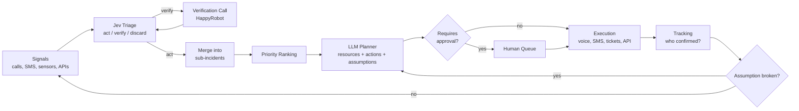
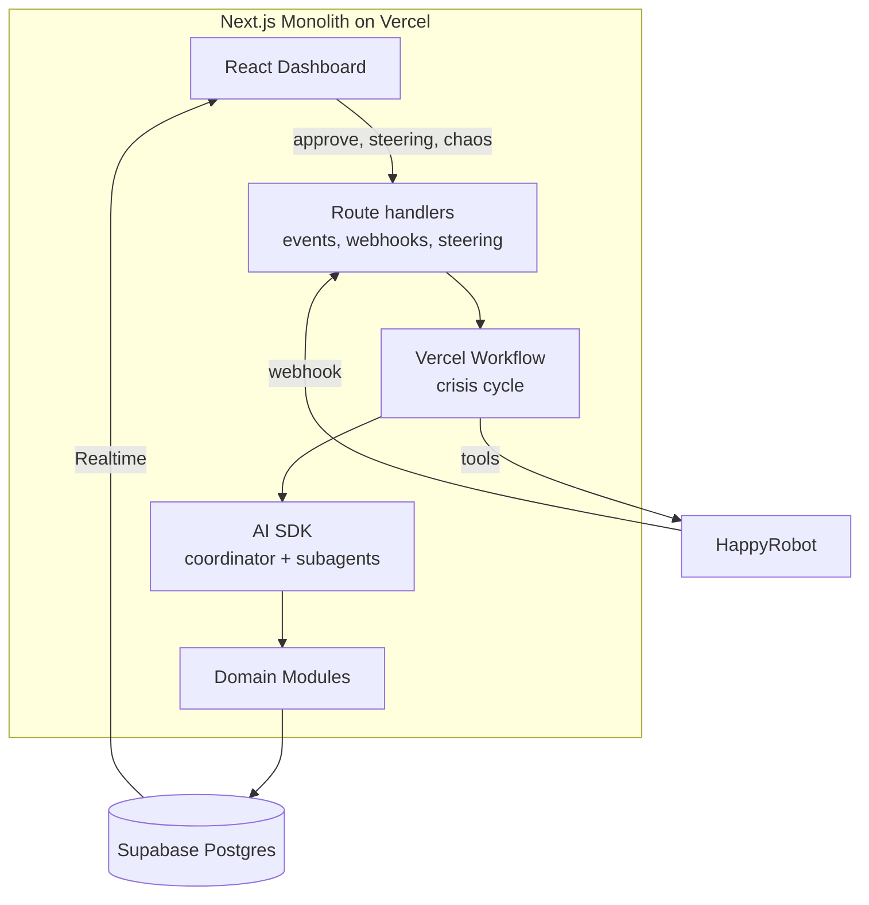

# HackSpain 2026 · Project Source of Truth

2026-09-18

## Executive Summary

We are building an **agentic command center for a wildfire in Andalusia** that makes decisions with incomplete data, acts via phone and SMS using HappyRobot, and redraws the plan as soon as one of its assumptions breaks. Name: **FARO**.

**User**: the dispatch room chief at 112 Andalucía, who coordinates firefighters, paramedics, police, and town halls. The entire dashboard, pitch, and calls speak their language and are **in Spanish**.

The core thesis that sets us apart, in one sentence: _FARO does not wait for certainty; it knows how much it knows, actively verifies what it does not know, and alerts when its own plan is no longer valid._

Three pillars support it (detailed in the Value Proposition section):

1. **Calibrated confidence + active intelligence.** Every signal carries relevance, truthfulness, and confidence; FARO separates _how severe it would be if true_ from _how likely we believe it is true_. If a missing piece of data could change the decision, it identifies that _unknown_, selects the best source, and proactively verifies it.
2. **Plan with live assumptions.** Every plan explicitly declares what it depends on (wind, open road, hospital with available beds). If an event breaks an assumption, the plan is marked invalid and replanned, complete with a diff and justification.
3. **Visible opportunity cost.** When allocating scarce resources, FARO shows who is waiting, for how long, and what operational coverage is sacrificed. The human operator can override and sees the consequence before confirming.

Demo moment: **the judges' phone rings** (playing the role of the mayor) and **the judges choose what we break** live with a chaos button. This proves it is not a scripted demo.

## The Challenge and How We Are Evaluated

The jury is HappyRobot: they score equally **how the system decides, how it acts, and how it is supervised**, and caution that the demo matters as much as the system ([challenge prompt](https://hackspain2026.happyrobot.ai)). The crisis scenario is open-ended and the environment must change while the system is running.

**Submission Requirements**

| Requirement                                    | Type      | How We Fulfill It                                                             |
| ---------------------------------------------- | --------- | ----------------------------------------------------------------------------- |
| Agentic system (decides and acts autonomously) | Mandatory | Perceive → decide → act loop without intervention; human only supervises      |
| Dynamic scenario                               | Mandatory | Scenario engine with scheduled events + chaos button operated by the judges   |
| Multi-step response                            | Mandatory | Chains: verify → prioritize → allocate → notify → confirm receipt → replan    |
| Real-world interaction                         | Mandatory | Real calls and SMS via HappyRobot, tickets with assignees, API calls          |
| Human interface                                | Mandatory | Dashboard with "what has changed", approval queue, and steering module        |
| Learns from past runs                          | Bonus     | Post-run review that generates lessons and alters behavior in subsequent runs |

**Criteria and the Question the Demo Must Answer**

| Block                | Criterion    | Judge's Question                                                      | Our Proof in the Demo                                                              |
| -------------------- | ------------ | --------------------------------------------------------------------- | ---------------------------------------------------------------------------------- |
| How it decides       | Decision     | Does it make a sensible decision without all the data?                | Signal with 62% confidence → verification call before deploying resources          |
| How it decides       | Priority     | Does it know what comes first when everything is urgent?              | Ranking with visible formula and "why" explained in one line                       |
| How it decides       | Adaptation   | Does it do something different when the situation changes?            | Wind shift breaks an assumption → plan v2 with diff                                |
| How it acts          | Coordination | Does it coordinate people, information, and resources simultaneously? | Differentiated messages to citizen, firefighter, and mayor; tracking who confirmed |
| How it acts          | Execution    | Does it execute outside the system or just propose?                   | The judge's phone rings; SMS sent to real mobile devices                           |
| How it is supervised | Control      | Is it clear what it does, and can a human intervene?                  | Evacuation approved by human; resource override with visible consequence           |
| How it is supervised | Creativity   | Do the scenario and management have a distinct identity?              | Calibrated confidence + live assumptions + judge disrupting the scenario           |
| Bonus                | Learning     | Does it learn from previous runs?                                     | Run 2 switches channel and source weight, citing the lesson learned                |

The six questions from the challenge prompt (what matters, what comes first, who to notify, where resources go, what to do now, when to scrap the plan) must be answered **on screen**, not just in code.

## Evaluation of the Original Idea

The idea covers the "how it decides" block well and the loop is sound, but it lacks four components that the judges will look for: a scenario engine, communication with the public, confirmation that actions have been executed, and an explicit criterion for scrapping the plan.

**Step-by-Step Fit**

| Original Step                                                   | Assessment | What Is Missing or What We Change                                                                                                                                                                                       |
| --------------------------------------------------------------- | ---------- | ----------------------------------------------------------------------------------------------------------------------------------------------------------------------------------------------------------------------- |
| 1. Triage with Jev (eliminate false positives)                  | Strong     | Use Jev's **probability**, not just yes/no: three outputs (act / verify / discard). Add deduplication and merging into sub-incidents                                                                                    |
| 2. Sub-incident ranking                                         | Good       | Explicit, visible formula; the "why" must be readable in one line                                                                                                                                                       |
| 3. Points of contact (police, hospital, firefighters, military) | Incomplete | Lacks **the public** (citizens, nursing homes, schools) and political decision-makers (mayor). The challenge gives the citizen / firefighter / decision-maker example. Military only as escalation, not as an MVP actor |
| 4. Resource management with cost per alert level                | Good       | Add minimum reserves and show **who is left waiting**                                                                                                                                                                   |
| 5. Dashboard with logical sequence and backup plan              | Good       | A Plan B is not enough: every plan needs declared **assumptions** that, when broken, trigger replanning                                                                                                                 |
| 6. Return to step 1                                             | Good       | Event-driven loop (not just time-based) to react in seconds                                                                                                                                                             |
| 7. Improve with past information                                | Bonus      | Concrete implementation: measurable lessons that adjust weights and channels in the next run                                                                                                                            |

**What Was Missing and Is Mandatory or Decisive**

- **Scenario engine.** Without it, there is no "dynamic scenario". It generates the noise (100 messages, 3 relevant) and the changes.
- **Closing the action loop.** Making a call is not enough: we must record who accepted the task, when, and reassign if no one responds.
- **Integration failure.** The prompt explicitly mentions it ("an integration goes down"). We need a channel fallback (SMS down → voice).
- **Graduated autonomy.** Defining what it does autonomously vs. what requires approval. This is the foundation of the control criterion.

**What to Cut to Win**

- Map of all Andalusia → **one district / county** with zoom (e.g., Serranía de Ronda / Sierra Bermeja). Understood in two seconds.
- Ten dashboard modules → **six zones** on a single screen (see Dashboard section).
- Military, police, hospitals, firefighters all integrated → **real HappyRobot channels and tickets** (inbound and outbound voice, SMS, WhatsApp, email; tickets in Supabase) with the rest simulated via API.
- "Subagents running" as a large module → a small strip; the jury cares about what they do, not how many there are.

## Differentiating Value Proposition

Most teams will show a dashboard with an LLM that summarizes and proposes. We win by showing **a system that knows how much it knows, acts in the real world, and detects when its plan has expired**.

**Narrative: System 1 + System 2**

In a crisis, one must be fast with noise and deliberate with what matters. Jev (TypeSafe, a "System One Model" with typed decisions and calibrated confidence, ~0.1 s per decision according to [TypeSafe](https://typesafe.ai)) filters the deluge. A reasoning LLM (System 2) only plans over what has passed the filter. HappyRobot represents **the hands**: calling, texting, and confirming. It is a compelling, easy-to-tell story that aligns with how both products are marketed.

**Pillar 1 · Calibrated Confidence + Active Intelligence**

- Every signal emerges from triage with p(relevant), p(truthful), urgency, and source; when merged into an incident, we keep **impact/criticality** and **confidence** separate.
- Confidence does not automatically lower criticality: a signal with very high potential impact and medium confidence can be far more critical than a minor, fully confirmed incident.
- FARO asks: **what unknown data point has the greatest capacity to alter my current decision?** That _unknown_ receives a _decision impact / value of information_ score and its resolution is prioritized.
- It then selects the best verification route: API or official source if available; sensor; deployed first responder; or call/SMS via HappyRobot to a witness, forest ranger, town hall, etc.
- The output is not merely "act / verify / discard": it can **act**, **prepare a response while verifying**, **verify urgently**, **observe**, or **discard**. Verifying is an action, not a waiting state.

**Pillar 2 · Plan with Live Assumptions**

- Every plan lists its assumptions: "NE wind < 30 km/h", "A-397 open", "Hospital Costa del Sol with ≥ 10 beds", "SMS operational".
- Every new event is cross-referenced with the assumptions. If it breaks one, the plan turns **INVALID** in red and v2 is generated with a diff: what changes, why, and what actions are cancelled.
- It directly answers "when to scrap the plan" and is highly visual.

**Pillar 3 · Visible Opportunity Cost**

- When allocating 3 ambulances across 5 requests, FARO shows the 2 that are waiting, their estimated ETA to care, and the accepted **coverage cost**: which area is left less protected and for how long.
- If the human operator forces a different allocation, they see before confirming which location is left uncovered and how operational coverage changes.
- It answers "where resources go" and reinforces human control.

**Two Demo Highlights No One Else Will Have**

- **The judge's phone rings.** A member of the jury plays the mayor of a town; FARO calls them via HappyRobot, delivers an alert tailored to their role, and asks them to confirm opening the sports pavilion as a shelter. Their response updates the plan on screen.
- **The jury disrupts the scenario.** Three chaos buttons (shift wind, close highway, drop SMS). The jury chooses; FARO adapts live. Proves it is not scripted.

**Closing Pitch Line:** "In the DANA floods and major wildfires, the problem was not a lack of data, but deciding and alerting in time with incomplete data. FARO is built for that exact minute."

## Scenario

We chose a **wildfire in the wildland-urban interface of Sierra Bermeja (Málaga)**, fictional but inspired by real fires in the area. It matches the challenge prompt's own example ("the wind shifts"), affects towns, residential developments, and highways, and generates the exact decisions being evaluated.

**Why a wildfire and not DANA floods**: the fire front moves continuously (visible adaptation on the map), aerial and ground resources are scarce, and evacuations involve vulnerable populations. DANA is a solid backup if another team chooses wildfire; it can be swapped simply by rewriting the scenario engine.

**Initial World (Simulated)**

- Area: Estepona, Jubrique, Genalguacil, Benahavís, and the fictional residential development "Los Pinares" (~600 residents).
- Vulnerable sites: nursing home (45 residents), rural school, campsite (~120 people).
- Roads: A-397, MA-8301, AP-7.
- Resources: 3 ambulances, 2 helicopters, 6 fire crews, 4 police patrols, 2 evacuation buses, 1 sports pavilion as a shelter.
- Hospitals: Costa del Sol (Marbella) and Serranía (Ronda), with simulated bed availability.

The simulator knows the **ground truth** of every variable, but FARO does not. The agent can only reconstruct it from incoming signals; this enables measuring _time-to-truth_ and proving that verification calls genuinely reduce uncertainty.

**Demo Timeline (Compressed Clock: 1 real min ≈ 10 crisis min)**

| T   | Event                                                              | What FARO Must Do                                                                            |
| --- | ------------------------------------------------------------------ | -------------------------------------------------------------------------------------------- |
| T+0 | ~40 messages arrive: sightings, duplicates, a hoax, a sensor alert | Triage: merges into 3 sub-incidents, discards the hoax, verifies one via phone call          |
| T+1 | Plan v1 with assumption "NE wind"                                  | Allocates resources, alerts firefighters, sends preventive SMS to Los Pinares                |
| T+2 | Call to the mayor (judge)                                          | Requests opening the pavilion; their response confirms or changes the shelter                |
| T+3 | **Chaos 1: wind shifts to SW**                                     | Breaks assumption → plan v2: nursing home becomes priority 1, evacuation queued for approval |
| T+4 | **Chaos 2: A-397 blocked**                                         | Recalculates routes and ETAs; reassigns buses via MA-8301                                    |
| T+5 | **Chaos 3: SMS provider goes down**                                | Detects delivery failure, falls back to voice calls for critical contacts                    |
| T+6 | 50 additional people discovered at the campsite                    | Reprioritizes; displays who is left waiting                                                  |
| T+7 | Wrap-up                                                            | Summary of actions, confirmations, and recorded lessons                                      |

The three chaos events are also automated on a timer in case the judges do not click the buttons. The sequence can change without breaking the demo.

## Agent Flow

FARO runs an event-driven loop (triggered by each new signal, call response, scenario change) and, as a safety net, every 30 seconds.



The decision log (what, why, with what confidence, who executed it) powers the dashboard and the learning module.

**Decision Rules**

| Situation                                               | Rule                                                                                                             |
| ------------------------------------------------------- | ---------------------------------------------------------------------------------------------------------------- |
| New signal                                              | Jev estimates relevance/truthfulness and detects duplicates; FARO keeps potential impact and confidence separate |
| Multiple signals from same location (< 500 m, < 10 min) | Merged; confidence increases with independent sources and the Digital Twin is updated                            |
| Source with error history                               | Its confidence is multiplied by its learned reliability                                                          |
| Unknown can change a high-impact decision               | FARO computes its value of information, selects the best available source, and initiates active verification     |
| Assigned task unconfirmed after 2 min                   | Redial / recontact; at 4 min, task is reassigned and human is alerted                                            |
| Channel fails (delivery error or no answer)             | Next channel: SMS → WhatsApp → voice → email or alternate contact within the same agency                         |
| Resource below minimum reserve                          | Not assigned unless priority 1; if assigned, flagged in red                                                      |
| Event contradicts an assumption                         | Plan invalid, immediate replan, visible diff                                                                     |

**Graduated Autonomy** (foundation of the control criterion)

| Action Type                            | Reversible | Level                                                                             |
| -------------------------------------- | ---------- | --------------------------------------------------------------------------------- |
| Verification call, informational alert | Yes        | Autonomous                                                                        |
| Assign or dispatch a resource          | Yes        | Autonomous with feed alert; human can undo                                        |
| Mass public alert                      | Partial    | **Always human approval**; FARO prepares audience, content, channel, and evidence |
| Evacuation order, request military/UME | No         | Always human approval                                                             |

The human operator can adjust these levels up or down from the steering module.

## Crisis Digital Twin

The **Crisis Digital Twin** is the continuously updated operational representation of what FARO believes is occurring. It is the **single source of truth** upon which the coordinator and subagents reason; the map is merely a geographic visualization of a portion of the Twin. The agents **do not plan directly on raw calls, SMS, or feeds**: they first translate those signals into evidence and Twin state transitions.

**Core Twin Entities**

- **Incidents**: type, location/polygon, impact, affected persons, trend, confidence, and status.
- **Resources**: capacity, location, availability, current mission, ETA, and minimum reserve.
- **People / Groups**: affected population, vulnerabilities, location, and evacuation/care status.
- **Infrastructure / World Objects**: roads, hospitals, shelters, communications network, safe zones, and any physical object that conditions a plan.
- **Evidence**: signals and corroborations justifying each fact in the Twin, with source, timestamp, and reliability.
- **Plans / Assumptions**: active plan, alternatives, supporting assumptions, and dependencies.
- **Actions / Tasks**: what is being done, who is doing it, status, confirmation, and outcome.

A signal never overwrites reality without an audit trail. The chain is preserved:

`raw signal → evidence → state change → decision impact → action`

For example: a call reports the A-397 is closed → converted to evidence → merged with another source → `A-397.status = CLOSED` in the Twin → dependent routes and plans identified → plan marked invalid and recalculated.

### Ground Truth vs. FARO Digital Twin

The scenario engine maintains a hidden **Ground Truth World**: what is actually happening in the simulation (actual wind, highway actually closed, people actually exposed, etc.). FARO **cannot read this state directly**. It only observes calls, sensors, APIs, and sources of varying quality, reconstructing its own reality within the Digital Twin.

This separation allows measuring whether the system is genuinely improving, rather than merely shuffling UI widgets:

- **Time-to-truth**: time elapsed between a real-world change and FARO correctly incorporating it into the Twin.
- **Twin accuracy**: proportion of relevant facts correctly represented.
- **False / stale state rate**: false or outdated facts that FARO maintains as active.
- **Uncertainty reduction**: how much uncertainty drops following active verification.
- **Decision recovery time**: time from an assumption breaking until a new executable plan exists.

### Active Intelligence: Resolving What Matters to Know

FARO does not verify all questionable signals equally. The coordinator identifies **unknowns** tied to active decisions and estimates their _decision impact_: how much priority, allocation, or the plan could shift if that data point were different.

`unknown → decision impact / value of information → best source → verification action → new evidence → Twin update`

Example: if the last bus can be dispatched to either the campsite or the nursing home and the decision hinges on whether the MA-8301 remains open, FARO prioritizes verifying that road over a secondary signal. If an official API exists, it queries it; otherwise, it asks a first responder or initiates a HappyRobot call. For high-impact decisions, it can **prepare a reversible response while verifying**, rather than passively waiting for certainty.

## Technical Architecture

FARO is a **modular monolith in TypeScript**: a single Next.js repository deployed on Vercel, with Supabase for data. Core division: **AI SDK decides; Workflow coordinates execution; Supabase maintains state; HappyRobot acts; Next.js enables supervision and intervention.**

**Stack**

| Technology          | Purpose                                                                                                                             |
| ------------------- | ----------------------------------------------------------------------------------------------------------------------------------- |
| TypeScript          | Common language across frontend, backend, and agents; shared types                                                                  |
| Zod                 | Unified schemas for events, model outputs, and tool arguments, shared between frontend and backend                                  |
| Next.js + React     | Crisis dashboard and endpoints (route handlers) for events, webhooks, and human intervention                                        |
| Vercel AI SDK       | Coordinator and subagents: model calls, tools, and multi-step decisions with structured output                                      |
| Vercel Workflow     | Persistent execution: steps, sleeps/waits, retries, and resumption upon receiving results (e.g., call webhooks)                     |
| Supabase PostgreSQL | Perceived Digital Twin: signals/evidence, incidents, infrastructure, resources, plans, assumptions, actions, decisions, and lessons |
| Supabase Realtime   | Updating the dashboard whenever the crisis state changes                                                                            |
| HappyRobot          | Executing phone calls and remaining communication channels available on the platform                                                |
| Jev (TypeSafe)      | Fast triage with typed decisions and calibrated confidence (access confirmed)                                                       |
| Vercel              | Deployment of frontend, endpoints, and workflows within the same project                                                            |

Excluded from the first version: Convex, Python/PydanticAI, separate worker, and Supabase Queues.



**Monolith Modules** (boundaries by folder; each module exposes typed functions and exclusively writes to its own tables)

| Module           | Responsibility                                                                                                                             | Tables Owned                 |
| ---------------- | ------------------------------------------------------------------------------------------------------------------------------------------ | ---------------------------- |
| `scenario`       | **Hidden ground truth** of the simulated world, scheduled events, chaos buttons, and noise generation; never directly accessible by agents | world_state, scenario_events |
| `ingest`         | Normalize inputs (HappyRobot, simulator, APIs) into a Zod-validated `Signal`                                                               | signals                      |
| `triage`         | Act / verify / discard with probability (Jev or LLM fallback)                                                                              | signals (status)             |
| `incidents`      | Signal merging, impact/criticality, confidence, and perceived incident status                                                              | incidents                    |
| `infrastructure` | Perceived status of roads, hospitals, shelters, communications, and other Digital Twin world objects                                       | infrastructure               |
| `intelligence`   | Detect unknowns capable of changing a decision, estimate value of information, and initiate the best verification                          | intelligence_tasks           |
| `resources`      | Availability, reserves, allocation, and coverage cost / "who is waiting"                                                                   | resources, assignments       |
| `planning`       | Plan with assumptions, Plan B, diff between versions, invalidation                                                                         | plans, assumptions           |
| `execution`      | Tools interfacing with HappyRobot and tickets; confirmation tracking and channel fallback                                                  | actions, tickets             |
| `control`        | Graduated autonomy, approval queue, human steering                                                                                         | approvals, directives        |
| `learning`       | Post-run review and lessons                                                                                                                | lessons, runs                |
| `audit`          | Immutable log of events and decisions                                                                                                      | events, decisions            |

**Agents (AI SDK)**

- **Coordinator**: receives summarized state, decides which subagents to spawn, and consolidates the plan.
- **Triage Subagent**: batch classifies signals (delegating to Jev).
- **Planning Subagent**: resource allocation, next action per incident, assumptions, and Plan B.
- **Communication Subagent**: drafts messages tailored by role (citizen, firefighter, mayor) and selects channel.
- All tools have Zod arguments; deterministic operations (ranking, allocation, assumption validation) are code, not LLM. The LLM proposes, code validates.

**Crisis Cycle Workflow (Vercel Workflow)**

1. `ingest` → `triage` step: signals are normalized, deduplicated, and converted to evidence.
2. `incidents` / `infrastructure` step: evidence updates the **perceived Digital Twin**, never ground truth directly.
3. `intelligence` step: unknowns with high impact on active decisions are identified; if worthwhile, verification is dispatched via API/sensor/HappyRobot and the workflow waits or prepares a reversible response.
4. `planning` step (coordinator + subagents): prioritization, allocation, actions, and assumptions using exclusively the Twin.
5. `control` step: autonomous actions proceed; actions requiring approval await dashboard events.
6. `execution` step: call/SMS via HappyRobot, awaiting results with timeout, retry, or channel shift.
7. Any result or event returns as evidence; if an assumption is broken, it triggers a new cycle with plan v+1.

**HappyRobot: Deep, Non-Decorative Use** (the jury is their team)

- **Active Intelligence / Verification Agent**: receives a concrete unknown and its information objective; queries or calls the selected source and returns structured fields (confirms smoke, direction, people, road status, capacity, etc.).
- **Coordination Agent**: calls firefighters/police/mayor with role-tailored messaging and gathers "accept / cannot / need X".
- **Citizen Overflow Line** (HappyRobot native channel): inbound calls and SMS from citizens converted into signals.
- **Public Alerts** across available channels, segmented by zone and vulnerability.
- Transcripts and outcomes return via webhook and serve as the raw input for learning ([platform](https://www.happyrobot.ai/product/platform-overview)).

**Jev: Where to Use and Where Not to Use**

- Yes: closed, high-volume questions (relevant?, duplicate?, urgent?, did the call confirm the fire?).
- No: planning or message drafting; that belongs to the AI SDK with the primary model.
- Display triage cost and latency on screen: it is a measurable argument.

## Data Model and Formulas

Ten entities suffice for the operational Digital Twin; the simulator's `world_state` remains isolated as hidden ground truth. All entities link to an immutable event log for replay, auditing, and learning.

| Entity         | Key Fields                                                                                                                         |
| -------------- | ---------------------------------------------------------------------------------------------------------------------------------- |
| Signal         | id, source, channel, text/audio, location, timestamp, p_relevant, p_truthful, urgency, status (act/verify/discard), reason         |
| Incident       | id, type, location/polygon, signals[], severity 1–5, exposed persons, vulnerability, time to harm, confidence, priority, status    |
| Resource       | id, type, capabilities, location, status (idle/assigned/en_route/out_of_service), ETA, minimum reserve for type, coverage provided |
| Infrastructure | id, type (road/hospital/shelter/communications…), location/geometry, perceived status, capacity, confidence, linked evidence       |
| Contact        | id, role (citizen, firefighter, mayor, hospital…), agency, channels, learned reliability, language                                 |
| Plan           | version, timestamp, assignments[], actions[], assumptions[], plan_B, status (active/invalid), diff from previous                   |
| Assumption     | id, text, world variable, condition, status (ok/broken), breaking event                                                            |
| Action         | id, type (call/SMS/ticket/API), recipient, content, autonomy level, status, outcome, confirmation                                  |
| Decision       | id, what, why, confidence, author (FARO/human), timestamp, inputs used                                                             |
| Lesson         | id, source run, observed pattern, applied change, justifying metric                                                                |

**Impact / Criticality of a Sub-Incident** (weights editable via steering)

Criticality measures **how severe the situation would be if true** and is not multiplied by confidence. This prevents masking a potential catastrophe simply because it is not yet fully confirmed.

```latex
I = G \cdot \log_{10}(1 + N) \cdot V \cdot \frac{1}{1 + t_{\text{harm}}/15}
```

G = severity (1–5), N = exposed persons, V = vulnerability multiplier (1; 1.5 school; 2 nursing home), t_harm = estimated minutes until harm. **Confidence C** is displayed as an independent second axis. The dashboard summarizes both: "Impact 94 · confidence 0.43 · 45 seniors · front ~20 min away".

**Impact × Confidence → Action Matrix**

| Impact     | Confidence | FARO Behavior                                                 |
| ---------- | ---------- | ------------------------------------------------------------- |
| High       | High       | Act and execute the plan                                      |
| High       | Medium     | Prepare reversible response + immediate verification          |
| High       | Low        | Priority verification; preposition if cost of waiting is high |
| Low/Medium | High       | Queue / standard response                                     |
| Low/Medium | Low        | Observe or discard with justification                         |

Attention ordering primarily uses impact, time to harm, and available coverage; confidence determines **how much to verify and what level of autonomy is safe**, not whether the potential risk exists.

**Resource Allocation**

- Greedy allocation by descending priority: to each incident, the suitable free resource with the lowest ETA.
- Constraint: do not drop below the minimum reserve per type unless priority 1.
- **Coverage cost**: before committing a resource, estimate which zone/incident is left with poorer coverage, how much its ETA increases, and what operational reserve is consumed.
- Mandatory output: list of **uncovered incidents** with estimated wait time and residual coverage. This is the "opportunity cost" of Pillar 3.
- Economic cost per hour can be tracked as a secondary metric, but does not govern critical emergency decisions.
- If time permits: replace greedy allocation with a small optimization problem (OR-Tools). Not required to win.

**Fused Confidence**: with k independent sources of reliability r_i and probabilities p_i, C = 1 − ∏(1 − p_i · r_i). Simple, explainable, and ensures two witnesses carry more weight than one.

## Dashboard

A single screen, six zones; the prompt calls for understanding the situation "in two seconds", so the first thing read is **what has changed**.

```
┌──────────────────────────────────────────────────────────────────┐
│ 1. CHANGE BAR: alert level · last 5 min · plan v2 ⚠              │
├───────────────┬──────────────────────────────┬───────────────────┤
│ 2. PRIORITIES │ 3. MAP (district)            │ 4. ACTION FEED    │
│ ranking + why │ front, wind, incidents,      │ what it does/did  │
│ (1 line)      │ resources, blocked roads     │ confirmations     │
│               │                              │ live calls        │
├───────────────┴──────────────┬───────────────┴───────────────────┤
│ 5. RESOURCES + WHO WAITS     │ 6. PLAN, ASSUMPTIONS & STEERING   │
│ idle/assigned, reserves      │ assumptions ok/broken, diff v1→v2,│
│                              │ approvals, human command box      │
└──────────────────────────────┴───────────────────────────────────┘
```

| Zone               | What It Displays                                                                                                     | Absorbed Team Modules                          |
| ------------------ | -------------------------------------------------------------------------------------------------------------------- | ---------------------------------------------- |
| 1. Change Bar      | Alert level, 3 recent changes, plan status                                                                           | Adaptation (summary)                           |
| 2. Priorities      | Live ranking, up/down arrows, reason                                                                                 | Real-time ranking                              |
| 3. Map             | Geographic view of Digital Twin: front, wind, incidents, resources, infrastructure, routes, and blockages            | Tactical map                                   |
| 4. Action Feed     | Each action with status (sent, answered, confirmed, failed), live call transcript, compact strip of active subagents | What it did, subagents, authority coordination |
| 5. Resources       | Availability, minimum reserves, uncovered incidents with wait time                                                   | Resource management                            |
| 6. Plan & Steering | Active plan, assumptions with status indicators, diff between versions, Plan B, approval queue, command box          | Action plan, steering, adaptation (detail)     |

**Context: What We Know and What We Don't.** The "context module" becomes an expandable panel with two columns: _confirmed_ and _unconfirmed / unknown_. Each unknown displays its **impact on active decisions**, the source selected to resolve it, and verification in progress. Showing what is unknown is rare and conveys operational maturity.

**Human Steering**: natural language text box ("prioritize the school", "do not use Helicopter 2") that the planner translates into a visible constraint. Quick action buttons: approve, reject, undo, pause autonomy.

**Chaos Buttons** (demo mode only): shift wind, cut highway, crash SMS, +50 people. Prominent and clear for the judges to press.

## Cross-Run Learning

At the end of each run, the learning module (deterministic rules, no LLM) reads the decision log and HappyRobot outcomes, calculates metrics, and writes **lessons** that the next run loads as configuration. No model retraining required: rules and weights adjust dynamically, always accompanied by the metric that justifies them.

| Metric                                      | Typical Lesson                                                                | Applied Change                                 |
| ------------------------------------------- | ----------------------------------------------------------------------------- | ---------------------------------------------- |
| Time to confirmation by contact and channel | "Estepona Firefighters do not answer calls at night; responds to SMS in 40 s" | Preferred channel for this contact = SMS       |
| Accuracy by source                          | "Social media: 4 out of 6 signals were false"                                 | Source reliability drops from 0.7 to 0.4       |
| Useless verifications                       | "90% of signals with p > 0.8 were confirmed"                                  | Verification threshold lowers from 0.85 to 0.8 |
| Idle or over-allocated resources            | "Helicopter 2 was unassigned for 25 min"                                      | Minimum reserve adjustment                     |
| Human overrides                             | "Operator prioritized the school over the residential development 3 times"    | School vulnerability multiplier increases      |

**How It Is Demonstrated**: we run the scenario once before the pitch. In the demo, the lessons panel displays 2–3 loaded lessons, and the feed shows a tagged action, e.g., "SMS instead of call · lesson #3". This makes the bonus visible in 10 seconds.

Lessons are validated by a human before activation (approve / discard), consistent with the control criterion.

## Demo Script and Pitch

Designed for 5 minutes (duration to be confirmed); each block showcases at least one criterion, with most of the time spent on a live running system, not slides.

| Time      | What Happens                                                                                                                                           | Who Speaks        | Criterion Demonstrated            |
| --------- | ------------------------------------------------------------------------------------------------------------------------------------------------------ | ----------------- | --------------------------------- |
| 0:00–0:30 | Hook: "It is 16:05, 40 messages pour in. Only 3 matter. Which ones?" Screen shows the deluge                                                           | Presenter         | Problem                           |
| 0:30–1:15 | Live triage: hoax discarded with explanation, duplicates merged, signal at 62% → FARO calls to verify (call audio played)                              | Presenter + audio | Decision                          |
| 1:15–2:00 | Ranking and allocation: 3 ambulances, 5 requests, showing who waits. **Judge's phone rings**: FARO calls them as mayor                                 | Judge answers     | Priority, Coordination, Execution |
| 2:00–3:15 | "Choose what we break": judge clicks shift wind → assumption turns red → plan v2 with diff; nursing home evacuation queued; we approve                 | Judge + operator  | Adaptation, Control               |
| 3:15–3:45 | Second chaos: SMS goes down → FARO falls back to voice autonomously                                                                                    | Operator          | Adaptation, Execution             |
| 3:45–4:15 | Lessons panel from previous run and action tagged with lesson                                                                                          | Presenter         | Learning                          |
| 4:15–5:00 | Wrap-up: run metrics (signals triaged, calls, confirmations, **time-to-truth**, uncertainty reduction, mean replan time, triage cost) and closing line | Presenter         | Creativity, Impact                |

**Staging Rules**

- Collect the judge's phone number before the pitch (or use a team member in the audience as Plan B).
- Always project the dashboard; never switch to a terminal.
- Route call audio through the room's speakers.
- Have a recorded **backup video** of the full demo in case of network failure.
- Rehearse multiple times with a stopwatch once code is frozen.

**Likely Questions from Judges and Short Answers**

- _What happens if the LLM makes a mistake?_ → Irreversible actions always require human approval; everything is logged with its confidence score.
- _Does this scale to a real crisis?_ → Jev triages at negligible cost per signal; HappyRobot already handles thousands of interactions daily.
- _What is real and what is simulated?_ → Phone calls, SMS, and tickets are real; the physical world (fire, sensors) is simulated. Stating this directly builds credibility.

## MVP Scope, Team, and Phases

Golden rule: **everything we build must appear in the demo**. If it does not show in the 5 minutes, it is not built.

**Scope**

| Level        | Includes                                                                                                                                                                                                                                                                                                     |
| ------------ | ------------------------------------------------------------------------------------------------------------------------------------------------------------------------------------------------------------------------------------------------------------------------------------------------------------ |
| Must-Have    | Scenario engine with hidden ground truth + 3 chaos events; perceived Digital Twin; triage/merging; impact + confidence; allocation with "who waits" and coverage cost; plan with assumptions and diff; 2 HappyRobot workflows (verification and coordination) with webhook; 6-zone dashboard; human approval |
| Should-Have  | **Active Intelligence** based on value of information; citizen inbound line (calls and SMS); WhatsApp and email as alert and fallback channels; SMS → voice channel fallback; confirmation tracking with reassignment; lessons from a prior run; wrap-up metrics                                             |
| Could-Have   | Natural language steering; ticket integration with external tools; OR-Tools optimizer                                                                                                                                                                                                                        |
| Out of Scope | Real integrations with 112/police/military; real satellite data; coverage of all Andalusia                                                                                                                                                                                                                   |

**Team Roles (5 members)**

| Role                    | Lead            | Responsibility                                                                                                                                                                                           |
| ----------------------- | --------------- | -------------------------------------------------------------------------------------------------------------------------------------------------------------------------------------------------------- |
| HappyRobot / Automation | Arribas         | Build workflows, configure agents and prompts in HappyRobot, integrate calls and messages with backend via webhooks, and prepare tests with explicit simulation.                                         |
| Backend / Data          | Zuki            | Data model, state, log, rules, coordinator and planner, priorities, resource allocation, APIs, and HappyRobot event ingestion.                                                                           |
| Sidecar / Integration   | Sifri           | Start by supporting backend and take ownership of the end-to-end flow: integration, test scenario, end-to-end testing, and deployment preparation. Support frontend or other areas based on bottlenecks. |
| Frontend / Experience   | Álvaro (Málaga) | Dashboard, map, real-time feed, approvals, and chaos buttons; make agent actions, outcomes, and operator intervention capabilities visible.                                                              |
| Product / Demo          | Luisan          | Define the problem and value proposition, prioritize and defend MVP scope, decide what is in and out, and prepare the scenario script, pitch, backup video, and rehearsals.                              |

Each person is responsible for their domain but collaborates across others.
Sifri has a dedicated integration mission and shifts based on team bottlenecks.
Luisan evaluates new ideas by their demonstrable value and prevents unnecessary scope creep.

First shared milestone: a minimal flow **frontend → backend → HappyRobot → visible result on frontend**, with test data and identified simulations where necessary. From there, complete the vertical slice described in subsequent phases. Real communications and deployment follow the authorizations in PROJECT.md.

**Build Phases** (sequence, not schedule: do not move to the next without completing the previous)

| Phase                 | Exit Criteria                                                                                                                                                                                                 |
| --------------------- | ------------------------------------------------------------------------------------------------------------------------------------------------------------------------------------------------------------- |
| 1. Contracts          | Shared Zod schemas (events, signals, incidents, infrastructure, resources, actions, plan), ground truth / Digital Twin separation, Supabase tables, tested HappyRobot and Jev accounts                        |
| 2. Minimal End-to-End | A signal arrives, Jev triages it, an action is generated, and HappyRobot executes a real call whose result appears on the dashboard                                                                           |
| 3. Complete Decision  | Scenario with all 3 chaos events; Twin updated solely via evidence; impact + confidence; allocation with coverage cost; plan with assumptions and diff; at least one unknown resolved via Active Intelligence |
| 4. Robust Execution   | All channels; channel fallback; tickets with confirmation and reassignment; approvals                                                                                                                         |
| 5. Learning & Polish  | Training run → lessons; polished dashboard; backup video                                                                                                                                                      |
| 6. Rehearsal          | Code frozen; script rehearsals only                                                                                                                                                                           |

Phase 2 is critical: with it, mandatory requirements are fulfilled in minimal form; the rest is refinement.

## Risks and Open Questions

The biggest risk is not technical but scope creep: the original idea contains a month's worth of work. The second is live dependence on phone calls and network connectivity.

| Risk                                             | Probability | Mitigation                                                                            |
| ------------------------------------------------ | ----------- | ------------------------------------------------------------------------------------- |
| Scope too large                                  | High        | "If it does not show in the demo, it is not built" rule; mandatory H+8 milestone      |
| Jev rate limits or downtime during demo          | Medium      | Swappable triage interface; fallback using small LLM with structured output           |
| Live call fails (network, phone number, latency) | Medium      | Backup phone number; pre-recorded video; demo continues even if call fails to connect |
| Planner LLM produces invalid JSON or absurd plan | Medium      | Schema validation, retry, deterministic rules overruling LLM                          |
| Dashboard confusing to judges                    | Medium      | Top change bar; test with an outsider to verify they understand it in 10 s            |
| Another team also chooses wildfire               | High        | Our differentiator is not the scenario, but the 3 pillars and live judge interaction  |

**Questions to Clarify with the HappyRobot Team Upon Arrival**

- [ ] How long is the pitch, and how many questions are there?
- [ ] Can we call and send SMS to Spanish mobile numbers belonging to judges during the demo?
- [ ] Which channels are active on hackathon accounts (voice, SMS, WhatsApp, email)?
- [ ] How do we receive call outcomes: webhook, executions API, or both?
- [ ] What are the concurrent call and cost limits on the account?
- [ ] What are the Jev requests-per-minute limits on our account?

**Open Team Decisions**

- [ ] Scenario: confirmed wildfire in Sierra Bermeja.
- [ ] Name: FARO (confirmed).
- [ ] Primary AI model for coordinator and subagents (TBD).
- [ ] Who serves as the pitch voice and who operates the demo.

**Sources**

- [HackSpain 2026 Challenge Prompt](https://hackspain2026.happyrobot.ai)
- [TypeSafe AI · Jev](https://typesafe.ai)
- [HappyRobot · Platform Overview](https://www.happyrobot.ai/product/platform-overview)
- [HappyRobot · Agents](https://www.happyrobot.ai/product/agents/agents-overview)
