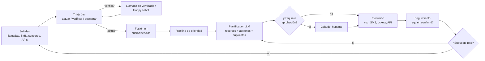
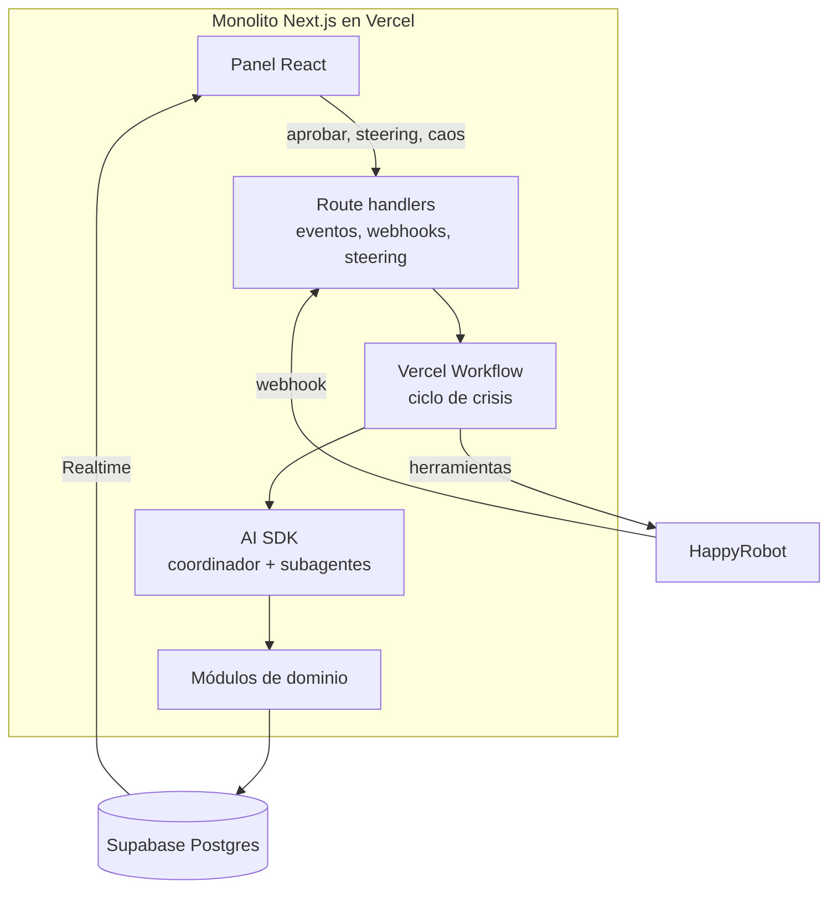

# HackSpain 2026 · Source of Truth del proyecto

2026-09-18

## Resumen ejecutivo

Construimos un **centro de mando agéntico para un incendio forestal en Andalucía** que decide con datos incompletos, actúa por teléfono y SMS con HappyRobot, y rehace el plan en cuanto uno de sus supuestos se rompe. Nombre: **FARO**.

**Usuario**: el jefe de sala del 112 Andalucía, que coordina bomberos, sanitarios, policía y ayuntamientos. Todo el panel, el pitch y las llamadas hablan su lenguaje y van **en español**.

La tesis que nos diferencia, en una frase: _FARO no espera a tener certeza; sabe cuánto sabe, sale a comprobar lo que no sabe y avisa cuando su propio plan deja de ser válido._

Tres pilares la sostienen (detalle en la sección de propuesta de valor):

1. **Confianza calibrada + inteligencia activa.** Cada señal lleva relevancia, veracidad y confianza; FARO separa _qué grave sería si fuese cierta_ de _cuánto creemos que es cierta_. Si falta un dato capaz de cambiar la decisión, identifica ese _unknown_, elige la mejor fuente y sale a verificarlo.
2. **Plan con supuestos vivos.** Cada plan declara de qué depende (viento, carretera abierta, hospital con camas). Si un evento rompe un supuesto, el plan se marca inválido y se rehace, con diff y justificación.
3. **Coste de oportunidad visible.** Al repartir recursos escasos, FARO muestra quién espera, cuánto y qué cobertura operacional se sacrifica. El humano puede corregir y ve la consecuencia antes de confirmar.

Momento demo: **el teléfono del jurado suena** (hace de alcalde) y **el jurado elige qué rompemos** en directo con un botón de caos. Así demostramos que no es un guion fijo.

## El reto y cómo nos evalúan

El jurado es HappyRobot: puntúa por igual **cómo decide, cómo actúa y cómo se supervisa** el sistema, y avisa de que la demo cuenta tanto como el sistema ([enunciado](https://hackspain2026.happyrobot.ai)). La crisis es libre y el entorno debe cambiar mientras el sistema corre.

**Requisitos de entrega**

| Requisito                              | Tipo        | Cómo lo cumplimos                                                                       |
| -------------------------------------- | ----------- | --------------------------------------------------------------------------------------- |
| Sistema agéntico (decide y actúa solo) | Obligatorio | Bucle percibir → decidir → actuar sin intervención; el humano solo supervisa            |
| Escenario que se mueve                 | Obligatorio | Motor de escenario con eventos programados + botón de caos manejado por el jurado       |
| Respuesta de varios pasos              | Obligatorio | Cadenas: verificar → priorizar → asignar → avisar → confirmar recepción → replanificar  |
| Interacción de verdad                  | Obligatorio | Llamadas y SMS reales vía HappyRobot, tickets con responsable, llamadas a APIs          |
| Interfaz para la persona               | Obligatorio | Dashboard con "qué ha cambiado", cola de aprobaciones y módulo de steering              |
| Aprende de ejecuciones pasadas         | Bonus       | Revisión post-ejecución que genera lecciones y cambia el comportamiento en la siguiente |

**Criterios y la pregunta que debe responder la demo**

| Bloque            | Criterio     | Pregunta del jurado                             | Nuestra prueba en demo                                                               |
| ----------------- | ------------ | ----------------------------------------------- | ------------------------------------------------------------------------------------ |
| Cómo decide       | Decisión     | ¿Decide algo sensato sin todos los datos?       | Señal con 62 % de confianza → llamada de verificación antes de mover medios          |
| Cómo decide       | Prioridad    | ¿Sabe qué va primero cuando todo es urgente?    | Ranking con fórmula visible y el "por qué" en una línea                              |
| Cómo decide       | Adaptación   | ¿Hace algo distinto cuando cambia la situación? | Cambio de viento rompe un supuesto → plan v2 con diff                                |
| Cómo actúa        | Coordinación | ¿Lleva a la vez gente, información y medios?    | Mensajes distintos a vecino, bombero y alcalde; seguimiento de quién confirmó        |
| Cómo actúa        | Ejecución    | ¿Ejecuta fuera del sistema o solo propone?      | El teléfono del jurado suena; SMS a móviles reales                                   |
| Cómo se supervisa | Control      | ¿Se entiende qué hace y se puede intervenir?    | Aprobación de evacuación por el humano; override de recurso con consecuencia visible |
| Cómo se supervisa | Creatividad  | ¿Escenario y gestión tienen algo propio?        | Confianza calibrada + supuestos vivos + jurado que rompe el escenario                |
| Bonus             | Aprendizaje  | ¿Aprende de ejecuciones anteriores?             | Ejecución 2 cambia de canal y de peso de fuente, citando la lección                  |

Las seis preguntas del enunciado (qué importa, qué va primero, a quién se avisa, dónde van los recursos, qué se hace ahora, cuándo tirar el plan) deben verse respondidas **en pantalla**, no solo en el código.

## Evaluación de la idea original

La idea cubre bien el bloque "cómo decide" y el bucle es correcto, pero le faltan cuatro piezas que el jurado va a buscar: un motor de escenario, comunicación con la población, confirmación de que las acciones se han hecho, y un criterio explícito para tirar el plan.

**Encaje paso a paso**

| Paso original                                                | Valoración | Qué le falta o qué cambiamos                                                                                                                                                                               |
| ------------------------------------------------------------ | ---------- | ---------------------------------------------------------------------------------------------------------------------------------------------------------------------------------------------------------- |
| 1. Triaje con Jev (quitar falsos positivos)                  | Fuerte     | Usar la **probabilidad** de Jev, no solo sí/no: tres salidas (actuar / verificar / descartar). Añadir deduplicación y fusión en subincidencias                                                             |
| 2. Ranking de subincidencias                                 | Bien       | Fórmula explícita y visible; el "por qué" debe leerse en una línea                                                                                                                                         |
| 3. Points of contact (policía, hospital, bomberos, ejército) | Incompleto | Falta **la población** (vecinos, residencias, colegios) y los responsables políticos (alcalde). El reto pone el ejemplo vecino / bombero / responsable. Ejército solo como escalado, no como actor del MVP |
| 4. Gestión de recursos con coste por nivel de alerta         | Bien       | Añadir reservas mínimas y mostrar **quién queda esperando**                                                                                                                                                |
| 5. Dashboard con secuencia lógica y backup plan              | Bien       | El plan B no basta: cada plan necesita **supuestos** declarados que, al romperse, disparen el cambio                                                                                                       |
| 6. Volver al punto 1                                         | Bien       | Bucle por eventos (no solo por tiempo) para reaccionar en segundos                                                                                                                                         |
| 7. Mejorar con información pasada                            | Bonus      | Concretar: lecciones medibles que cambian pesos y canales en la siguiente ejecución                                                                                                                        |

**Lo que no estaba y es obligatorio o decisivo**

- **Motor de escenario.** Sin él no hay "escenario que se mueve". Genera el ruido (100 mensajes, 3 relevantes) y los cambios.
- **Cierre del ciclo de acción.** No basta con llamar: hay que registrar quién aceptó la tarea, cuándo, y re-asignar si nadie responde.
- **Fallo de integración.** El enunciado lo cita literalmente ("se cae una integración"). Necesitamos un fallback de canal (SMS caído → voz).
- **Autonomía graduada.** Definir qué hace solo y qué pide aprobación. Es la base del criterio de control.

**Qué recortar para ganar**

- Mapa de toda Andalucía → **una comarca** con zoom (p. ej. Serranía de Ronda / Sierra Bermeja). Se entiende en dos segundos.
- Diez módulos de dashboard → **seis zonas** en una sola pantalla (ver sección Dashboard).
- Ejército, policía, hospitales, bomberos todos integrados → **los canales reales de HappyRobot y tickets** (voz entrante y saliente, SMS, WhatsApp, email; tickets en Supabase) y el resto simulado vía API.
- "Subagentes corriendo" como módulo grande → una tira pequeña; al jurado le importa lo que hacen, no cuántos son.

## Propuesta de valor diferenciadora

La mayoría de equipos enseñará un dashboard con un LLM que resume y propone. Nosotros ganamos enseñando **un sistema que sabe cuánto sabe, actúa en el mundo real y detecta cuándo su plan ha caducado**.

**Narrativa: Sistema 1 + Sistema 2**

En una crisis hay que ser rápido con el ruido y lento con lo importante. Jev (TypeSafe, un "System One Model" con decisiones tipadas y confianza calibrada, \~0,1 s por decisión según [TypeSafe](https://typesafe.ai)) filtra el aluvión. Un LLM razonador (Sistema 2) solo planifica sobre lo que ha pasado el filtro. HappyRobot es **las manos**: llama, escribe y confirma. Es una historia fácil de contar y encaja con cómo se venden ambos productos.

**Pilar 1 · Confianza calibrada + Active Intelligence**

- Cada señal sale del triaje con p(relevante), p(verídica), urgencia y fuente; al fusionarse en una incidencia mantenemos por separado **impacto/criticidad** y **confianza**.
- La confianza no baja automáticamente la criticidad: una señal de impacto potencial muy alto y confianza media puede ser más importante que una incidencia menor totalmente confirmada.
- FARO pregunta: **¿qué dato desconocido tiene más capacidad de cambiar mi decisión actual?** Ese _unknown_ recibe un _decision impact / value of information_ y se prioriza su resolución.
- Después elige la mejor vía de verificación: API o fuente oficial si existe; sensor; responder desplegado; o llamada/SMS vía HappyRobot a un testigo, guarda forestal, ayuntamiento, etc.
- La salida no es solo "actuar / verificar / descartar": puede **actuar**, **preparar respuesta mientras verifica**, **verificar urgentemente**, **observar** o **descartar**. Verificar es una acción, no una espera.

**Pilar 2 · Plan con supuestos vivos**

- Cada plan lista sus supuestos: "viento NE < 30 km/h", "A-397 abierta", "Hospital Costa del Sol con ≥ 10 camas", "SMS operativo".
- Cada evento nuevo se cruza con los supuestos. Si rompe uno, el plan pasa a **INVÁLIDO** en rojo y se genera el v2 con diff: qué cambia, por qué, qué acciones se cancelan.
- Responde literalmente a "cuándo tirar el plan" y es muy visual.

**Pilar 3 · Coste de oportunidad visible**

- Al asignar 3 ambulancias a 5 peticiones, FARO muestra las 2 que esperan, su ETA de atención y el **coste de cobertura** aceptado: qué zona queda peor protegida y durante cuánto tiempo.
- Si el humano fuerza otra asignación, ve antes de confirmar qué sitio queda descubierto y cómo cambia la cobertura operacional.
- Responde a "dónde van los recursos" y refuerza el control humano.

**Dos golpes de demo que nadie más tendrá**

- **El teléfono del jurado suena.** Un miembro del jurado hace de alcalde de un pueblo; FARO le llama por HappyRobot, le da el aviso adaptado a su rol y le pide confirmar la apertura del pabellón como albergue. Su respuesta cambia el plan en pantalla.
- **El jurado rompe el escenario.** Tres botones de caos (girar el viento, cortar la carretera, tumbar el SMS). Elige el jurado; FARO se adapta en directo. Demuestra que no es un guion.

**Frase para el cierre del pitch:** "En la DANA y en los grandes incendios el problema no fue la falta de datos, sino decidir y avisar a tiempo con datos incompletos. FARO está hecho para ese minuto."

## Escenario

Elegimos un **incendio forestal en la interfaz urbano-forestal de Sierra Bermeja (Málaga)**, ficticio pero inspirado en incendios reales de la zona. Es el ejemplo que el propio enunciado usa ("cambia el viento"), afecta a pueblos, urbanizaciones y carreteras, y genera las decisiones que se puntúan.

**Por qué incendio y no DANA**: el frente se mueve de forma continua (adaptación visible en el mapa), hay escasez de medios aéreos y terrestres, y hay evacuaciones con población vulnerable. La DANA es buena alternativa si otro equipo elige incendio; se puede cambiar reescribiendo solo el motor de escenario.

**Mundo inicial (simulado)**

- Zona: Estepona, Jubrique, Genalguacil, Benahavís y la urbanización ficticia "Los Pinares" (\~600 vecinos).
- Vulnerables: residencia de mayores (45 residentes), colegio rural, camping (\~120 personas).
- Vías: A-397, MA-8301, AP-7.
- Recursos: 3 ambulancias, 2 helicópteros, 6 dotaciones de bomberos, 4 patrullas, 2 autobuses de evacuación, 1 pabellón como albergue.
- Hospitales: Costa del Sol (Marbella) y Serranía (Ronda), con camas disponibles simuladas.

El simulador conoce el **ground truth** de cada variable, pero FARO no. El agente solo puede reconstruirlo desde las señales que recibe; esto permite medir _time-to-truth_ y demostrar que las llamadas de verificación reducen incertidumbre de verdad.

**Línea temporal de la demo (reloj comprimido: 1 min real ≈ 10 min de crisis)**

| T   | Evento                                                                         | Qué debe hacer FARO                                                                    |
| --- | ------------------------------------------------------------------------------ | -------------------------------------------------------------------------------------- |
| T+0 | Llegan \~40 mensajes: avistamientos, duplicados, un bulo, una alerta de sensor | Triaje: fusiona en 3 subincidencias, descarta el bulo, verifica una por llamada        |
| T+1 | Plan v1 con supuesto "viento NE"                                               | Asigna medios, avisa a bomberos, SMS preventivo a Los Pinares                          |
| T+2 | Llamada al alcalde (jurado)                                                    | Pide abrir el pabellón; su respuesta confirma o cambia el albergue                     |
| T+3 | **Caos 1: el viento gira a SO**                                                | Rompe supuesto → plan v2: la residencia pasa a prioridad 1, evacuación pide aprobación |
| T+4 | **Caos 2: corte de la A-397**                                                  | Recalcula rutas y ETA; reasigna autobuses por MA-8301                                  |
| T+5 | **Caos 3: cae el proveedor de SMS**                                            | Detecta fallo de entrega, pasa a llamadas de voz a los contactos críticos              |
| T+6 | Aparecen 50 personas más en el camping                                         | Reprioriza; muestra quién queda esperando                                              |
| T+7 | Cierre                                                                         | Resumen de acciones, confirmaciones y lecciones guardadas                              |

Los tres eventos de caos también están programados, por si el jurado no pulsa. El orden puede cambiar sin romper la demo.

## Flujo del agente

FARO corre un bucle disparado por eventos (cada señal nueva, cada respuesta de llamada, cada cambio del escenario) y, como red de seguridad, cada 30 s.



El registro de decisiones (qué, por qué, con qué confianza, quién lo hizo) alimenta el dashboard y el aprendizaje.

**Reglas de decisión**

| Situación                                          | Regla                                                                                                         |
| -------------------------------------------------- | ------------------------------------------------------------------------------------------------------------- |
| Señal nueva                                        | Jev estima relevancia/veracidad y detecta duplicado; FARO conserva por separado impacto potencial y confianza |
| Varias señales del mismo punto (< 500 m, < 10 min) | Se fusionan; la confianza sube con fuentes independientes y se actualiza el Digital Twin                      |
| Fuente con historial de errores                    | Su confianza se multiplica por su fiabilidad aprendida                                                        |
| Unknown puede cambiar una decisión de alto impacto | FARO calcula su valor de información, elige la mejor fuente disponible y lanza verificación activa            |
| Tarea asignada sin confirmar en 2 min              | Re-llamada; a los 4 min, se reasigna y se avisa al humano                                                     |
| Canal falla (error de entrega o sin respuesta)     | Siguiente canal: SMS → WhatsApp → voz → email u otro contacto del mismo organismo                             |
| Recurso bajo reserva mínima                        | No se asigna salvo prioridad 1; si se hace, se marca en rojo                                                  |
| Evento contradice un supuesto                      | Plan inválido, replan inmediato, diff visible                                                                 |

**Autonomía graduada** (base del criterio de control)

| Tipo de acción                             | Reversible | Nivel                                                                               |
| ------------------------------------------ | ---------- | ----------------------------------------------------------------------------------- |
| Llamada de verificación, aviso informativo | Sí         | Automática                                                                          |
| Asignar o mover un recurso                 | Sí         | Automática con aviso en el feed; el humano puede deshacer                           |
| Aviso masivo a población                   | Parcial    | **Siempre aprobación humana**; FARO prepara audiencia, contenido, canal y evidencia |
| Orden de evacuación, pedir ejército/UME    | No         | Siempre aprobación humana                                                           |

El humano puede subir o bajar estos niveles desde el módulo de steering.

## Crisis Digital Twin

El **Crisis Digital Twin** es la representación operacional y continuamente actualizada de lo que FARO cree que está ocurriendo. Es la **única source of truth** sobre la que razonan el coordinador y los subagentes; el mapa es solo una vista geográfica de una parte del Twin. Los agentes **no planifican directamente sobre llamadas, SMS o feeds raw**: primero convierten esas señales en evidencia y en cambios de estado del Twin.

**Entidades principales del Twin**

- **Incidents**: tipo, localización/polígono, impacto, afectados, tendencia, confianza y estado.
- **Resources**: capacidad, localización, disponibilidad, misión actual, ETA y reserva mínima.
- **People / Groups**: población afectada, vulnerabilidades, ubicación y estado de evacuación/atención.
- **Infrastructure / World Objects**: carreteras, hospitales, refugios, red de comunicaciones, zonas seguras y cualquier objeto físico que condicione un plan.
- **Evidence**: señales y corroboraciones que justifican cada hecho del Twin, con fuente, timestamp y fiabilidad.
- **Plans / Assumptions**: plan vigente, alternativas, supuestos que lo sostienen y dependencias.
- **Actions / Tasks**: qué se está haciendo, quién lo hace, estado, confirmación y resultado.

Una señal nunca sobrescribe la realidad sin traza. Se mantiene la cadena:

`raw signal → evidence → state change → decision impact → action`

Por ejemplo: una llamada reporta la A-397 cortada → se convierte en evidencia → se fusiona con otra fuente → `A-397.status = CLOSED` en el Twin → se detectan las rutas y planes dependientes → el plan pasa a inválido y se recalcula.

### Ground Truth vs. FARO Digital Twin

El motor de escenario mantiene un **Ground Truth World** oculto: lo que realmente ocurre en la simulación (viento real, carretera realmente cortada, personas realmente expuestas, etc.). FARO **no puede leer ese estado directamente**. Solo observa llamadas, sensores, APIs y fuentes de distinta calidad y reconstruye su propia realidad en el Digital Twin.

Esta separación permite medir si el sistema mejora de verdad, no solo si mueve widgets:

- **Time-to-truth**: tiempo entre un cambio real del mundo y que FARO lo incorpore correctamente al Twin.
- **Twin accuracy**: proporción de hechos relevantes correctamente representados.
- **False / stale state rate**: hechos falsos o caducados que FARO mantiene activos.
- **Uncertainty reduction**: cuánto baja la incertidumbre tras una verificación activa.
- **Decision recovery time**: tiempo desde que se rompe un supuesto hasta que existe un nuevo plan ejecutable.

### Active Intelligence: resolver lo que importa saber

FARO no verifica todas las señales dudosas por igual. El coordinador identifica **unknowns** ligados a decisiones activas y estima su _decision impact_: cuánto podría cambiar la prioridad, la asignación o el plan si ese dato fuese distinto.

`unknown → decision impact / value of information → best source → verification action → new evidence → Twin update`

Ejemplo: si el último autobús puede ir al camping o a la residencia y la decisión depende de si la MA-8301 sigue abierta, FARO prioriza verificar esa carretera antes que una señal secundaria. Si hay API oficial, la consulta; si no, pregunta a un responder o lanza una llamada HappyRobot. En decisiones de alto impacto puede **preparar una respuesta reversible mientras verifica**, en lugar de esperar pasivamente a la certeza.

## Arquitectura técnica

FARO es un **monolito modular en TypeScript**: un único repositorio Next.js desplegado en Vercel, con Supabase para los datos. Reparto esencial: **AI SDK decide; Workflow coordina la ejecución; Supabase conserva el estado; HappyRobot actúa; Next.js permite supervisar e intervenir.**

**Stack**

| Tecnología          | Para qué la usamos                                                                                                                     |
| ------------------- | -------------------------------------------------------------------------------------------------------------------------------------- |
| TypeScript          | Lenguaje común para frontend, backend y agentes; tipos compartidos                                                                     |
| Zod                 | Esquemas únicos para eventos, salidas del modelo y argumentos de herramientas, compartidos entre frontend y backend                    |
| Next.js + React     | Panel de crisis y endpoints (route handlers) para eventos, webhooks e intervención humana                                              |
| Vercel AI SDK       | Coordinador y subagentes: llamadas al modelo, herramientas y decisiones de varios pasos con salida estructurada                        |
| Vercel Workflow     | Ejecución persistente: pasos, esperas, reintentos y continuación al recibir resultados (p. ej. el webhook de una llamada)              |
| Supabase PostgreSQL | Digital Twin percibido: señales/evidencias, incidentes, infraestructura, recursos, planes, supuestos, acciones, decisiones y lecciones |
| Supabase Realtime   | Actualizar el panel cuando cambia el estado de la crisis                                                                               |
| HappyRobot          | Ejecutar llamadas y el resto de comunicaciones disponibles en la plataforma                                                            |
| Jev (TypeSafe)      | Triaje rápido con decisiones tipadas y confianza calibrada (acceso confirmado)                                                         |
| Vercel              | Despliegue de frontend, endpoints y workflows del mismo proyecto                                                                       |

Fuera de la primera versión: Convex, Python/PydanticAI, worker separado y Supabase Queues.



**Módulos del monolito** (fronteras por carpeta; cada módulo expone funciones tipadas y solo él escribe sus tablas)

| Módulo           | Responsabilidad                                                                                                                                         | Tablas que posee               |
| ---------------- | ------------------------------------------------------------------------------------------------------------------------------------------------------- | ------------------------------ |
| `scenario`       | **Ground truth oculto** del mundo simulado, eventos programados, botones de caos y generación de ruido; nunca es accesible directamente por los agentes | world\_state, scenario\_events |
| `ingest`         | Normalizar entradas (HappyRobot, simulador, APIs) a `Signal` validado con Zod                                                                           | signals                        |
| `triage`         | Actuar / verificar / descartar con probabilidad (Jev o fallback LLM)                                                                                    | signals (estado)               |
| `incidents`      | Fusión de señales, impacto/criticidad, confianza y estado percibido de las incidencias                                                                  | incidents                      |
| `infrastructure` | Estado percibido de carreteras, hospitales, refugios, comunicaciones y demás world objects del Digital Twin                                             | infrastructure                 |
| `intelligence`   | Detectar unknowns que pueden cambiar una decisión, estimar value of information y lanzar la mejor verificación                                          | intelligence_tasks             |
| `resources`      | Disponibilidad, reservas, reparto y coste de cobertura / "quién espera"                                                                                 | resources, assignments         |
| `planning`       | Plan con supuestos, plan B, diff entre versiones, invalidación                                                                                          | plans, assumptions             |
| `execution`      | Herramientas hacia HappyRobot y tickets; seguimiento de confirmaciones y fallback de canal                                                              | actions, tickets               |
| `control`        | Autonomía graduada, cola de aprobaciones, steering humano                                                                                               | approvals, directives          |
| `learning`       | Revisión post-ejecución y lecciones                                                                                                                     | lessons, runs                  |
| `audit`          | Log inmutable de eventos y decisiones                                                                                                                   | events, decisions              |

**Agentes (AI SDK)**

- **Coordinador**: recibe el estado resumido, decide qué subagentes lanzar y consolida el plan.
- **Subagente de triaje**: clasifica señales en lote (delegando en Jev).
- **Subagente de planificación**: reparto de recursos, siguiente acción por incidencia, supuestos y plan B.
- **Subagente de comunicación**: redacta el mensaje por rol (vecino, bombero, alcalde) y elige canal.
- Todas las herramientas tienen argumentos Zod; las deterministas (ranking, reparto, validación de supuestos) son código, no LLM. El LLM propone, el código valida.

**Workflow del ciclo de crisis (Vercel Workflow)**

1. Paso `ingest` → `triage`: las señales se normalizan, deduplican y convierten en evidencia.
2. Paso `incidents` / `infrastructure`: la evidencia actualiza el **Digital Twin percibido**, nunca el ground truth directamente.
3. Paso `intelligence`: se identifican unknowns con alto impacto sobre decisiones activas; si merece la pena, se lanza verificación por API/sensor/HappyRobot y el flujo espera o prepara una respuesta reversible.
4. Paso `planning` (coordinador + subagentes): priorización, reparto, acciones y supuestos usando exclusivamente el Twin.
5. Paso `control`: acciones automáticas siguen; las que requieren aprobación esperan el evento del panel.
6. Paso `execution`: llamada/SMS vía HappyRobot, espera del resultado con timeout, reintento o cambio de canal.
7. Cualquier resultado o evento vuelve como evidencia; si rompe un supuesto dispara un nuevo ciclo con plan v+1.

**HappyRobot: uso profundo, no decorativo** (el jurado es su equipo)

- **Agente de Active Intelligence / verificación**: recibe un unknown concreto y su objetivo de información; consulta o llama a la fuente elegida y devuelve campos estructurados (confirma humo, dirección, personas, carretera, capacidad, etc.).
- **Agente de coordinación**: llama a bomberos/policía/alcalde con mensaje por rol y recoge "acepto / no puedo / necesito X".
- **Línea ciudadana de desbordamiento** (canal propio de HappyRobot): llamadas y SMS entrantes de vecinos convertidos en señales.
- **Avisos a población** por los canales disponibles, segmentados por zona y vulnerabilidad.
- Las transcripciones y resultados vuelven por webhook y son la materia prima del aprendizaje ([plataforma](https://www.happyrobot.ai/product/platform-overview)).

**Jev: dónde sí y dónde no**

- Sí: preguntas cerradas y masivas (¿relevante?, ¿duplicado?, ¿urgente?, ¿la llamada confirmó el incendio?).
- No: planificación ni redacción de mensajes; eso es del AI SDK con el modelo principal.
- Mostrar en pantalla coste y latencia del triaje: es un argumento medible.

## Modelo de datos y fórmulas

Diez entidades bastan para el Digital Twin operativo; el `world_state` del simulador queda separado como ground truth oculto. Todas cuelgan de un log de eventos inmutable para poder reproducir, auditar y aprender.

| Entidad        | Campos clave                                                                                                                                 |
| -------------- | -------------------------------------------------------------------------------------------------------------------------------------------- |
| Signal         | id, fuente, canal, texto/audio, ubicación, hora, p\_relevante, p\_verídica, urgencia, estado (actuar/verificar/descartar), motivo            |
| Incident       | id, tipo, ubicación/polígono, signals\[\], gravedad 1–5, personas expuestas, vulnerabilidad, tiempo hasta daño, confianza, prioridad, estado |
| Resource       | id, tipo, capacidades, ubicación, estado (libre/asignado/en ruta/fuera), ETA, reserva mínima del tipo, cobertura que aporta                  |
| Infrastructure | id, tipo (carretera/hospital/refugio/comunicaciones…), ubicación/geometría, estado percibido, capacidad, confianza, evidencia asociada       |
| Contact        | id, rol (vecino, bombero, alcalde, hospital…), organismo, canales, fiabilidad aprendida, idioma                                              |
| Plan           | versión, hora, asignaciones\[\], acciones\[\], supuestos\[\], plan\_B, estado (vigente/inválido), diff con anterior                          |
| Assumption     | id, texto, variable del mundo, condición, estado (ok/roto), evento que lo rompió                                                             |
| Action         | id, tipo (llamada/SMS/ticket/API), destinatario, contenido, nivel de autonomía, estado, resultado, confirmación                              |
| Decision       | id, qué, por qué, confianza, autor (FARO/humano), hora, entradas usadas                                                                      |
| Lesson         | id, ejecución origen, patrón observado, cambio aplicado, métrica que lo justifica                                                            |

**Impacto / criticidad de una subincidencia** (pesos editables desde steering)

La criticidad mide **qué grave sería la situación si fuese cierta** y no se multiplica por la confianza. Esto evita esconder una posible catástrofe solo porque todavía no esté bien confirmada.

```latex
I = G \cdot \log_{10}(1 + N) \cdot V \cdot \frac{1}{1 + t_{\text{daño}}/15}
```

G = gravedad (1–5), N = personas expuestas, V = multiplicador de vulnerabilidad (1; 1,5 colegio; 2 residencia), t\_daño = minutos estimados hasta el daño. La **confianza C** se muestra como un segundo eje independiente. El dashboard resume ambos: "Impacto 94 · confianza 0,43 · 45 mayores · frente a ~20 min".

**Matriz impacto × confianza → acción**

| Impacto    | Confianza | Comportamiento de FARO                                                 |
| ---------- | --------- | ---------------------------------------------------------------------- |
| Alto       | Alta      | Actuar y ejecutar el plan                                              |
| Alto       | Media     | Preparar respuesta reversible + verificación inmediata                 |
| Alto       | Baja      | Verificación prioritaria; preposicionar si el coste de esperar es alto |
| Bajo/medio | Alta      | Cola / respuesta normal                                                |
| Bajo/medio | Baja      | Observar o descartar con motivo                                        |

El orden de atención usa principalmente impacto, tiempo hasta daño y cobertura disponible; la confianza decide **cuánto verificar y qué nivel de autonomía es seguro**, no si el riesgo potencial existe.

**Reparto de recursos**

- Asignación voraz por prioridad descendente: a cada incidencia, el recurso libre adecuado con menor ETA.
- Restricción: no bajar de la reserva mínima por tipo salvo prioridad 1.
- **Coste de cobertura**: antes de comprometer un recurso se estima qué zona/incidencia queda peor cubierta, cuánto aumenta su ETA y qué reserva operacional se consume.
- Salida obligatoria: lista de **incidencias no cubiertas** con tiempo estimado de espera y cobertura residual. Es el "coste de oportunidad" del pilar 3.
- El coste económico por hora puede registrarse como métrica secundaria, pero no gobierna una decisión crítica de emergencia.
- Si sobra tiempo: sustituir la voraz por un pequeño problema de optimización (OR-Tools). No es necesario para ganar.

**Confianza fusionada**: con k fuentes independientes de fiabilidad r\_i y probabilidades p\_i, C = 1 − ∏(1 − p\_i · r\_i). Simple, explicable y hace que dos testigos pesen más que uno.

## Dashboard

Una sola pantalla, seis zonas; el enunciado pide entender la situación "en dos segundos", así que lo primero que se lee es **qué ha cambiado**.

```
┌──────────────────────────────────────────────────────────────────┐
│ 1. BARRA DE CAMBIOS: nivel de alerta · últimos 5 min · plan v2 ⚠ │
├───────────────┬──────────────────────────────┬───────────────────┤
│ 2. PRIORIDADES│ 3. MAPA (comarca)            │ 4. FEED DE ACCIÓN │
│ ranking + por │ frente, viento, incidencias, │ qué hace / hecho  │
│ qué (1 línea) │ recursos, vías cortadas      │ confirmaciones    │
│               │                              │ llamadas en vivo  │
├───────────────┴──────────────┬───────────────┴───────────────────┤
│ 5. RECURSOS + QUIÉN ESPERA   │ 6. PLAN, SUPUESTOS Y STEERING     │
│ libres/asignados, reservas   │ supuestos ok/rotos, diff v1→v2,   │
│                              │ aprobaciones, comando humano      │
└──────────────────────────────┴───────────────────────────────────┘
```

| Zona                | Qué muestra                                                                                                                              | Vuestros módulos que absorbe                           |
| ------------------- | ---------------------------------------------------------------------------------------------------------------------------------------- | ------------------------------------------------------ |
| 1. Barra de cambios | Nivel de alerta, 3 cambios recientes, estado del plan                                                                                    | Adaptación (resumen)                                   |
| 2. Prioridades      | Ranking en vivo, flecha de subida/bajada, motivo                                                                                         | Ranking real time                                      |
| 3. Mapa             | Vista geográfica del Digital Twin: frente, viento, incidencias, recursos, infraestructura, rutas y bloqueos                              | Mapa táctico                                           |
| 4. Feed de acción   | Cada acción con estado (enviada, contestada, confirmada, fallida), transcripción en vivo de llamadas, tira pequeña de subagentes activos | Qué ha hecho, subagentes, coordinación con autoridades |
| 5. Recursos         | Disponibilidad, reservas mínimas, incidencias no cubiertas con espera                                                                    | Gestión de recursos                                    |
| 6. Plan y steering  | Plan vigente, supuestos con semáforo, diff entre versiones, plan B, cola de aprobaciones, caja de comando                                | Plan de acción, steering, adaptación (detalle)         |

**Contexto: lo que sabemos y lo que no.** Vuestro "módulo de contexto" se convierte en un panel desplegable con dos columnas: _confirmado_ y _sin confirmar / desconocido_. Cada unknown muestra su **impacto sobre decisiones activas**, fuente elegida para resolverlo y verificación en curso. Enseñar lo desconocido es raro y transmite madurez.

**Steering humano**: caja de texto en lenguaje natural ("prioriza el colegio", "no uses helicóptero 2") que el planificador convierte en restricción visible. Botones rápidos: aprobar, rechazar, deshacer, pausar autonomía.

**Botones de caos** (solo en modo demo): girar viento, cortar carretera, tumbar SMS, +50 personas. Grandes y claros para que el jurado los pulse.

## Aprendizaje entre ejecuciones

Al cerrar cada ejecución, el módulo learning (reglas deterministas, sin LLM) lee el log de decisiones y los resultados de HappyRobot, calcula métricas y escribe **lecciones** que la siguiente ejecución carga como configuración. Sin reentrenar nada: reglas y pesos que cambian, siempre con la métrica que lo justifica.

| Métrica                                        | Lección típica                                                      | Cambio aplicado                                  |
| ---------------------------------------------- | ------------------------------------------------------------------- | ------------------------------------------------ |
| Tiempo hasta confirmación por contacto y canal | "Bomberos Estepona no coge llamadas de noche; responde SMS en 40 s" | Canal preferido de ese contacto = SMS            |
| Precisión por fuente                           | "Redes sociales: 4 de 6 señales fueron falsas"                      | Fiabilidad de la fuente baja de 0,7 a 0,4        |
| Verificaciones inútiles                        | "El 90 % de señales con p > 0,8 se confirmaron"                     | Umbral de verificación baja de 0,85 a 0,8        |
| Recursos ociosos o sobreasignados              | "Helicóptero 2 estuvo 25 min sin misión"                            | Ajuste de reserva mínima                         |
| Overrides del humano                           | "El operador priorizó 3 veces el colegio sobre la urbanización"     | Multiplicador de vulnerabilidad del colegio sube |

**Cómo se demuestra**: ejecutamos el escenario una vez antes del pitch. En la demo, el panel de lecciones muestra 2–3 lecciones cargadas, y en el feed aparece una acción etiquetada, p. ej. "SMS en vez de llamada · lección #3". Es el bonus hecho visible en 10 segundos.

Las lecciones las valida el humano antes de activarse (aprobar / descartar), coherente con el criterio de control.

## Guion de demo y pitch

Pensado para 5 minutos (duración por confirmar); cada bloque enseña al menos un criterio y la mayor parte del tiempo es sistema funcionando, no diapositivas.

| Tiempo    | Qué pasa                                                                                                                                                                           | Quién habla         | Criterio que demuestra             |
| --------- | ---------------------------------------------------------------------------------------------------------------------------------------------------------------------------------- | ------------------- | ---------------------------------- |
| 0:00–0:30 | Gancho: "Son las 16:05, entran 40 mensajes. Solo 3 importan. ¿Cuáles?" Pantalla con el aluvión                                                                                     | Presentador         | Problema                           |
| 0:30–1:15 | Triaje en vivo: bulo descartado con motivo, duplicados fusionados, una señal al 62 % → FARO llama para verificar (se oye la llamada)                                               | Presentador + audio | Decisión                           |
| 1:15–2:00 | Ranking y reparto: 3 ambulancias, 5 peticiones, se ve quién espera. **Suena el móvil del jurado**: FARO le llama como alcalde                                                      | Jurado responde     | Prioridad, Coordinación, Ejecución |
| 2:00–3:15 | "Elegid qué rompemos": el jurado pulsa girar viento → supuesto rojo → plan v2 con diff; evacuación de la residencia en cola de aprobación; aprobamos                               | Jurado + operador   | Adaptación, Control                |
| 3:15–3:45 | Segundo caos: cae el SMS → FARO pasa a voz sin intervención                                                                                                                        | Operador            | Adaptación, Ejecución              |
| 3:45–4:15 | Panel de lecciones de la ejecución anterior y acción etiquetada con lección                                                                                                        | Presentador         | Aprendizaje                        |
| 4:15–5:00 | Cierre: métricas de la ejecución (señales triadas, llamadas, confirmaciones, **time-to-truth**, reducción de incertidumbre, tiempo medio de replan, coste de triaje) y frase final | Presentador         | Creatividad, impacto               |

**Reglas de puesta en escena**

- Pedir el número del miembro del jurado antes del pitch (o usar el de un compañero en el público como plan B).
- Proyectar el dashboard siempre; nada de cambiar a terminal.
- Audio de las llamadas por altavoz de la sala.
- Tener un **vídeo de respaldo** grabado de la demo completa por si falla la red.
- Ensayar varias veces con cronómetro, con el código ya congelado.

**Preguntas probables del jurado y respuesta corta**

- _¿Qué pasa si el LLM se equivoca?_ → Las acciones irreversibles siempre pasan por humano; todo queda registrado con su confianza.
- _¿Escala a una crisis real?_ → Jev tria a coste ínfimo por señal; HappyRobot ya mueve miles de interacciones al día.
- _¿Qué es real y qué simulado?_ → Llamadas, SMS y tickets son reales; el mundo (fuego, sensores) es simulado. Decirlo sin rodeos da credibilidad.

## Alcance MVP, equipo y fases

Regla de oro: **cada cosa que construimos debe aparecer en la demo**. Si no sale en los 5 minutos, no se construye.

**Alcance**

| Nivel           | Incluye                                                                                                                                                                                                                                                                                                |
| --------------- | ------------------------------------------------------------------------------------------------------------------------------------------------------------------------------------------------------------------------------------------------------------------------------------------------------ |
| Imprescindible  | Motor de escenario con ground truth oculto + 3 caos; Digital Twin percibido; triaje/fusión; impacto + confianza; reparto con "quién espera" y coste de cobertura; plan con supuestos y diff; 2 workflows HappyRobot (verificación y coordinación) con webhook; dashboard de 6 zonas; aprobación humana |
| Importante      | **Active Intelligence** por value of information; línea ciudadana entrante (llamadas y SMS); WhatsApp y email como canales de aviso y fallback; fallback de canal SMS → voz; seguimiento de confirmaciones con reasignación; lecciones de una ejecución previa; métricas de cierre                     |
| Si sobra tiempo | Steering en lenguaje natural; integración de tickets con herramientas externas; optimizador OR-Tools                                                                                                                                                                                                   |
| Fuera           | Integraciones reales con 112/policía/ejército; datos reales de satélite; toda Andalucía                                                                                                                                                                                                                |

**Roles del equipo (5 personas)**

| Rol                         | Responsable     | Responsabilidad                                                                                                                                                                                                                    |
| --------------------------- | --------------- | ---------------------------------------------------------------------------------------------------------------------------------------------------------------------------------------------------------------------------------- |
| HappyRobot / automatización | Arribas         | Crear workflows, configurar agentes y prompts en HappyRobot, integrar llamadas y mensajes con el backend mediante webhooks y preparar pruebas con simulación explícita.                                                            |
| Backend / datos             | Zuki            | Modelo de datos, estado, log, reglas, coordinador y planificador, prioridades, reparto de recursos, APIs y recepción de eventos de HappyRobot.                                                                                     |
| Sidecar / integración       | Sifri           | Empezar apoyando backend y hacerse responsable de que el flujo completo funcione: integración, escenario de prueba, pruebas de punta a punta y preparación del despliegue. Apoyar frontend u otra área según el cuello de botella. |
| Frontend / experiencia      | Álvaro (Málaga) | Dashboard, mapa, feed en tiempo real, aprobaciones y botones de caos; hacer visible qué hace el agente, sus resultados y cómo puede intervenir el operador.                                                                        |
| Producto / demo             | Luisan          | Concretar el problema y la propuesta de valor, priorizar y proteger el alcance del MVP, decidir qué entra y qué queda fuera, y preparar el guion del escenario, pitch, vídeo de respaldo y ensayos.                                |

Cada persona es responsable de su área, pero puede colaborar en las demás.
Sifri tiene una misión propia de integración y se mueve según los bloqueos del
equipo. Luisan evalúa nuevas ideas por su valor demostrable y evita ampliar el
alcance sin necesidad.

Primer hito compartido: un flujo mínimo **frontend → backend → HappyRobot →
resultado visible en frontend**, con datos de prueba y simulaciones identificadas
cuando sean necesarias. A partir de ahí se completa la vertical descrita en las
fases siguientes. Las comunicaciones reales y el despliegue siguen las
autorizaciones de PROJECT.md.

**Fases de construcción** (orden, no horario: no se pasa a la siguiente sin cerrar la anterior)

| Fase                    | Criterio de cierre                                                                                                                                                                                  |
| ----------------------- | --------------------------------------------------------------------------------------------------------------------------------------------------------------------------------------------------- |
| 1. Contratos            | Esquemas Zod compartidos (eventos, señales, incidencias, infraestructura, recursos, acciones, plan), separación ground truth / Digital Twin, tablas Supabase, cuenta HappyRobot y Jev probados      |
| 2. Punta a punta mínimo | Una señal entra, Jev la tría, se genera una acción y HappyRobot hace una llamada real cuyo resultado aparece en el panel                                                                            |
| 3. Decisión completa    | Escenario con los 3 caos; Twin actualizado solo por evidencia; impacto + confianza; reparto con coste de cobertura; plan con supuestos y diff; al menos un unknown resuelto por Active Intelligence |
| 4. Ejecución robusta    | Todos los canales; fallback de canal; tickets con confirmación y reasignación; aprobaciones                                                                                                         |
| 5. Aprendizaje y pulido | Ejecución de entrenamiento → lecciones; panel pulido; vídeo de respaldo                                                                                                                             |
| 6. Ensayo               | Código congelado; solo ensayos del guion                                                                                                                                                            |

La fase 2 es la crítica: con ella ya se cumplen los obligatorios en versión mínima; el resto es mejora.

## Riesgos y preguntas abiertas

El mayor riesgo no es técnico sino de alcance: la idea original tiene material para un mes. El segundo es depender en directo de llamadas y red.

| Riesgo                                           | Probabilidad | Mitigación                                                                          |
| ------------------------------------------------ | ------------ | ----------------------------------------------------------------------------------- |
| Alcance demasiado grande                         | Alta         | Regla "si no sale en la demo, no se construye"; hito H+8 obligatorio                |
| Límites de uso o caída de Jev durante la demo    | Media        | Interfaz de triaje intercambiable; fallback con LLM pequeño y salida estructurada   |
| Llamada en directo falla (red, número, latencia) | Media        | Número de respaldo; vídeo grabado; la demo sigue aunque la llamada no conecte       |
| LLM planificador da JSON inválido o plan absurdo | Media        | Validación de esquema, reintento, reglas deterministas por encima del LLM           |
| Dashboard confuso para el jurado                 | Media        | Barra de cambios arriba; probar con alguien ajeno que lo explique en 10 s           |
| Otro equipo elige también incendio               | Alta         | Nuestro diferencial no es el escenario sino los 3 pilares y el jurado interactuando |

**Preguntas para resolver con el equipo de HappyRobot al llegar**

- [ ] ¿Cuánto dura el pitch y cuántas preguntas hay?
- [ ] ¿Podemos llamar y enviar SMS a móviles españoles del jurado durante la demo?
- [ ] ¿Qué canales están activos en las cuentas del hackathon (voz, SMS, WhatsApp, email)?
- [ ] ¿Cómo recibimos resultados de llamadas: webhook, API de ejecuciones, ambos?
- [ ] ¿Límites de llamadas concurrentes y de coste en la cuenta?
- [ ] ¿Límites de peticiones por minuto de Jev en nuestra cuenta?

**Decisiones abiertas del equipo**

- [ ] Escenario: confirmado incendio forestal en Sierra Bermeja.
- [ ] Nombre: FARO (confirmado).
- [ ] Modelo de IA principal para coordinador y subagentes (por definir).
- [ ] Quién hace de voz del pitch y quién de operador.

**Fuentes**

- [Enunciado del reto HackSpain 2026](https://hackspain2026.happyrobot.ai)
- [TypeSafe AI · Jev](https://typesafe.ai)
- [HappyRobot · visión general de la plataforma](https://www.happyrobot.ai/product/platform-overview)
- [HappyRobot · agentes](https://www.happyrobot.ai/product/agents/agents-overview)
