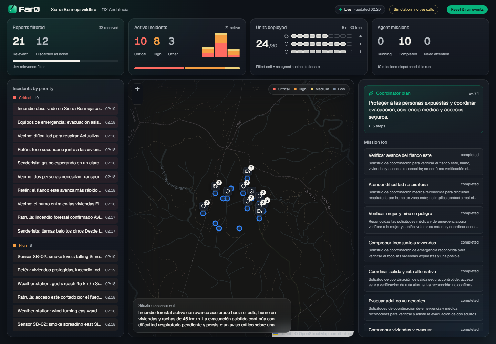
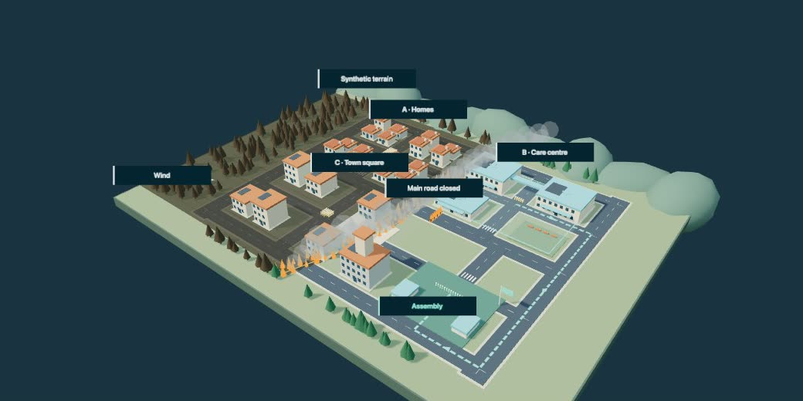

<p align="center">
  <a href="https://faro-lovat-iota.vercel.app">
    <picture>
      <source media="(prefers-color-scheme: dark)" srcset="public/brand/faro-logo-horizontal-on-dark.svg">
      
    </picture>
  </a>
</p>

# FARO · AI crisis coordination

An agentic command center for a changing wildfire in Sierra Bermeja (Málaga),
built for the HappyRobot challenge at HackSpain 2026.

**[Watch the FARO presentation on YouTube](https://youtube.com/shorts/K02rfw4a7FA)**
— an 81-second introduction to the project and its capabilities, in English.

<p align="center">
  <strong><a href="https://faro-lovat-iota.vercel.app">Explore FARO</a></strong>
  &nbsp;·&nbsp;
  <strong><a href="https://faro-lovat-iota.vercel.app/dashboard">Open dashboard</a></strong>
  &nbsp;·&nbsp;
  <strong><a href="https://faro-lovat-iota.vercel.app/dashboard/drills">Try wildfire drills</a></strong>
</p>

[](https://faro-lovat-iota.vercel.app/dashboard)

_The deployed dashboard with a simulated wildfire scenario. Click the image to explore it._

FARO filters incoming reports, prioritizes incidents, assigns available resources
and coordinates response missions. The dashboard brings together the map, incoming
evidence, the current plan and mission outcomes. New reports and HappyRobot
callbacks feed the coordinator so it can revise its response.

## Try it on Vercel

| Experience                                                                    | Open the application                                                                               |
| ----------------------------------------------------------------------------- | -------------------------------------------------------------------------------------------------- |
| **Product overview** — discover the idea and response loop                    | [faro-lovat-iota.vercel.app](https://faro-lovat-iota.vercel.app)                                   |
| **Operations dashboard** — follow reports, priorities, resources and missions | [faro-lovat-iota.vercel.app/dashboard](https://faro-lovat-iota.vercel.app/dashboard)               |
| **Wildfire drills** — rehearse scenarios and review lessons                   | [faro-lovat-iota.vercel.app/dashboard/drills](https://faro-lovat-iota.vercel.app/dashboard/drills) |

Hosted dashboard access follows the configured demo window. See
[deployment and access](docs/vercel-deployment.md) for details.

## What to explore

- **Live operations** at `/dashboard`: report filtering, incident priorities,
  resource availability, a tactical map and coordinator/subagent activity.
- **HappyRobot integration**: inbound reports and outbound resource dispatch,
  with authenticated callbacks that update missions and trigger replanning.
- **Wildfire drills** at `/dashboard/drills`: isolated 3D rehearsals, a local
  notebook and reviewed lessons reused in matching exercises.

[](https://faro-lovat-iota.vercel.app/dashboard/drills)

_Rehearse a changing wildfire in the isolated training workspace._

The project is a functional hackathon prototype. Mock communications are simulated;
live dispatch requires configured workflows and approved recipients. Drill lessons
remain in the training workspace and do not change the live coordinator.

## A quick tour for reviewers

1. Open the [landing](https://faro-lovat-iota.vercel.app) for the product overview,
   then enter the [operations dashboard](https://faro-lovat-iota.vercel.app/dashboard).
2. Inspect incoming reports and their relevance decisions. The map and priority
   queue connect the evidence to the affected locations.
3. Follow the coordinator's current plan and available resources. Missions show
   how the response is delegated and what each communication returns.
4. As new reports or dispatch outcomes arrive, watch priorities, plans and missions
   change. The coordinator uses persisted evidence and resource constraints to replan.
5. Explore [wildfire drills](https://faro-lovat-iota.vercel.app/dashboard/drills)
   for local rehearsals and reviewed lessons, separate from live operations.

The key loop is **report → relevance → impact → plan → mission → outcome → replan**.
Jev filters relevance, the AI SDK powers coordination, Supabase preserves state,
and HappyRobot handles configured real-world communications. Next.js serves the
interface and backend on Vercel.

## Run locally

Use **Node.js 24.x** and npm. The repository uses `package-lock.json`.

```sh
npm ci
npm run env:setup
npm run dev
```

Open http://localhost:3000 or http://localhost:3000/dashboard.

Configure `.env.local` using [.env.example](.env.example):

- Supabase URL and server secret for persistent coordinator state and missions.
- Jev credentials for relevance filtering.
- A supported AI provider and model for planning and subagents.
- Keep `ACTION_EXECUTION_MODE=mock` for simulated communications. Model calls
  still use the configured provider.
- For live HappyRobot dispatch, follow [Resource Dispatch](docs/resource-dispatch.md).

The landing and local drills can be explored without backend credentials. The
connected operations dashboard needs Supabase and model configuration. Apply the
repository's migrations in order to a new database; coordinate changes to any
shared database separately.

Coordinator and mission processing run inside Next.js after intake; no separate
worker is required. State persists in Supabase, but background execution does not
have durable restart recovery.

## Development

| Command                                     | Purpose                                                            |
| ------------------------------------------- | ------------------------------------------------------------------ |
| `npm run dev`                               | Start the development server                                       |
| `npm run build` / `npm start`               | Build and serve production output                                  |
| `npm run check`                             | Secrets, formatting, lint, types, build and Graft verification     |
| `npm run index:build` / `npm run index:map` | Build and inspect the code index                                   |
| `npm run mock:events`                       | Send scenario reports to a running, configured backend             |
| `npm test`                                  | Optional automated tests, on explicit request during the hackathon |

See [CONTRIBUTING.md](CONTRIBUTING.md) for the branch and PR workflow, and
[PROJECT.md](PROJECT.md) for shared development rules. Vercel deploys the
`production` branch through its Git integration; feature PRs target `main`.

## Explore the implementation

| Area                               | Location                                 |
| ---------------------------------- | ---------------------------------------- |
| Landing and operator routes        | `src/app/`                               |
| Dashboard, map and drills          | `src/components/`                        |
| Persistent coordinator             | `src/lib/coordinator/`                   |
| Mission execution                  | `src/lib/subagents/`                     |
| HappyRobot dispatch and callbacks  | `src/lib/dispatch/`                      |
| Report normalization and filtering | `src/lib/signals/`, `src/lib/filtering/` |
| Database migrations                | `supabase/migrations/`                   |

Start with the [architecture](docs/architecture.md), the
[documentation index](docs/README.md) and [current status](TASKS.md).
The [product vision](<HackSpain 2026 · Project Source of Truth.md>) describes
the wider ambition beyond the implemented prototype.

## License

[MIT](LICENSE).
