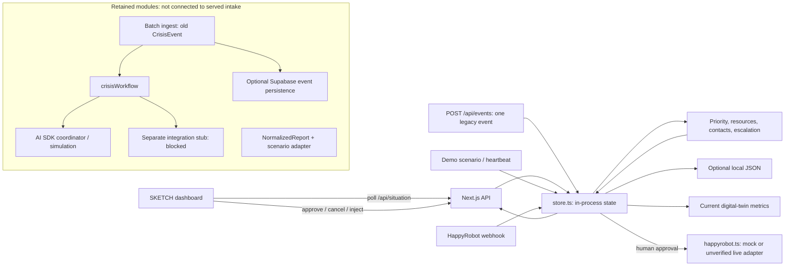
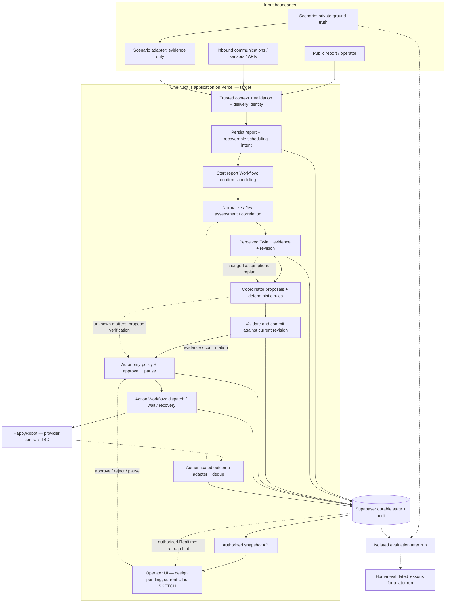

# Architecture review · FARO

**Initial delivery update, 2026-09-19:** follow the agreed [POC](poc.md) and its
P0–P5 packages. The diagrams, A1–A7 review and larger work packages below are
broader product proposals, not mandatory POC scope. In particular, the POC uses
persisted activity delivered by SSE, a relevance filter followed by deterministic
triage, and one agent/tool; full Twin/resource integration remains deferred.

Review draft, 2026-09-19. **Not yet approved for implementation.** This document
separates confirmed product decisions, observed code, and proposed integration.
The dashboard remains **SKETCH**; its controls do not define the target design.

Read this with [the contract draft](contracts-v0.md). The
[input contract](input-contract.md) remains authoritative for confirmed intake
semantics; [architecture.md](architecture.md) describes the current runtime.
The [product vision](<../HackSpain 2026 · Project Source of Truth.md>) and
[open decisions](../thoughts/open-questions.md) supply the product requirements.
No new runtime, database migration, deployment or live communication is introduced.

## 1. What is confirmed

| Decision                                                                                   | Evidence / implementation boundary                                                                                  |
| ------------------------------------------------------------------------------------------ | ------------------------------------------------------------------------------------------------------------------- |
| Sierra Bermeja wildfire; 112 Andalucía operator; changing scenario                         | Product vision and confirmed decisions. Seed naming still needs migration.                                          |
| TypeScript modular monolith: Next.js, Zod, AI SDK, Workflow, Supabase, HappyRobot, Jev     | Agreed stack. No separate worker or Supabase Queues. Services are not all connected.                                |
| Text required; location optional; no reporter-supplied classification                      | [Input contract](input-contract.md). `src/lib/report.ts` implements the internal envelope, not the public endpoint. |
| Persist and confirm durable scheduling before successful receipt; interpret asynchronously | Confirmed target. `POST /api/signals` is not currently served.                                                      |
| Preserve original evidence; distinguish delivery deduplication from incident correlation   | Confirmed input semantics. Distinct witnesses must survive correlation.                                             |
| Agents reason over the perceived Twin, never simulator ground truth                        | Product requirement. The future access boundary is not established by the sketch.                                   |
| LLM proposes; code validates, ranks, allocates and checks assumptions                      | Product requirement. Current zone scoring is reusable code, not the approved impact policy.                         |
| Potential impact and confidence are independent; five triage outcomes                      | Product direction. Old three-outcome diagrams and confidence-weighted sketch scoring are not target contracts.      |
| Graduated autonomy; population alerts and evacuation require a person                      | Product direction. Current implementation requires approval for every outbound action.                              |
| Cross-run lessons need human validation; no free-form agent memory                         | Confirmed direction. Existing learning mainly affects contact/channel selection.                                    |
| English project/UI language; dashboard is SKETCH                                           | PROJECT.md takes precedence over stale language notes.                                                              |

## 2. What runs today

Solid arrows below are current code connections. External HappyRobot access is
conditional and its live provider contract is unverified. Mock is the default.



Source checkpoints: [event route](../src/app/api/events/route.ts),
[store](../src/lib/store.ts), [batch ingest](../src/lib/ingest-server.ts),
[workflow](../src/workflows/crisis.ts), [blocked integration](../src/lib/integrations/happyrobot.ts),
[report schema](../src/lib/report.ts). `CrisisEvent.incidentId`, sketch zone IDs
and `NormalizedReport.runId` are different contracts; do not alias them silently.

## 3. Target integration proposal

This is a **proposed wiring of the confirmed stack**, not a deployment diagram
of the current application. Solid edges show the primary proposed path; dashed
edges show feedback, supervision or evaluation. Every new connection is pending.



The database arrows represent logical persistence ports, not permission for
every module to write every entity. Each domain owner validates its writes;
the integration layer coordinates transactions and audit events. Ground truth
is accessible only to scenario/evaluation, never to a planning prompt, Twin
repository, operational API response or triage tool. Storage/access design is
pending and must enforce this separation, not merely hide it in the UI.

## 4. Decisions proposed for validation

| ID  | Recommendation                                                                                                                                                                                   | Alternative and consequence                                                                                            | Approval status                                                 |
| --- | ------------------------------------------------------------------------------------------------------------------------------------------------------------------------------------------------ | ---------------------------------------------------------------------------------------------------------------------- | --------------------------------------------------------------- |
| A1  | One processing Workflow per report; independent action Workflows for waits. Commit plans against a Twin revision; reject stale proposals.                                                        | One long-lived Workflow per crisis serializes everything, but requires an inbox and can delay replanning behind waits. | Proposed                                                        |
| A2  | Persist a scheduling intent with the report. Start processing before acknowledging; recover unscheduled work with the same identity. Use durable effect deduplication even if start is repeated. | Request-only retry is simpler but leaves orphaned work when the client disappears.                                     | Proposed; recovery trigger/cadence must be chosen before launch |
| A3  | Provider delivery ID, or browser-generated retry key scoped to trusted run/session/source. Same key with changed content is a conflict. No text/location-based fallback merge.                   | Time-window content hashing can merge two independent witnesses and lose evidence.                                     | Proposed                                                        |
| A4  | Supabase is the shared durable authority. Modules use repository ports; Workflow owns timing, retries and waits. No runtime dual-write to the sketch store.                                      | Keep in-memory runtime for the demo; explicitly cannot claim durable acceptance or multi-instance correctness.         | Proposed migration boundary                                     |
| A5  | Operator authentication + incident/run authorization. Snapshot API is canonical; Realtime triggers refresh. Reconnect fetches a complete snapshot.                                               | Server relay is possible, but still needs operator authorization and adds another boundary.                            | Proposed; authentication choice and policies pending            |
| A6  | Freeze an internal execution contract now; map it to HappyRobot only after a real request, response and callback are verified.                                                                   | Expose provider payloads everywhere; changes then block frontend, planner and persistence together.                    | Proposed; external API facts remain unknown                     |
| A7  | Policy expresses confirmed graduated autonomy. Initial connected slice allows only approved demo recipients; keep all-actions approval until policy tests pass.                                  | Enable every automatic action immediately; no tested control boundary yet.                                             | Proposed rollout, not a change to the confirmed product policy  |

Suggested first Active Intelligence example: **is MA-8301 open?** Verification
should affect the last bus allocation between campsite and care home. This is a
demo proposal, not a known road status or an approved operational policy.

## 5. Receipt, failures and concurrent changes

```mermaid
sequenceDiagram
  participant C as Reporter
  participant API as Intake API
  participant DB as Durable repository
  participant W as Workflow
  C->>API: report + trusted session + retry identity
  API->>DB: persist original + pending scheduling intent
  API->>W: start processing with stable signalId
  alt start confirmed
    W-->>API: workflowRunId
    API->>DB: record confirmed scheduling
    API-->>C: 202 accepted (not triaged)
  else failed or acknowledgement uncertain
    API-->>C: retryable item error (503 if no success)
    Note over DB,W: Recovery retries same signal; processing effects deduplicated
  end
  W->>DB: claim report processing; read evidence
  W->>DB: commit Twin update and audit
  W->>DB: commit plan only if revision still current
  Note over DB,W: Stale plan: rebuild; never dispatch from the stale proposal
```

There is no assumed distributed transaction between Supabase and Workflow.
Starting can succeed even when the caller loses its acknowledgement. Recovery
must tolerate multiple Workflow runs for one report and prevent duplicate
domain effects through durable claims/version checks. A process-local `Set`
cannot provide that guarantee. Failed scheduling is not a duplicate success.

Recovery proposal: a protected reconciliation endpoint, invoked by an agreed
deployment scheduler, scans pending intents with bounded retries; requests may
also retry their own pending intent. This does not introduce a separate worker
or Supabase Queues. Scheduler configuration, stale-claim expiry and a tested
recovery interval remain acceptance blockers, not silently supplied defaults.

Workflow supplies orchestration and retryable steps; persistence, model calls
and integrations belong in steps. It does not make an external side effect
exactly-once automatically. See [official Workflow documentation](https://workflow-sdk.dev/docs/foundations/workflows-and-steps)
and the installed `node_modules/workflow/docs/` references checked for this draft.

Before dispatch, recheck plan validity, resource reservation, pause state and
approval for that exact action revision. A pause stops new dispatches; it cannot
recall an already sent message. A provider timeout after dispatch means
**unknown outcome**, not safe-to-repeat. Reconcile before resending unless the
provider's idempotency guarantee has been verified. Late callbacks remain
auditable but must not reactivate cancelled or superseded work.

## 6. Parallel delivery after contract approval

These are work packages, not agent launches or assignments made by this document.
Suggested team roles follow the product vision; confirm availability separately.

| Package                             | Ownership boundary                                                               | Can build against                             | Required proof before integration                                                                  |
| ----------------------------------- | -------------------------------------------------------------------------------- | --------------------------------------------- | -------------------------------------------------------------------------------------------------- |
| Contracts / integration (one owner) | Shared Zod schemas, fixtures, versions, adapters, end-to-end assembly            | [Contracts v0](contracts-v0.md) once accepted | Every producer and consumer passes the same fixture suite                                          |
| Intake / scenario                   | Public validator, adapters, trusted context, retry identity                      | Receipt and report repository ports           | Text-only/GPS/text place; distinct witnesses; same delivery; no ground-truth leak                  |
| Data / state                        | Durable repository, audit, revisions, scheduling recovery, authorization         | Report/Twin/plan/action ports                 | Restart recovery; concurrent writers; unauthorized run; no double reservation                      |
| Triage / planning                   | Assessment, correlation, perceived Twin updates, priority/allocation/assumptions | NormalizedReport and snapshot fixtures        | Five outcomes; unknown data; impact separate from confidence; stale-plan rejection                 |
| HappyRobot / execution              | Provider adapter, callback validation, action waits and result mapping           | Dispatch and outcome fixtures                 | Duplicate/late callback; uncertain timeout; real provider contract proof with authorized recipient |
| Frontend                            | Receipt, perceived snapshot, action feed and revision-bound commands             | Snapshot/command fixtures                     | Receipt differs from completion; unknowns visible; paused/stale command behavior; SKETCH notice    |

The shared schema owner integrates changes to `src/lib/contracts/` (proposed
folder), repository interfaces and route wiring. Other work packages use those
exports rather than changing shared enums independently. Existing `types.ts`,
`domain.ts` and `report.ts` need explicit adapters; no second competing report
schema. Providers may develop against explicit mocks, but mocks do not count as
live integration proof.

First integration milestone: text report → durable receipt → assessment →
perceived state → validated plan → approved demo call → outcome → visible UI.
Then prove that a road-closure report invalidates the plan while an action is
waiting, without double allocation or accidental redispatch.

## 7. Review gate

- [ ] Accept or amend A1–A7; record date and rationale here.
- [ ] Approve the v0 contract names, identifiers, lifecycle and fixture cases.
- [ ] Assign one owner per package and one integration owner.
- [ ] Resolve the provider request/response/callback contract and account limits.
- [ ] Define priority parameters, reserve/coverage policy and unknown-value behavior.
- [ ] Specify authorization, recovery trigger and ground-truth access separation.
- [ ] Publish shared executable schemas and fixtures before parallel integration.

Model choice, Jev limits/fallback, enabled HappyRobot channels, verification
fields, callback authentication and provider idempotency are **unknown**. No
placeholder value in a test fixture constitutes approval of these facts.
