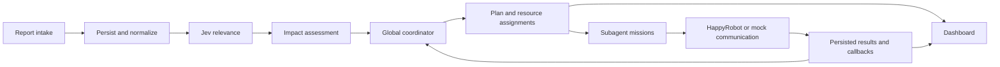

# Architecture

FARO is one Next.js application: a public landing, an operations dashboard and
an isolated wildfire training workspace. Supabase stores coordinator state,
reports, assignments, missions and dispatch evidence.

## Operations flow

- `src/lib/coordinator/` filters persisted inputs and runs the global planning
  cycle. The model proposes priorities and assignments; schemas and database
  operations validate and commit them.
- `src/lib/subagents/` handles reserved missions and their results.
  `src/lib/dispatch/` implements live HappyRobot resource communications.
- `GET /api/state` and mission APIs supply dashboard snapshots.
  `GET /api/telemetry` delivers report/filter activity; `GET /api/map` supplies
  illustrative geography. Viewing the dashboard does not drive the coordinator.
- Next.js `after()` starts processing after intake and callback requests.
  Pending inputs and state are durable; scheduling itself is process-bound.
  A standalone worker is not required for the dashboard.

See [state v2](coordinator-state-contract.md),
[Resource Dispatch](resource-dispatch.md) and
[event telemetry](event-telemetry.md) for wire contracts.

## Compatibility boundaries

The older `store.ts`, scenario, action and digital-twin modules remain in use
by compatibility routes and HappyRobot input interpretation. Their memory/local
JSON state is separate from persistent coordinator state. They are retained
because active code still depends on them.

`POST /api/signals` persists and interprets HappyRobot reports, then attempts an
additive bridge into the coordinator. Its receipt does not prove model completion;
a bridge failure does not invalidate the original signal receipt.

Resource inventories contain ten ambulances, ten Policía patrols and ten Guardia
Civil patrols. Completing a communication mission does not release field resources.
General release and reassignment remain disabled. Provider acceptance and confirmed
outcomes are distinct; see the dispatch contract for failure and retry behavior.

## Presentation and training

Separate marketing and console root layouts isolate their styles.
[Wildfire drills](emergency-drills.md) use an independent local training model
and browser storage. Reviewed lessons can inform matching rehearsals; they are
not loaded into live coordinator decisions.

## Hosting

Vercel's native Git integration deploys `production`. Feature PRs target `main`;
release PRs target `production`. Shared state lives in Supabase, but interrupted
background work still needs recovery triggers. See
[deployment](vercel-deployment.md) for access configuration and hosting limits.
