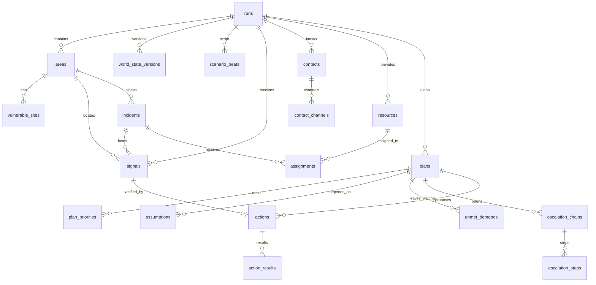
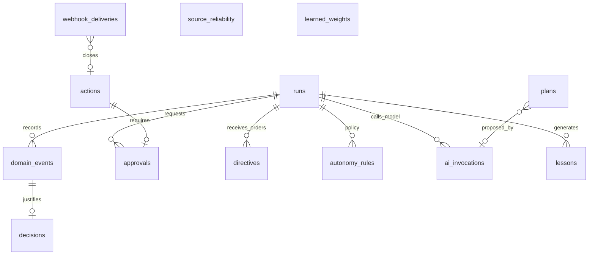

# FARO · Data Model Proposal

> Runtime update: Vercel Workflow and its unused execution scaffold have been
> removed. Workflow-based execution below is an earlier proposal, not an installed
> dependency or an agreed requirement. Background scheduling is TBD. HappyRobot
> workflows are separate and remain in scope.

> **Confirmed intake decision (2026-09-19):**
> [input-contract.md](input-contract.md) is authoritative for report intake and
> normalization: text, optional geographic location, trusted metadata, synchronous
> durable receipt and asynchronous interpretation. The SQL below is a proposal;
> reconcile it for unassessed reports with unknown category and severity before
> implementing it. Public GPS uses WGS84 latitude/longitude, not panel-map x/y.
> The only implemented database schema is in `supabase/migrations/`.

Status: proposal for team discussion. Base: the platform modules under `src/`
(Next 16, Supabase Postgres + Realtime, Zod, Vercel Workflow, AI SDK).

This document proposes the complete data model for the command center. It is
deliberately verbose: each table includes its purpose, DDL, field-by-field
explanation, and motivating decisions so it can be discussed without having to
open code. The summary is in section 3, the diagram.

---

## 1. What the Model Must Support

The challenge prompt requires answering six questions on screen, each imposing
requirements on the data model:

| Challenge Question       | Data Model Requirement                                                                  |
| ------------------------ | --------------------------------------------------------------------------------------- |
| What information matters | Signals with probability, deduplication, incident fusion, and stored dismissal reason   |
| What comes first         | Versioned ranking with score breakdown, not just the number                             |
| Whom to notify and when  | Contacts by role, channels with measured reliability, escalation chains with wait times |
| Where resources go       | Assignments with rationale, and the list of who remains waiting and why                 |
| What is being done now   | Actions with autonomy level, attempt, idempotency, and real outcome                     |
| When to discard the plan | Declared assumptions per plan and the exact event that invalidated them                 |

And the source document adds four cross-cutting requirements:

- **Immutable event log** from which everything hangs, to replay an execution and
  learn from it.
- **Cross-execution learning** with lessons validated by a human.
- **Honesty regarding simulation**: each action must explicitly record whether it
  reached the real world or not.
- **AI provenance**: which model proposed what, with what input, at what cost.

---

## 2. Design Principles

### 2.1 The Log Is the Truth; State Tables Are Convenient Projections

`domain_events` is append-only and ordered. Everything else (`signals`, `plans`,
`actions`…) is current state that can be reconstructed from the log. In
practice, we write both in the same transaction because reading current state
is what the dashboard does two hundred times a minute. But the golden rule is:
**if the log and a state table disagree, the log takes precedence**.

This buys three things the challenge scores: replaying a demo step-by-step,
auditing who decided what, and feeding learning without instrumenting anything
extra.

### 2.2 A Dismissed Signal Is Not Deleted: It Is Excluded

Learnings from the domain branch. There, each arriving signal _mutated_ the
risk of its zone, and dismissing it required reversing that mutation with
explicit bookkeeping. It worked, but it was fragile and forced a delicate
contract between two modules. Here, the pressure on an incident **is derived**
from its live signals at calculation time. Dismissing is simply changing a
state; the priority engine stops counting it. No rollbacks.

### 2.3 Probabilities, Not Labels

Signals carry `p_relevant`, `p_truthful`, `urgency`, and `fused_confidence` as
numbers in [0, 1], in addition to the label declared by the source. This enables
the three triage outcomes (act, verify, discard) and confidence fusion across
independent sources.

### 2.4 Everything Decided by the System Leaves a Rationale and Breakdown

`plan_priorities.factors`, `assignments.reason`, `actions.reason`,
`assumptions.consequence`, `decisions.why`. These are not decorations: they are
what the dashboard displays to the jury to justify every decision. If a domain
function cannot supply the reason, it indicates the decision is not well
defined.

### 2.5 Per-Attempt Idempotency

Each `action` carries `attempt` and `idempotency_key = "<action_id>:<attempt>"`.
An operator retry generates a new key; an internal adapter retry (timeout, 5xx)
reuses the same key. This ensures HappyRobot deduplicates what it should and
does not deduplicate what it shouldn't. Inbound webhooks are deduplicated
separately in `webhook_deliveries`.

### 2.6 Zod Is the Contract; SQL Materializes It

Zod schemas live in `src/lib/domain/*.ts` and are the sole definition of shape
seen by frontend, route handlers, workflows, and agents. The SQL migration
materializes them with `check` constraints that mirror the `z.enum`s. We choose
`check` rather than `create type … as enum` because adding a value to a Postgres
enum within a transaction has annoying restrictions, and in a hackathon we will
be adding values.

### 2.7 Versioned JSONB for Rapidly Evolving Structures

`factors`, `changes`, world `state`, `structured` call results, `interpreted`
directives. These structures will change multiple times over the weekend. They
live in `jsonb`, validated by Zod on write and read, accompanied by a formula or
schema version column where relevant (`plan_priorities.formula_version`,
`world_state_versions.schema_version`).

### 2.8 Multi-Tenancy by Execution Run

Everything hangs off `runs`. A run represents a crisis managed from start to
finish: in the demo, a single session; in real operations, a wildfire. This
provides data isolation, allows comparing runs for learning, and serves as the
natural axis for row-level security policies when operator authentication is
introduced.

### 2.9 Personal Data: Segregated, Minimal, and Never in Seeds

Phone numbers and emails live **only** in `contact_channels.address`. No other
table copies them. Version-controlled seeds contain `null` or placeholders.
Before the demo, approved recipients are populated manually with `consent_note`
filled in. This adheres to `AGENTS.md` and the `demo_safe` safeguard.

---

## 3. Overview

Two diagrams: the decision loop and the control, audit, and learning tables.





**Module → Tables Map.** Each module writes only its designated tables; other modules read them.

| Module      | Writes                                                                                | Reads                                            |
| ----------- | ------------------------------------------------------------------------------------- | ------------------------------------------------ |
| `scenario`  | `runs` (clock), `world_state_versions`, `scenario_beats`, `areas`, `vulnerable_sites` | —                                                |
| `ingest`    | `signals` (creation), `webhook_deliveries`                                            | `runs`, `areas`                                  |
| `triage`    | `signals` (triage columns), `source_reliability` (read)                               | `contacts`                                       |
| `incidents` | `incidents`, `signals.incident_id`                                                    | `signals`, `vulnerable_sites`                    |
| `resources` | `resources`, `assignments`, `unmet_demands`                                           | `incidents`, `plans`                             |
| `planning`  | `plans`, `plan_priorities`, `assumptions`                                             | all previous, `world_state_versions`             |
| `execution` | `actions`, `action_results`, `escalation_chains`, `escalation_steps`                  | `contacts`, `contact_channels`, `autonomy_rules` |
| `control`   | `approvals`, `directives`, `autonomy_rules`, `runs.autonomy_paused`                   | `actions`                                        |
| `audit`     | `domain_events`, `decisions`                                                          | —                                                |
| `learning`  | `lessons`, `learned_weights`, `source_reliability`                                    | `domain_events`, `action_results`, `signals`     |
| `agents`    | `ai_invocations`                                                                      | passed by coordinator                            |

---

## 4. Conventions

- **SQL identifiers in English and `snake_case`; TypeScript types in
  `camelCase`.** Mapping is handled by a single function per entity
  (`rowToSignal`, `signalToRow`). Prose, reasons, and UI text in English.
- **Primary keys are `uuid` with `gen_random_uuid()`**, except `domain_events`,
  which uses `bigint generated always as identity` because it requires cheap
  total ordering. Entities referenced by stable names in scripts and tests
  (areas, resources, seed contacts) also carry a unique `slug` per run.
- **Two timestamps where it matters**: `occurred_at` (when it happened in the
  real world) and `received_at` or `recorded_at` (when we learned of it).
  Temporal decay and execution replay depend on distinguishing them.
- **`created_at` and `updated_at`** on all mutable tables, with the
  `set_updated_at` trigger. Append-only tables do not have `updated_at`.
- **States as `text` with `check` constraints**, exactly mirroring a `z.enum`.
  When adding a value, both Zod and the migration are updated in the same commit.
- **No hard deletes in domain tables.** Everything transitions state
  (`dismissed`, `cancelled`, `superseded`). FKs use `on delete restrict`.
- **Circular cross-references** (`signals ↔ actions`, `plans ↔ assumptions`)
  are added at the end of the migration using `alter table … add constraint`, so
  table creation order does not matter.
- **Probability numbers** as `numeric` constrained `between 0 and 1`. Costs in
  integer micro-units (`cost_micros bigint`), never `float`.

```sql
create or replace function public.set_updated_at() returns trigger
language plpgsql as $$
begin
  new.updated_at = now();
  return new;
end $$;
```

---

## 5. Entities

Reading order: first the container and world, then perception, people and
assets, plan, action, control, logging, learning, and AI.

### 5.1 `runs` — The Execution Run

Container for everything. One row per managed crisis. Replaces the `incidents`
table from the scaffolding, which played this role under a different name; that
name is now reserved for sub-incidents, as requested by the source document.

```sql
create table public.runs (
  id               uuid primary key default gen_random_uuid(),
  name             text not null,
  kind             text not null default 'demo'
                   check (kind in ('demo', 'drill', 'live')),
  status           text not null default 'open'
                   check (status in ('open', 'paused', 'closed')),
  scenario_id      text,
  clock_speed      numeric not null default 1 check (clock_speed > 0),
  alert_level      smallint not null default 1 check (alert_level between 1 and 3),
  autonomy_paused  boolean not null default false,
  started_at       timestamptz not null default now(),
  paused_at        timestamptz,
  ended_at         timestamptz,
  summary          jsonb,
  created_at       timestamptz not null default now(),
  updated_at       timestamptz not null default now()
);
create trigger runs_updated before update on public.runs
  for each row execute function public.set_updated_at();
```

| Field             | Purpose                                                                                                                                             |
| ----------------- | --------------------------------------------------------------------------------------------------------------------------------------------------- |
| `kind`            | `demo` is a session before the jury; `drill` is a rehearsal from which we also learn; `live` is reserved. Allows filtering which runs feed lessons. |
| `scenario_id`     | Script used (`wildfire-sierra-bermeja`). `null` if no script.                                                                                       |
| `clock_speed`     | Scenario clock multiplier. The document specifies compressed time: 1 real minute ≈ 10 crisis minutes.                                               |
| `alert_level`     | Alert level 1–3. Sets maximum hourly cost allowed for resource expenditure.                                                                         |
| `autonomy_paused` | Master switch. When `true`, every action requires approval. The operator's strongest control.                                                       |
| `summary`         | Wrap-up metrics: triaged signals, calls, confirmations, average replan time, triage cost. Populated upon closing.                                   |

### 5.2 `areas` — Geographic Zones

Municipalities, developments, landscapes. They are the "where" for everything:
signals, incidents, resources, and vulnerable sites are located in an area. In
the demo: Estepona, Jubrique, Genalguacil, Benahavís, and Los Pinares.

```sql
create table public.areas (
  id           uuid primary key default gen_random_uuid(),
  run_id       uuid not null references public.runs(id),
  slug         text not null,
  name         text not null,
  kind         text not null
               check (kind in ('municipio', 'urbanizacion', 'paraje', 'via', 'otro')),
  population   integer not null default 0 check (population >= 0),
  base_risk    integer not null default 0 check (base_risk between 0 and 100),
  centroid_x   numeric not null,
  centroid_y   numeric not null,
  geometry     jsonb,
  created_at   timestamptz not null default now(),
  updated_at   timestamptz not null default now(),
  unique (run_id, slug)
);
create index areas_run_idx on public.areas (run_id);
create trigger areas_updated before update on public.areas
  for each row execute function public.set_updated_at();
```

| Field                      | Purpose                                                                                                                                                                               |
| -------------------------- | ------------------------------------------------------------------------------------------------------------------------------------------------------------------------------------- |
| `slug`                     | Stable identifier (`estepona`, `los-pinares`) used by scripts, seeds, and tests. UUIDs change per run; slugs do not.                                                                  |
| `base_risk`                | Structural risk of the area, independent of live signals. The only stored part of risk: the rest is derived.                                                                          |
| `centroid_x`, `centroid_y` | Map coordinates for the dashboard, in whatever coordinate system the SVG uses. Sufficient for calculating inter-zone distances needed for resource allocation.                        |
| `geometry`                 | Optional GeoJSON polygon. When time permits, replaced with PostGIS `geography(Polygon, 4326)` (which comes pre-installed in Supabase); the `jsonb` column allows starting without it. |

### 5.3 `vulnerable_sites` — Vulnerable Locations

Nursing homes, rural schools, campsites. They trigger the vulnerability
multiplier in the priority formula and make an evacuation irreversible.

```sql
create table public.vulnerable_sites (
  id            uuid primary key default gen_random_uuid(),
  run_id        uuid not null references public.runs(id),
  area_id       uuid not null references public.areas(id),
  slug          text not null,
  name          text not null,
  kind          text not null
                check (kind in ('residencia', 'colegio', 'camping', 'hospital', 'urbanizacion', 'nucleo')),
  people        integer not null check (people >= 0),
  multiplier    numeric not null default 1 check (multiplier >= 1),
  evacuated     boolean not null default false,
  evacuated_at  timestamptz,
  notes         text,
  created_at    timestamptz not null default now(),
  updated_at    timestamptz not null default now(),
  unique (run_id, slug)
);
create index vulnerable_sites_area_idx on public.vulnerable_sites (area_id);
```

`multiplier` follows the specification: 1 by default, 1.5 for schools, 2 for
nursing homes. It is data, not a hardcoded constant, so learning can adjust it
("the operator prioritized the school three times").

### 5.4 `world_state_versions` — Versioned Simulated World

Wind, road closures, channel statuses, hospital beds. Each change creates a new
version; never updated in place. This is what assumptions are evaluated
against, and versioning allows stating "the assumption broke in version 7,
triggered by signal X."

```sql
create table public.world_state_versions (
  id                    uuid primary key default gen_random_uuid(),
  run_id                uuid not null references public.runs(id),
  version               integer not null,
  schema_version        smallint not null default 1,
  state                 jsonb not null,
  caused_by_signal_id   uuid,
  caused_by_beat_id     uuid,
  caused_by_actor       text not null
                        check (caused_by_actor in ('scenario', 'operator', 'happyrobot', 'system')),
  recorded_at           timestamptz not null default now(),
  unique (run_id, version)
);
create index world_state_run_idx on public.world_state_versions (run_id, version desc);
```

Shape of `state`, validated by `worldStateSchema`:

```ts
export const worldStateSchema = z
  .object({
    wind: z.object({
      direction: z.enum(["N", "NE", "E", "SE", "S", "SO", "O", "NO"]),
      speedKmh: z.number().min(0),
    }),
    roads: z.record(z.string(), z.enum(["open", "restricted", "closed"])),
    channels: z.object({
      sms: z.boolean(),
      voice: z.boolean(),
      whatsapp: z.boolean(),
      email: z.boolean(),
    }),
    hospitals: z.record(z.string(), z.object({ beds: z.number().int().min(0) })),
    frontline: z.object({ x: z.number(), y: z.number(), headingDeg: z.number() }).optional(),
  })
  .strict();
```

### 5.5 `scenario_beats` — The Script

Scheduled scenario events and chaos buttons. Storing triggers in the database,
rather than solely in memory, ensures the script survives a server restart
mid-demo and allows the learning module to know what happened and when.

```sql
create table public.scenario_beats (
  id           uuid primary key default gen_random_uuid(),
  run_id       uuid not null references public.runs(id),
  scenario_id  text not null,
  beat_key     text not null,
  at_seconds   integer not null check (at_seconds >= 0),
  label        text not null,
  kind         text not null
               check (kind in ('signal', 'world_change', 'chaos', 'noise_burst')),
  payload      jsonb not null,
  fired_at     timestamptz,
  skipped      boolean not null default false,
  fired_by     text check (fired_by in ('clock', 'operator', 'jury')),
  unique (run_id, scenario_id, beat_key)
);
create index scenario_beats_due_idx on public.scenario_beats (run_id, at_seconds)
  where fired_at is null and skipped = false;
```

`kind = 'chaos'` with `fired_by = 'jury'` represents the exact "the jury
chooses what we break" moment, logged as such. `noise_burst` is the flood of
forty messages containing only three relevant ones: the payload carries the list
of signals to generate.

### 5.6 `signals` — Signals

Everything entering the system: calls, SMS, sensors, HappyRobot webhooks, the
script. It is the most heavily written table and the first processed by triage.
Replaces the `events` table from the scaffolding, which held this role and a
name now reserved for domain logging.

```sql
create table public.signals (
  id                    uuid primary key default gen_random_uuid(),
  run_id                uuid references public.runs(id),
  area_id               uuid references public.areas(id),
  incident_id           uuid,
  source                text not null
                        check (source in ('operator', 'sensor', 'happyrobot', 'public', 'scenario', 'webhook')),
  channel               text
                        check (channel in ('voice', 'call', 'sms', 'whatsapp', 'email', 'web', 'api', 'sensor')),
  external_ref          text,
  title                 text check (length(title) <= 300),
  body                  text check (length(body) <= 4000),
  category              text,
  severity              text
                        check (severity in ('low', 'medium', 'high', 'critical')),
  reported_confidence   text
                        check (reported_confidence in ('low', 'medium', 'high')),
  location              jsonb,
  occurred_at           timestamptz not null default now(),
  received_at           timestamptz not null default now(),
  dedupe_key            text,
  occurrences           integer not null default 1 check (occurrences >= 1),
  merged_into_id        uuid references public.signals(id),

  -- calibrated triage
  p_relevant            numeric check (p_relevant between 0 and 1),
  p_truthful            numeric check (p_truthful between 0 and 1),
  urgency               numeric check (urgency between 0 and 1),
  fused_confidence      numeric check (fused_confidence between 0 and 1),
  triage_decision       text check (triage_decision in ('act', 'verify', 'discard')),
  triage_rationale      text,
  triage_assessor       text
                        check (triage_assessor in ('deterministic', 'jev', 'llm', 'operator')),
  triage_details        jsonb,
  triage_latency_ms     integer,
  triage_cost_micros    bigint,
  triaged_at            timestamptz,

  -- verification
  verification_status   text not null default 'unverified'
                        check (verification_status in ('unverified', 'verifying', 'confirmed', 'refuted')),
  verification_action_id uuid,
  verified_at           timestamptz,
  verified_by           text,

  raw                   jsonb,
  created_at            timestamptz not null default now(),
  updated_at            timestamptz not null default now(),

  -- durable HappyRobot receipt (see src/lib/signals/repository.ts and
  -- supabase/migrations/202609190001_happyrobot_signals.sql /
  -- 202609190002_reconcile_signals_schema.sql for the applied migration history)
  external_identity     text not null unique,
  raw_payload           jsonb not null,
  processing_status     text not null default 'received'
                        check (processing_status in ('received', 'processing', 'processed', 'failed')),
  event_id              text,
  processed_at          timestamptz,
  processing_error      text,
  check ((processing_status = 'processed') = (event_id is not null)),
  check (processing_status <> 'failed' or processing_error is not null)
);
create index signals_run_received_idx on public.signals (run_id, received_at desc);
create index signals_dedupe_idx       on public.signals (run_id, dedupe_key, received_at desc);
create index signals_incident_idx     on public.signals (incident_id);
create index signals_untriaged_idx    on public.signals (run_id, received_at)
  where triage_decision is null;
create index signals_live_idx         on public.signals (run_id, area_id)
  where triage_decision = 'act' and verification_status <> 'refuted';
create index signals_status_created_idx on public.signals (processing_status, created_at);
create trigger signals_updated before update on public.signals
  for each row execute function public.set_updated_at();
```

The triage-oriented columns above (`run_id` through `updated_at`) predate the durable HappyRobot
receipt columns and were deployed to the development project directly from this proposal before
`src/lib/signals/repository.ts` existed. The reconcile migration
(`202609190002_reconcile_signals_schema.sql`) is what actually brought the deployed table in line
with both halves shown here: it added the receipt columns, relaxed `not null` on the
triage-only columns (a raw HappyRobot receipt has no run/title/category/severity/dedupe key until
it is interpreted into an Event), and extended the `channel` check with HappyRobot's `voice`
value. Existing rows were preserved and backfilled with a synthetic `external_identity` and a
`raw_payload` derived from their prior columns.

| Field                                                        | Purpose                                                                                                                                                                                    |
| ------------------------------------------------------------ | ------------------------------------------------------------------------------------------------------------------------------------------------------------------------------------------ |
| `source` / `channel`                                         | Logical source and physical channel. `public` is a resident; `happyrobot` is what a system call returns. Learned reliability attaches to `source`.                                         |
| `external_ref`                                               | Identifier in source system: call ID in HappyRobot, message ID. Allows linking to transcript.                                                                                              |
| `category`                                                   | Open catalog (`incendio`, `evacuacion`, `route-blocked`, `refugio`). Used by resource allocation and contact selection; hence stable, unaccented text.                                     |
| `occurred_at` / `received_at`                                | Temporal decay uses `occurred_at`; dashboard sorting and deduplication use `received_at`.                                                                                                  |
| `dedupe_key`, `occurrences`, `merged_into_id`                | A repeated signal within the window does not create a new row: it increments `occurrences` on the original. If created and later detected, it points to the original via `merged_into_id`. |
| `p_*`, `fused_confidence`, `triage_decision`                 | The three triage outcomes. The intermediate band generates a verification action and `verification_status` becomes `verifying`.                                                            |
| `triage_assessor`, `triage_latency_ms`, `triage_cost_micros` | Who assessed and at what cost. Provides the "40 signals triaged in X seconds for Y euros" metric shown on screen.                                                                          |
| `triage_details`                                             | What doesn't warrant its own column: fusion breakdown, discarded alternatives, evaluator version.                                                                                          |
| `verification_*`                                             | Result of phone verification or operator input. `refuted` is what was previously called "dismissed by a human".                                                                            |
| `raw`                                                        | The untouched original payload. Never modified. Allows re-triaging with an upgraded evaluator without re-fetching data.                                                                    |

Partial indices (`signals_untriaged_idx`, `signals_live_idx`) because the hot
queries are "what remains to be triaged" and "what live signals exist in this
zone", both representing a small fraction of the table.

### 5.7 `incidents` — Sub-Incidents

An incident groups coherent signals in a location: "active front on the northern
slope of Los Pinares." This is what gets prioritized and assigned resources.
A signal belongs to at most one incident.

```sql
create table public.incidents (
  id                        uuid primary key default gen_random_uuid(),
  run_id                    uuid not null references public.runs(id),
  area_id                   uuid not null references public.areas(id),
  title                     text not null,
  category                  text not null,
  status                    text not null default 'open'
                            check (status in ('open', 'contained', 'resolved', 'dismissed')),
  gravity                   smallint not null check (gravity between 1 and 5),
  people_exposed            integer not null default 0 check (people_exposed >= 0),
  vulnerability_multiplier  numeric not null default 1 check (vulnerability_multiplier >= 1),
  minutes_to_impact         integer check (minutes_to_impact >= 0),
  fused_confidence          numeric check (fused_confidence between 0 and 1),
  location                  jsonb,
  first_signal_at           timestamptz,
  last_signal_at            timestamptz,
  opened_at                 timestamptz not null default now(),
  closed_at                 timestamptz,
  created_at                timestamptz not null default now(),
  updated_at                timestamptz not null default now()
);
create index incidents_run_open_idx on public.incidents (run_id)
  where status in ('open', 'contained');
create index incidents_area_idx on public.incidents (area_id);
create trigger incidents_updated before update on public.incidents
  for each row execute function public.set_updated_at();
```

The five fields `gravity`, `people_exposed`, `vulnerability_multiplier`,
`minutes_to_impact`, and `fused_confidence` correspond exactly to variables G,
N, V, t, and C in the priority formula. `minutes_to_impact` allows `null`
intentionally: "unknown" is a valid answer and the dashboard must display it as
such, not as zero.

### 5.8 `contacts` and `contact_channels` — Whom to Notify

We decouple the contact from their communication channels because reliability
is measured **per channel**: "Estepona Fire Department does not answer night calls
but responds to SMS in 40 seconds" is a lesson about a channel, not a person.

```sql
create table public.contacts (
  id              uuid primary key default gen_random_uuid(),
  run_id          uuid not null references public.runs(id),
  slug            text not null,
  name            text not null,
  role            text not null
                  check (role in ('vecino', 'residencia', 'colegio', 'camping', 'bombero', 'sanitario',
                                  'policia', 'alcalde', 'sala-112', 'autoridad', 'voluntario', 'otro')),
  organization    text,
  area_id         uuid references public.areas(id),
  language        text not null default 'es',
  demo_safe       boolean not null default false,
  consent_note    text,
  responsiveness  numeric not null default 0.5 check (responsiveness between 0 and 1),
  created_at      timestamptz not null default now(),
  updated_at      timestamptz not null default now(),
  unique (run_id, slug),
  check (demo_safe = false or consent_note is not null)
);

create table public.contact_channels (
  id                       uuid primary key default gen_random_uuid(),
  contact_id               uuid not null references public.contacts(id),
  channel                  text not null
                           check (channel in ('call', 'sms', 'whatsapp', 'email', 'slack', 'teams')),
  address                  text not null,
  priority                 smallint not null default 1,
  attempts                 integer not null default 0,
  successes                integer not null default 0,
  avg_seconds_to_confirm   integer,
  last_used_at             timestamptz,
  created_at               timestamptz not null default now(),
  updated_at               timestamptz not null default now(),
  unique (contact_id, channel, address)
);
create index contact_channels_contact_idx on public.contact_channels (contact_id, priority);
```

| Field                                             | Purpose                                                                                                                                                                                                  |
| ------------------------------------------------- | -------------------------------------------------------------------------------------------------------------------------------------------------------------------------------------------------------- |
| `role`                                            | Message and channel depend on role: residents receive SMS, coordinators receive calls, authorities receive written reports. Includes `alcalde` (mayor) because that is who the jury acts as in the demo. |
| `demo_safe` + `consent_note`                      | A contact can only receive live actions if approved **and** authorized with recorded consent. The `check` constraint enforces both simultaneously.                                                       |
| `address`                                         | The only place in the model holding personal data. Never in versioned seeds. When Supabase Vault is configured, it is encrypted at the column level.                                                     |
| `attempts`, `successes`, `avg_seconds_to_confirm` | Reliability measured per channel. Requires a minimum sample count before being utilized, as handled by the learning module.                                                                              |

### 5.9 `resources` and `assignments` — Where Assets Go

```sql
create table public.resources (
  id                  uuid primary key default gen_random_uuid(),
  run_id              uuid not null references public.runs(id),
  slug                text not null,
  name                text not null,
  kind                text not null
                      check (kind in ('ambulancia', 'helicoptero', 'bomberos', 'patrulla', 'autobus',
                                      'albergue', 'comunicaciones', 'otro')),
  capabilities        text[] not null default '{}',
  capacity            integer not null default 1 check (capacity >= 0),
  status              text not null default 'available'
                      check (status in ('available', 'assigned', 'en_route', 'unavailable')),
  home_area_id        uuid references public.areas(id),
  current_area_id     uuid references public.areas(id),
  position            jsonb,
  eta_minutes         integer,
  cost_per_hour       numeric,
  min_reserve         integer not null default 0 check (min_reserve >= 0),
  unavailable_reason  text,
  created_at          timestamptz not null default now(),
  updated_at          timestamptz not null default now(),
  unique (run_id, slug)
);
create index resources_run_status_idx on public.resources (run_id, status);
create index resources_capabilities_gin on public.resources using gin (capabilities);

create table public.assignments (
  id               uuid primary key default gen_random_uuid(),
  run_id           uuid not null references public.runs(id),
  resource_id      uuid not null references public.resources(id),
  incident_id      uuid references public.incidents(id),
  plan_id          uuid,
  action_id        uuid,
  status           text not null default 'proposed'
                   check (status in ('proposed', 'active', 'released', 'superseded')),
  score            numeric,
  reason           text not null,
  assigned_at      timestamptz not null default now(),
  released_at      timestamptz,
  released_reason  text
);
create unique index assignments_one_active_per_resource
  on public.assignments (resource_id) where status = 'active';
create index assignments_incident_idx on public.assignments (incident_id) where status = 'active';
```

| Field                                | Purpose                                                                                                                                                                       |
| ------------------------------------ | ----------------------------------------------------------------------------------------------------------------------------------------------------------------------------- |
| `capabilities`                       | What the resource can handle, as `text[]` with a GIN index. Prevents assigning a forestry brigade to a medical emergency; verified with a real scenario in the domain branch. |
| `min_reserve`                        | Minimum reserve for that resource type. Never violated unless priority 1, and flagged in red if breached.                                                                     |
| `cost_per_hour` × `runs.alert_level` | Alert level dictates allowed spending.                                                                                                                                        |
| `assignments.reason` and `score`     | Why this resource and not the closest one. Displayed on screen.                                                                                                               |
| Partial unique index                 | A resource has at most one active assignment. Enforced by the database, not application code.                                                                                 |

### 5.10 `plans`, `plan_priorities`, `assumptions`, `unmet_demands` — The Plan

The plan is **versioned and immutable**: each replanning creates a new row and
marks the previous one as `superseded` or `invalid`. Only one is `current` per
run, enforced by index.

```sql
create table public.plans (
  id                            uuid primary key default gen_random_uuid(),
  run_id                        uuid not null references public.runs(id),
  version                       integer not null,
  previous_plan_id              uuid references public.plans(id),
  status                        text not null default 'current'
                                check (status in ('draft', 'current', 'superseded', 'invalid')),
  mode                          text not null
                                check (mode in ('deterministic', 'ai', 'simulation')),
  trigger                       text not null,
  summary                       text not null,
  changes                       jsonb not null default '[]',
  plan_b                        jsonb,
  invalidated_at                timestamptz,
  invalidated_by_assumption_id  uuid,
  ai_invocation_id              uuid,
  generated_at                  timestamptz not null default now(),
  unique (run_id, version)
);
create unique index plans_one_current on public.plans (run_id) where status = 'current';

create table public.plan_priorities (
  id               uuid primary key default gen_random_uuid(),
  plan_id          uuid not null references public.plans(id),
  incident_id      uuid not null references public.incidents(id),
  rank             integer not null check (rank >= 1),
  previous_rank    integer,
  score            numeric not null,
  formula_version  text not null,
  factors          jsonb not null,
  reason           text not null,
  unique (plan_id, incident_id),
  unique (plan_id, rank)
);

create table public.assumptions (
  id                          uuid primary key default gen_random_uuid(),
  run_id                      uuid not null references public.runs(id),
  plan_id                     uuid not null references public.plans(id),
  key                         text not null,
  text                        text not null,
  variable                    text not null,
  operator                    text not null
                              check (operator in ('eq', 'neq', 'lt', 'lte', 'gt', 'gte', 'in', 'contains')),
  expected                    jsonb not null,
  status                      text not null default 'ok'
                              check (status in ('ok', 'broken', 'unknown')),
  broken_at                   timestamptz,
  broken_by_signal_id         uuid,
  broken_by_world_version_id  uuid,
  consequence                 text,
  unique (plan_id, key)
);
create index assumptions_open_idx on public.assumptions (run_id) where status = 'ok';

create table public.unmet_demands (
  id                       uuid primary key default gen_random_uuid(),
  plan_id                  uuid not null references public.plans(id),
  incident_id              uuid not null references public.incidents(id),
  wanted_resource_kind     text not null,
  wanted_resource_id       uuid references public.resources(id),
  blocked_by_assignment_id uuid references public.assignments(id),
  estimated_wait_minutes   integer,
  accepted_risk            text not null,
  reason                   text not null
);
create index unmet_demands_plan_idx on public.unmet_demands (plan_id);
```

| Field                                          | Purpose                                                                                                                                                                                                                                                          |
| ---------------------------------------------- | ---------------------------------------------------------------------------------------------------------------------------------------------------------------------------------------------------------------------------------------------------------------- |
| `plans.changes`                                | Diff against previous version, formatted for display: `[{ kind, label, detail }]`. Read by the dashboard change feed.                                                                                                                                            |
| `plans.trigger`                                | Why replanning occurred, in a single sentence.                                                                                                                                                                                                                   |
| `plans.mode`                                   | `deterministic` is core; `ai` when coordinator proposed and code validated; `simulation` for model-free runs. Never mixed in the same row.                                                                                                                       |
| `plan_priorities.factors` + `formula_version`  | Actual score breakdown. The model is formula-agnostic: `[{ key, label, value, op: "add" \| "mul" }]`. The domain branch uses additive factors; the specification suggests a multiplicative formula. Both fit, and `formula_version` specifies which was applied. |
| `assumptions.variable`, `operator`, `expected` | Assumption evaluated against `world_state_versions.state`: `("wind.direction", "eq", "NE")`, `("roads.A-397", "eq", "open")`, `("hospitals.costa-del-sol.beds", "gte", 10)`.                                                                                     |
| `assumptions.consequence`                      | What ceases to make sense if breached: "buses along A-397 to the sports center."                                                                                                                                                                                 |
| `unmet_demands`                                | Who remains waiting in this plan version, what was needed, who took the resource, and what risk was accepted. Pillar 3 of the challenge materialized as a table.                                                                                                 |

### 5.11 `escalation_chains`, `escalation_steps`, `actions`, `action_results`, `webhook_deliveries` — Execution

```sql
create table public.escalation_chains (
  id            uuid primary key default gen_random_uuid(),
  run_id        uuid not null references public.runs(id),
  plan_id       uuid references public.plans(id),
  incident_id   uuid references public.incidents(id),
  objective     text not null,
  status        text not null default 'active'
                check (status in ('active', 'satisfied', 'exhausted', 'cancelled')),
  current_step  integer not null default 0,
  workflow_run_id text,
  created_at    timestamptz not null default now(),
  updated_at    timestamptz not null default now()
);

create table public.escalation_steps (
  id            uuid primary key default gen_random_uuid(),
  chain_id      uuid not null references public.escalation_chains(id),
  position      integer not null check (position >= 0),
  contact_id    uuid not null references public.contacts(id),
  channel       text not null,
  wait_seconds  integer not null check (wait_seconds > 0),
  reason        text not null,
  ask_for       text,
  action_id     uuid,
  unique (chain_id, position)
);

create table public.actions (
  id                  uuid primary key default gen_random_uuid(),
  run_id              uuid not null references public.runs(id),
  plan_id             uuid references public.plans(id),
  incident_id         uuid references public.incidents(id),
  kind                text not null
                      check (kind in ('verify', 'notify', 'assign', 'mass_alert', 'evacuate',
                                      'escalate', 'ticket', 'review')),
  channel             text not null
                      check (channel in ('call', 'sms', 'whatsapp', 'email', 'slack', 'teams',
                                         'ticket', 'webhook', 'internal')),
  contact_id          uuid references public.contacts(id),
  resource_id         uuid references public.resources(id),
  chain_step_id       uuid,
  verifies_signal_id  uuid references public.signals(id),
  target_label        text not null,
  objective           text not null,
  message_body        text,
  ask_for             text,
  reason              text not null,
  autonomy_level      text not null
                      check (autonomy_level in ('auto', 'auto_notify', 'approval')),
  reversibility       text not null
                      check (reversibility in ('reversible', 'partial', 'irreversible')),
  status              text not null default 'proposed'
                      check (status in ('proposed', 'awaiting_approval', 'approved', 'rejected',
                                        'running', 'succeeded', 'failed', 'blocked', 'stalled',
                                        'cancelled')),
  execution_mode      text not null default 'simulated'
                      check (execution_mode in ('simulated', 'live')),
  attempt             integer not null default 1 check (attempt >= 1),
  idempotency_key     text not null unique,
  external_action_id  text,
  workflow_run_id     text,
  approval_id         uuid,
  error               text,
  result_summary      text,
  stalled_after       timestamptz,
  dispatched_at       timestamptz,
  completed_at        timestamptz,
  created_at          timestamptz not null default now(),
  updated_at          timestamptz not null default now()
);
create index actions_run_open_idx on public.actions (run_id, created_at desc)
  where status in ('proposed', 'awaiting_approval', 'approved', 'running', 'blocked', 'stalled');
create index actions_external_idx on public.actions (external_action_id)
  where external_action_id is not null;
create index actions_stalled_sweep_idx on public.actions (stalled_after)
  where status = 'running';
create trigger actions_updated before update on public.actions
  for each row execute function public.set_updated_at();

create table public.action_results (
  id              uuid primary key default gen_random_uuid(),
  action_id       uuid not null references public.actions(id),
  attempt         integer not null,
  outcome         text not null
                  check (outcome in ('accepted', 'declined', 'no_answer', 'needs_human',
                                     'delivered', 'failed', 'info')),
  summary         text,
  transcript      text,
  structured      jsonb,
  new_signal_ids  uuid[] not null default '{}',
  received_via    text not null
                  check (received_via in ('webhook', 'poll', 'manual', 'simulation')),
  received_at     timestamptz not null default now()
);
create index action_results_action_idx on public.action_results (action_id, received_at desc);

create table public.webhook_deliveries (
  id            uuid primary key default gen_random_uuid(),
  provider      text not null,
  delivery_id   text not null,
  body_sha256   text not null,
  action_id     uuid references public.actions(id),
  http_status   integer,
  response      jsonb,
  received_at   timestamptz not null default now(),
  unique (provider, delivery_id)
);
```

| Field                             | Purpose                                                                                                                                                                           |
| --------------------------------- | --------------------------------------------------------------------------------------------------------------------------------------------------------------------------------- |
| `actions.kind`                    | Type for autonomy purposes. Extends scaffolding types (`review`, `notify`, `allocate` → `assign`) with challenge requirements: `verify`, `mass_alert`, `evacuate`, `escalate`.    |
| `autonomy_level`, `reversibility` | Dispatched level and rationale. Copied from rule at action creation time so changing policies later does not rewrite history.                                                     |
| `execution_mode`                  | `simulated` or `live`. No third option. Displayed on every row in the dashboard.                                                                                                  |
| `attempt`, `idempotency_key`      | See principle 2.5. Uniqueness enforced by database.                                                                                                                               |
| `workflow_run_id`                 | Link to the Vercel Workflow execution running this action. Workflow persists its own state; we store the reference.                                                               |
| `stalled_after`                   | When an action is considered stalled if no result arrives. Partial index enables cheap sweeping.                                                                                  |
| `verifies_signal_id`              | Verification action points to the signal whose uncertainty it resolves. Updates `signals.verification_status` upon completion.                                                    |
| `action_results.structured`       | Fields returned by the HappyRobot agent: "confirms smoke", "direction", "people". Extracted new signals are stored in `new_signal_ids`.                                           |
| `action_results.transcript`       | Call transcript. Raw material for learning.                                                                                                                                       |
| `webhook_deliveries`              | Inbound deduplication: the same callback redelivered returns the same response and mutates nothing. Key `(provider, delivery_id)`; if provider sends no ID, body SHA-256 is used. |

### 5.12 `autonomy_rules`, `approvals`, `directives` — Human Control

```sql
create table public.autonomy_rules (
  id                    uuid primary key default gen_random_uuid(),
  run_id                uuid references public.runs(id),
  action_kind           text not null,
  reversibility         text not null
                        check (reversibility in ('reversible', 'partial', 'irreversible')),
  level                 text not null
                        check (level in ('auto', 'auto_notify', 'approval')),
  confidence_threshold  numeric check (confidence_threshold between 0 and 1),
  rationale             text not null,
  enabled               boolean not null default true,
  updated_by            text,
  updated_at            timestamptz not null default now()
);
create unique index autonomy_rules_scope_idx
  on public.autonomy_rules (coalesce(run_id, '00000000-0000-0000-0000-000000000000'::uuid), action_kind);

create table public.approvals (
  id                   uuid primary key default gen_random_uuid(),
  run_id               uuid not null references public.runs(id),
  action_id            uuid not null references public.actions(id),
  status               text not null default 'pending'
                       check (status in ('pending', 'approved', 'rejected', 'expired')),
  consequence_preview  jsonb,
  requested_at         timestamptz not null default now(),
  decided_at           timestamptz,
  decided_by           text,
  note                 text
);
create unique index approvals_one_pending on public.approvals (action_id) where status = 'pending';
create index approvals_run_pending_idx on public.approvals (run_id) where status = 'pending';

create table public.directives (
  id                   uuid primary key default gen_random_uuid(),
  run_id               uuid not null references public.runs(id),
  raw_text             text not null,
  interpreted          jsonb,
  interpretation_mode  text check (interpretation_mode in ('ai', 'manual')),
  ai_invocation_id     uuid,
  status               text not null default 'active'
                       check (status in ('active', 'revoked', 'rejected')),
  author               text not null,
  created_at           timestamptz not null default now(),
  revoked_at           timestamptz
);
create index directives_active_idx on public.directives (run_id) where status = 'active';
```

| Field                                 | Purpose                                                                                                                                                                                                                   |
| ------------------------------------- | ------------------------------------------------------------------------------------------------------------------------------------------------------------------------------------------------------------------------- |
| `autonomy_rules.run_id` null          | Global default rule; with `run_id`, overrides for that run. The operator can raise or lower levels from steering without affecting globals.                                                                               |
| `approvals.consequence_preview`       | What happens if approved vs. rejected: which zone is left unprotected, which resource moves. The document requires humans to see the consequence **before** confirming.                                                   |
| `directives.raw_text` / `interpreted` | "Prioritize the school" as typed by the operator, and the structured constraint it produced: `{ kind: "boost", target: { vulnerable_site: "colegio-rural" }, factor: 1.5 }`. Both are stored for interpretation auditing. |

### 5.13 `domain_events` and `decisions` — The Audit Trail

```sql
create table public.domain_events (
  id            bigint generated always as identity primary key,
  run_id        uuid not null references public.runs(id),
  type          text not null,
  actor         text not null
                check (actor in ('system', 'operator', 'happyrobot', 'scenario', 'ai', 'jury')),
  entity_type   text,
  entity_id     uuid,
  plan_version  integer,
  payload       jsonb not null default '{}',
  occurred_at   timestamptz not null default now()
);
create index domain_events_run_idx on public.domain_events (run_id, id);
create index domain_events_entity_idx on public.domain_events (entity_type, entity_id);
create index domain_events_type_idx on public.domain_events (run_id, type);

create table public.decisions (
  id                uuid primary key default gen_random_uuid(),
  run_id            uuid not null references public.runs(id),
  domain_event_id   bigint references public.domain_events(id),
  kind              text not null
                    check (kind in ('triage', 'fusion', 'priority', 'assignment', 'autonomy',
                                    'channel', 'replan', 'invalidation', 'approval', 'override')),
  what              text not null,
  why               text not null,
  confidence        numeric check (confidence between 0 and 1),
  actor             text not null,
  entity_type       text,
  entity_id         uuid,
  inputs            jsonb not null default '{}',
  ai_invocation_id  uuid,
  decided_at        timestamptz not null default now()
);
create index decisions_run_idx on public.decisions (run_id, decided_at desc);
```

`domain_events` is truly append-only: in addition to lacking `updated_at`,
`update` and `delete` privileges are revoked even from the service role; only
`insert` and `select` are granted. `type` follows `entity.verb` convention:
`signal.received`, `signal.triaged`, `plan.invalidated`, `action.dispatched`,
`approval.decided`, `chaos.fired`.

`decisions` is the human-readable version of the log: what, why, with what
confidence, who, with what inputs. Displayed by the audit panel and consumed by
learning. `inputs` stores IDs of signals, resources, and assumptions used,
ensuring decisions are reproducible.

### 5.14 `lessons`, `source_reliability`, `learned_weights` — Learning

```sql
create table public.lessons (
  id                 uuid primary key default gen_random_uuid(),
  source_run_id      uuid not null references public.runs(id),
  pattern            text not null,
  change             jsonb not null,
  metric             text not null,
  evidence           jsonb,
  status             text not null default 'proposed'
                     check (status in ('proposed', 'accepted', 'rejected', 'applied')),
  reviewed_by        text,
  reviewed_at        timestamptz,
  applied_in_run_id  uuid references public.runs(id),
  created_at         timestamptz not null default now()
);
create index lessons_status_idx on public.lessons (status, created_at desc);

create table public.source_reliability (
  id            uuid primary key default gen_random_uuid(),
  source        text not null,
  category      text,
  reliability   numeric not null check (reliability between 0 and 1),
  observations  integer not null default 0,
  confirmed     integer not null default 0,
  refuted       integer not null default 0,
  min_samples   integer not null default 8,
  explanation   text,
  updated_at    timestamptz not null default now()
);
create unique index source_reliability_scope_idx
  on public.source_reliability (source, coalesce(category, ''));

create table public.learned_weights (
  id                    uuid primary key default gen_random_uuid(),
  scope                 text not null default 'global',
  key                   text not null,
  value                 jsonb not null,
  samples               integer not null default 0,
  derived_from_run_ids  uuid[] not null default '{}',
  explanation           text not null,
  updated_at            timestamptz not null default now(),
  unique (scope, key)
);
```

| Field                            | Purpose                                                                                                                                                                                                                                           |
| -------------------------------- | ------------------------------------------------------------------------------------------------------------------------------------------------------------------------------------------------------------------------------------------------- |
| `lessons.change`                 | Structured patch, not prose: `{ target: "contact_channel", contact: "bomberos-estepona", set: { preferred: "sms" } }`. What the next run **applies** on startup.                                                                                  |
| `lessons.metric` + `evidence`    | Supporting metric and proving IDs. No metric, no lesson; the dashboard displays both.                                                                                                                                                             |
| `lessons.status`                 | Lessons require human validation before activation. `applied` when a run loads them, with `applied_in_run_id`. Allows tagging the feed: "SMS instead of call · lesson #3".                                                                        |
| `source_reliability.min_samples` | Below the minimum, reliability is not published. A system overreacting to a single error is worse than one that does not learn.                                                                                                                   |
| `learned_weights`                | Weights derived from past runs with explanation: `triage.verify_threshold`, `channel.sms.success_rate`, `vulnerability.colegio.multiplier`. Reconstructed from scratch on startup by aggregating closed `runs`, preventing drift across restarts. |

### 5.15 `ai_invocations` — Model Provenance

Every AI SDK call leaves a row. No exceptions. Answers "what if the model is
wrong?" with empirical data, displaying cost and latency on screen.

```sql
create table public.ai_invocations (
  id                uuid primary key default gen_random_uuid(),
  run_id            uuid references public.runs(id),
  agent             text not null
                    check (agent in ('coordinator', 'triage', 'planner', 'communicator', 'steering')),
  model             text not null,
  prompt_version    text not null,
  schema_name       text,
  input_hash        text not null,
  input             jsonb,
  output            jsonb,
  valid             boolean,
  validation_error  text,
  latency_ms        integer,
  input_tokens      integer,
  output_tokens     integer,
  cost_micros       bigint,
  created_at        timestamptz not null default now()
);
create index ai_invocations_run_idx on public.ai_invocations (run_id, created_at desc);
```

`valid = false` with `validation_error` handles the case where the model
returned something Zod rejected: logged, retried, or fell back to
deterministic, with full traceability. `input_hash` enables caching and
detects when the same prompt produced different outputs.

### 5.16 Cross-Table Constraints

Added at the end of the migration once all tables exist.

```sql
alter table public.signals
  add constraint signals_incident_fk foreign key (incident_id) references public.incidents(id),
  add constraint signals_verification_action_fk foreign key (verification_action_id) references public.actions(id);

alter table public.world_state_versions
  add constraint world_caused_by_signal_fk foreign key (caused_by_signal_id) references public.signals(id),
  add constraint world_caused_by_beat_fk foreign key (caused_by_beat_id) references public.scenario_beats(id);

alter table public.assignments
  add constraint assignments_plan_fk foreign key (plan_id) references public.plans(id),
  add constraint assignments_action_fk foreign key (action_id) references public.actions(id);

alter table public.plans
  add constraint plans_invalidated_by_fk foreign key (invalidated_by_assumption_id) references public.assumptions(id),
  add constraint plans_ai_invocation_fk foreign key (ai_invocation_id) references public.ai_invocations(id);

alter table public.assumptions
  add constraint assumptions_broken_by_signal_fk foreign key (broken_by_signal_id) references public.signals(id),
  add constraint assumptions_broken_by_world_fk foreign key (broken_by_world_version_id) references public.world_state_versions(id);

alter table public.escalation_steps
  add constraint escalation_steps_action_fk foreign key (action_id) references public.actions(id);

alter table public.actions
  add constraint actions_chain_step_fk foreign key (chain_step_id) references public.escalation_steps(id),
  add constraint actions_approval_fk foreign key (approval_id) references public.approvals(id);

alter table public.directives
  add constraint directives_ai_invocation_fk foreign key (ai_invocation_id) references public.ai_invocations(id);

alter table public.decisions
  add constraint decisions_ai_invocation_fk foreign key (ai_invocation_id) references public.ai_invocations(id);
```

---

## 6. Contract Zod Schemas

Only those crossing the boundary between frontend, route handlers, workflows,
and agents. The rest are internal and follow the same pattern. They live in
`src/lib/domain/`, one file per entity, exporting both the **input** schema
(what the API accepts) and the **row** schema (what exists in the table).

```ts
// src/lib/domain/shared.ts
import { z } from "zod";

export const severity = z.enum(["low", "medium", "high", "critical"]);
export const confidenceLabel = z.enum(["low", "medium", "high"]);
export const probability = z.number().min(0).max(1);
export const isoDate = z.iso.datetime();

export const signalSource = z.enum([
  "operator",
  "sensor",
  "happyrobot",
  "public",
  "scenario",
  "webhook",
]);
export const channel = z.enum([
  "call",
  "sms",
  "whatsapp",
  "email",
  "slack",
  "teams",
  "ticket",
  "webhook",
  "internal",
]);
export const triageDecision = z.enum(["act", "verify", "discard"]);
export const autonomyLevel = z.enum(["auto", "auto_notify", "approval"]);
export const reversibility = z.enum(["reversible", "partial", "irreversible"]);
export const actionKind = z.enum([
  "verify",
  "notify",
  "assign",
  "mass_alert",
  "evacuate",
  "escalate",
  "ticket",
  "review",
]);
export const actionStatus = z.enum([
  "proposed",
  "awaiting_approval",
  "approved",
  "rejected",
  "running",
  "succeeded",
  "failed",
  "blocked",
  "stalled",
  "cancelled",
]);
```

```ts
// src/lib/domain/signal.ts
// Report intake and the normalized triage envelope are specified in
// docs/input-contract.md. The former incomingSignalSchema is superseded.
// incomingReportSchema below refers to the planned text/location validator.

export const signalAssessmentSchema = z
  .object({
    pRelevant: probability,
    pTruthful: probability,
    urgency: probability,
    fusedConfidence: probability,
    decision: triageDecision,
    rationale: z.string().min(1).max(600),
    assessor: z.enum(["deterministic", "jev", "llm", "operator"]),
    latencyMs: z.number().int().min(0).optional(),
    costMicros: z.number().int().min(0).optional(),
    details: z.record(z.string(), z.unknown()).optional(),
  })
  .strict();
```

```ts
// src/lib/domain/plan.ts
export const priorityFactorSchema = z
  .object({
    key: z.string(),
    label: z.string(),
    value: z.number(),
    op: z.enum(["add", "mul"]).default("add"),
  })
  .strict();

export const planPrioritySchema = z
  .object({
    incidentId: z.uuid(),
    rank: z.number().int().min(1),
    previousRank: z.number().int().min(1).nullable(),
    score: z.number(),
    formulaVersion: z.string(),
    factors: z.array(priorityFactorSchema).min(1),
    reason: z.string().min(1).max(400),
  })
  .strict();

export const planChangeSchema = z
  .object({
    kind: z.enum([
      "priority_up",
      "priority_down",
      "action_added",
      "action_invalidated",
      "resource_reassigned",
      "assumption_broken",
      "zone_status",
      "integration",
    ]),
    label: z.string().min(1).max(160),
    detail: z.string().min(1).max(600),
  })
  .strict();

export const assumptionSchema = z
  .object({
    key: z.string().regex(/^[a-z0-9.-]+$/),
    text: z.string().min(1).max(200),
    variable: z.string(),
    operator: z.enum(["eq", "neq", "lt", "lte", "gt", "gte", "in", "contains"]),
    expected: z.unknown(),
    consequence: z.string().max(400).optional(),
  })
  .strict();

/** Output of the planner (AI SDK). Application code validates it before persisting anything. */
export const plannerOutputSchema = z
  .object({
    summary: z.string().min(1).max(600),
    priorities: z.array(planPrioritySchema).min(1),
    assumptions: z.array(assumptionSchema).min(1).max(8),
    proposedActions: z
      .array(
        z
          .object({
            kind: actionKind,
            channel,
            incidentId: z.uuid(),
            contactSlug: z.string().optional(),
            resourceSlug: z.string().optional(),
            objective: z.string().min(1).max(400),
            messageBody: z.string().max(1200).optional(),
            askFor: z.string().max(300).optional(),
            reason: z.string().min(1).max(400),
          })
          .strict(),
      )
      .max(12),
    planB: z.string().max(800).optional(),
  })
  .strict();
```

```ts
// src/lib/domain/action.ts
export const createActionSchema = z
  .object({
    runId: z.uuid(),
    incidentId: z.uuid().optional(),
    kind: actionKind,
    channel,
    contactId: z.uuid().optional(),
    resourceId: z.uuid().optional(),
    targetLabel: z.string().min(1).max(200),
    objective: z.string().min(1).max(400),
    messageBody: z.string().max(1200).optional(),
    reason: z.string().min(1).max(400),
  })
  .strict();

export const actionResultSchema = z
  .object({
    externalActionId: z.string().optional(),
    localActionId: z.uuid().optional(),
    attempt: z.number().int().min(1),
    outcome: z.enum([
      "accepted",
      "declined",
      "no_answer",
      "needs_human",
      "delivered",
      "failed",
      "info",
    ]),
    summary: z.string().max(2000).optional(),
    transcript: z.string().max(20000).optional(),
    structured: z.record(z.string(), z.unknown()).optional(),
    newInformation: z.array(incomingReportSchema).max(10).optional(),
  })
  .strict();
```

```ts
// src/lib/domain/control.ts
export const approvalDecisionSchema = z
  .object({
    approvalId: z.uuid(),
    decision: z.enum(["approved", "rejected"]),
    note: z.string().max(400).optional(),
  })
  .strict();

export const directiveSchema = z
  .object({
    runId: z.uuid(),
    rawText: z.string().trim().min(1).max(300),
  })
  .strict();

export const interpretedDirectiveSchema = z.discriminatedUnion("kind", [
  z.object({
    kind: z.literal("boost"),
    target: z.object({
      incidentId: z.uuid().optional(),
      vulnerableSiteSlug: z.string().optional(),
    }),
    factor: z.number().min(1).max(3),
  }),
  z.object({ kind: z.literal("forbid_resource"), resourceSlug: z.string() }),
  z.object({
    kind: z.literal("reserve"),
    resourceKind: z.string(),
    minimum: z.number().int().min(0),
  }),
  z.object({ kind: z.literal("pause_autonomy") }),
  z.object({ kind: z.literal("set_autonomy"), actionKind, level: autonomyLevel }),
]);
```

**TypeScript types**: `z.infer` for each schema. For database rows, `Database`
is generated via `supabase gen types typescript`, with `rowTo*` mapping
functions acting as the single point where `snake_case` converts to `camelCase`.

---

## 7. Workflows and Affected Tables

Each workflow is a single transaction, except where noted. All write to
`domain_events`.

**Ingest and triage.**
`webhook_deliveries` (dedup) → `signals` (creation with `raw`) → triage populates
`p_*`, `triage_decision` → if `discard`, end; if `verify`, `actions` (kind
`verify`, `verifies_signal_id`) and `signals.verification_status = 'verifying'`;
if `act`, fusion into `incidents` (`signals.incident_id`) and recalculation of
`fused_confidence`. `decisions` with kind `triage` and `fusion`.

**Replanning.**
Triggered by: signal set to `act`, action result, broken assumption, new
directive, unavailable resource. Reads open `incidents`, live `signals`,
`resources`, current `world_state_versions`, active `directives`,
`learned_weights`. Writes `plans` (new version, previous marked `superseded`),
`plan_priorities`, `assumptions`, `assignments` (new `active`, changed to
`superseded`), `unmet_demands`, proposed `actions`, and `decisions` with kind
`priority`, `assignment`, `replan`. If coordinator intervened, `ai_invocations`
first, followed by `plans.ai_invocation_id`.

**Assumption breach.**
New `world_state_versions` or signal set to `act` → evaluates `assumptions`
where `status = 'ok'` for `current` plan → failed assumptions become `broken`
with `broken_by_*` → `plans.status = 'invalid'`, `invalidated_by_assumption_id`
→ `decisions` kind `invalidation` → immediate replanning. Actions from the
invalid plan that depended on the assumption become `cancelled` with `error`
explaining why.

**Action dispatch.**
`autonomy_rules` + `runs.autonomy_paused` determine `autonomy_level`. If
`approval`, row in `approvals` and status `awaiting_approval`; Workflow awaits
the event. If `auto` or `auto_notify`, status `running`, `dispatched_at`,
`stalled_after`, `execution_mode` based on `contacts.demo_safe` and config.
Adapter sends with `idempotency_key`. `decisions` kind `autonomy` and `channel`.

**Action outcome.**
`webhook_deliveries` → `action_results` → `actions.status`, `completed_at`,
`result_summary` → `contact_channels.attempts/successes` → if returning
`newInformation`, new signals with `source = 'happyrobot'` → if verification,
`signals.verification_status` → replan if anything changed. If `no_answer` and
`chain_step_id` exists, `escalation_chains.current_step` advances and the next
step's action is created.

**Run closure.**
`runs.status = 'closed'`, `ended_at`, `summary` with metrics. Learning module
reads `domain_events`, `decisions`, `action_results`, and `signals` from the run
and writes `lessons` in `proposed`, recalculating `source_reliability` and
`learned_weights` from all closed runs of kind (`demo`, `drill`). None of this
affects the next run until a human moves the lesson to `accepted`.

---

## 8. Row-Level Security and Realtime

**Phase 1, the demo phase.** Same as scaffolding: RLS enabled on all tables,
permissions revoked for `anon` and `authenticated`, all granted to
`service_role`. Browser does not speak to Supabase; it speaks to route handlers
using the service key. Realtime in this phase: server subscribes to
`postgres_changes` and re-emits to browser via Server-Sent Events from a route
handler, filtered by `run_id`. Small surface area avoiding exposing the
database to the browser prior to authentication.

```sql
alter table public.runs enable row level security;
-- … idem for the remaining 30 tables …
revoke all on all tables in schema public from anon, authenticated;
grant all on all tables in schema public to service_role;
revoke update, delete on public.domain_events from service_role;
grant insert, select on public.domain_events to service_role;
```

**Phase 2, with authenticated operators.** Adds `run_members (run_id, user_id,
role)` and membership-based read policies. Browser can then subscribe directly
to Realtime.

```sql
create policy "members read signals" on public.signals
  for select to authenticated
  using (run_id in (select run_id from public.run_members where user_id = auth.uid()));
```

**Realtime Publication.** Deliberately narrow. Scaffolding published `events`;
here we publish tables whose updates must repaint the dashboard without waiting
for the next poll, excluding high-volume tables.

```sql
alter publication supabase_realtime add table
  public.plans, public.plan_priorities, public.assumptions,
  public.actions, public.approvals, public.world_state_versions, public.runs;
```

`signals` and `domain_events` are **not** published: a burst of forty messages
would saturate the channel. The dashboard reloads them when `plans` changes,
which is when meaningful updates occur.

---

## 9. Scalability

What is done now because it is cheap, and what is prepared for later.

- **Partial indices on hot paths**: untriaged signals, live signals by zone,
  open actions, pending approvals, valid assumptions, pending beats. These are
  queries polled by the dashboard and Workflow, each touching a small fraction
  of its table.
- **`domain_events` with `bigint` identity**: total ordering without `order by
occurred_at`, cheap cursors (`where id > $last`) for feeds and replaying
  runs. As it grows, partition by `run_id` with `partition by hash`; the key is
  already in all queries.
- **Retention**: `runs.kind = 'drill'` can be purged by age without touching
  demo runs; `ai_invocations.input/output` can be cleared over time while
  preserving `input_hash`, cost, and latency.
- **JSONB only where not filtered**: `factors`, `changes`, `state`,
  `structured`. Filtered or sorted attributes have dedicated columns. If
  searching inside `state` becomes necessary, use a GIN index with
  `jsonb_path_ops` on that specific column, not across all.
- **No unbounded growing arrays**: `new_signal_ids` and `derived_from_run_ids`
  are short by construction. True many-to-many relationships have dedicated
  join tables.
- **Serverless and connection pooling**: route handlers and Workflow steps use
  the Supabase pooler in transaction mode. No function keeps connections open
  between invocations.
- **Views for dashboard**: `v_run_situation(run_id)` combines current plan,
  priorities, open actions, pending approvals, assumptions, and unmet demands in
  a single query. Starts as a standard view; if needed by the dashboard,
  materialized and refreshed via trigger on `plans`.
- **PostGIS when appropriate**: `areas.geometry` and `signals.location` convert
  to `geography` with GiST indices when the map moves beyond SVG. The current
  `jsonb` column converts via data migration, not schema overhaul.

---

## 10. Migration Plan from Scaffolding

Migration `202609180001_initial_schema.sql` from the scaffolding was **written
but never applied in any environment** (noted in its `TASKS.md`). Therefore
there is nothing to migrate: it is replaced by this document's schema, either in
the same file or as `202609180002_faro_schema.sql` deleting the prior one.

Renaming relative to scaffolding, to avoid confusion when reading older code:

| Scaffolding                  | Here                                   | Why                                                                             |
| ---------------------------- | -------------------------------------- | ------------------------------------------------------------------------------- |
| `incidents` (container)      | `runs`                                 | Source document uses "incident" for the prioritizable sub-incident.             |
| `events` (inputs)            | `signals`                              | "Event" is reserved for domain logging, as required by the `audit` module.      |
| `results`                    | `action_results`                       | Explicit about what it belongs to.                                              |
| `actions.kind` `allocate`    | `assign`                               | Aligned with autonomy and the resource engine.                                  |
| `actions.status` `simulated` | `actions.execution_mode = 'simulated'` | Simulated is not a lifecycle state; a simulated action also completes or fails. |

Preserved as-is from scaffolding: RLS enabled by default with permissions
revoked for `anon` and `authenticated`, unique `idempotency_key` on actions,
`plans.mode` distinguishing simulation/AI, and HappyRobot adapter returning
explicit `blocked` when unconfigured.

Proposed work order:

1. `src/lib/domain/*.ts` with section 6 Zod schemas and tests.
2. Migration with 31 tables, cross-table constraints, RLS, and publication.
3. `supabase gen types` and `rowTo*` / `*ToRow` mapping functions.
4. Sierra Bermeja seeds (`areas`, `vulnerable_sites`, `resources`,
   `contacts` without `address`, global `autonomy_rules`, `scenario_beats`).
5. Per-module repositories, each writing only its designated tables.

---

## 11. Open Decisions

- **Priority formula.** The model supports additive and multiplicative factors
  via `formula_version`. One must be chosen for the demo. The multiplicative
  formula from the document is easier to explain in a sentence; the additive
  formula from the domain branch has 49 tests and verified temporal decay.
- **Encryption of `contact_channels.address`.** Supabase Vault is available;
  configuration takes half an hour. Proposed: before loading jury phone numbers.
- **Realtime in phase 1.** Server-Sent Events from a route handler, as proposed,
  or open read policies for `authenticated` with minimal login. The latter is
  more "Supabase"; the former avoids authentication requirements during the demo.
- **Tickets.** The document mentions tickets as a dedicated Supabase table.
  Here they are `actions` with `kind = 'ticket'` and `channel = 'ticket'`. If a
  ticketing workflow with assignee and due dates is needed, it can be split into
  a table.
- **Scenario noise.** `scenario_beats.kind = 'noise_burst'` generates signals
  upon trigger. Alternative: pre-generate as `signals` rows with future
  `received_at`. The former is simpler; the latter allows inspecting the noise
  burst before the demo.
