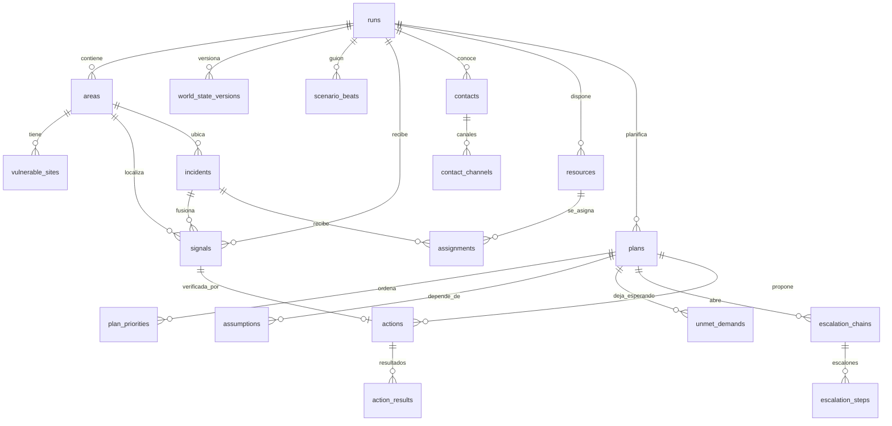
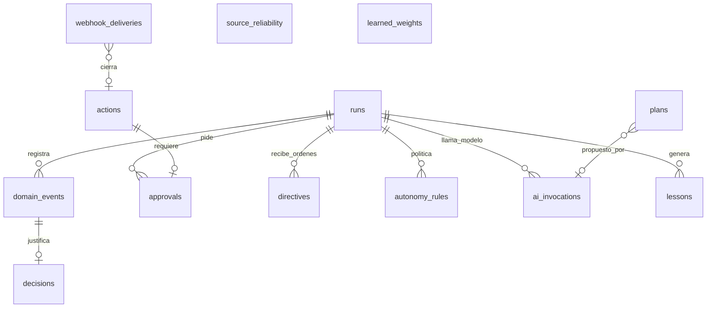

# FARO · Propuesta de modelo de datos

Estado: propuesta para discusión en equipo. Base: rama `chore-scaffold-typescript-vercel`
(Next 16, Supabase Postgres + Realtime, Zod, Vercel Workflow, AI SDK).

Este documento propone el modelo de datos completo del centro de mando. Es
deliberadamente verboso: cada tabla lleva su propósito, su DDL, la explicación
campo a campo y las decisiones que la motivan, para que se pueda discutir sin
tener que abrir el código. La versión corta está en la sección 3, el diagrama.

---

## 1. Qué tiene que soportar el modelo

El enunciado del reto obliga a responder seis preguntas en pantalla, y cada una
impone algo al modelo de datos:

| Pregunta del reto         | Lo que exige del modelo                                                                      |
| ------------------------- | -------------------------------------------------------------------------------------------- |
| Qué información importa   | Señales con probabilidad, deduplicación, fusión en incidentes, y motivo de descarte guardado |
| Qué va primero            | Ranking versionado con el desglose de la puntuación, no solo el número                       |
| A quién se avisa y cuándo | Contactos por rol, canales con fiabilidad medida, cadenas de escalado con espera             |
| Dónde van los recursos    | Asignaciones con motivo, y la lista de quién se queda esperando y por qué                    |
| Qué se hace ahora         | Acciones con nivel de autonomía, intento, idempotencia y resultado real                      |
| Cuándo tirar el plan      | Supuestos declarados por plan y el evento exacto que los rompió                              |

Y el documento fuente añade cuatro requisitos transversales:

- **Log de eventos inmutable** del que cuelga todo, para reproducir una
  ejecución y aprender de ella.
- **Aprendizaje entre ejecuciones** con lecciones validadas por una persona.
- **Honestidad sobre lo simulado**: en cada acción tiene que quedar escrito si
  salió al mundo real o no.
- **Provenance de la IA**: qué modelo propuso qué, con qué entrada, a qué coste.

---

## 2. Principios de diseño

### 2.1 El registro es la verdad; las tablas de estado son proyecciones cómodas

`domain_events` es append-only y ordenado. Todo lo demás (`signals`, `plans`,
`actions`…) es estado corriente que se puede reconstruir desde el registro. En
la práctica escribimos las dos cosas en la misma transacción, porque leer el
estado corriente es lo que hace el panel doscientas veces por minuto. Pero la
regla de oro es: **si el registro y una tabla de estado discrepan, manda el
registro**.

Esto compra tres cosas que el reto puntúa: reproducir una demo paso a paso,
auditar quién decidió qué, y alimentar el aprendizaje sin instrumentar nada más.

### 2.2 Una señal descartada no se borra: se excluye

Aprendizaje de la rama de dominio. Allí, cada señal _mutaba_ el riesgo de su
zona al llegar, y al descartarla había que revertir esa mutación con contabilidad
explícita. Funcionaba, pero era frágil y obligó a un contrato delicado entre
dos módulos. Aquí la presión sobre un incidente **se deriva** de sus señales
vivas en el momento de calcular. Descartar es cambiar un estado; el motor de
prioridad simplemente deja de contarla. Sin reversiones.

### 2.3 Probabilidades, no etiquetas

Las señales llevan `p_relevant`, `p_truthful`, `urgency` y `fused_confidence`
como numéricos en [0, 1], además de la etiqueta que declare la fuente. Es lo que
permite las tres salidas del triaje (actuar, verificar, descartar) y la fusión de
confianza entre fuentes independientes.

### 2.4 Todo lo que decide el sistema deja motivo y desglose

`plan_priorities.factors`, `assignments.reason`, `actions.reason`,
`assumptions.consequence`, `decisions.why`. No son adornos: son lo que el panel
enseña al jurado para justificar cada decisión. Si una función del dominio no
puede rellenar el motivo, es señal de que la decisión no está bien definida.

### 2.5 Idempotencia por intento

Cada `action` lleva `attempt` e `idempotency_key = "<action_id>:<attempt>"`. Un
reintento del operador estrena clave; un reintento interno del adaptador
(timeout, 5xx) reutiliza la misma. Así HappyRobot deduplica lo que debe y no lo
que no debe. Los webhooks de entrada se deduplican aparte en
`webhook_deliveries`.

### 2.6 Zod es el contrato; SQL lo materializa

Los esquemas Zod viven en `src/lib/domain/*.ts` y son la única definición de
forma que ven frontend, route handlers, workflows y agentes. La migración SQL
los materializa con `check` constraints que espejan los `z.enum`. Elegimos
`check` y no `create type … as enum` porque añadir un valor a un enum de
Postgres dentro de una transacción tiene restricciones molestas y en un
hackathon vamos a añadir valores.

### 2.7 JSONB con versión, para lo que evoluciona rápido

`factors`, `changes`, `state` del mundo, `structured` de un resultado de
llamada, `interpreted` de una directiva. Son estructuras que van a cambiar
varias veces el fin de semana. Van en `jsonb`, validadas por Zod al escribir y
al leer, y acompañadas de una columna de versión de fórmula o esquema donde
importa (`plan_priorities.formula_version`, `world_state_versions.schema_version`).

### 2.8 Multi-tenancy por ejecución

Todo cuelga de `runs`. Una ejecución es una crisis gestionada de principio a
fin: en la demo, una partida; en un operativo real, un incendio. Eso da
aislamiento de datos, permite comparar ejecuciones para aprender, y es el eje
natural de las políticas de seguridad a nivel de fila cuando entre la
autenticación de operadores.

### 2.9 Datos personales: separados, mínimos y nunca en semillas

Los teléfonos y correos viven **solo** en `contact_channels.address`. Ninguna
otra tabla los copia. Las semillas versionadas llevan `null` o marcadores. Antes
de la demo se cargan a mano los destinatarios aprobados, con `consent_note`
rellena. Es el mismo criterio de `AGENTS.md` y de la salvaguarda `demo_safe`.

---

## 3. Vista general

Dos diagramas: el bucle de decisión y las tablas de control, registro y
aprendizaje.





**Mapa módulo → tablas.** Cada módulo escribe solo sus tablas; el resto las lee.

| Módulo      | Escribe                                                                               | Lee                                              |
| ----------- | ------------------------------------------------------------------------------------- | ------------------------------------------------ |
| `scenario`  | `runs` (reloj), `world_state_versions`, `scenario_beats`, `areas`, `vulnerable_sites` | —                                                |
| `ingest`    | `signals` (alta), `webhook_deliveries`                                                | `runs`, `areas`                                  |
| `triage`    | `signals` (columnas de triaje), `source_reliability` (lectura)                        | `contacts`                                       |
| `incidents` | `incidents`, `signals.incident_id`                                                    | `signals`, `vulnerable_sites`                    |
| `resources` | `resources`, `assignments`, `unmet_demands`                                           | `incidents`, `plans`                             |
| `planning`  | `plans`, `plan_priorities`, `assumptions`                                             | todo lo anterior, `world_state_versions`         |
| `execution` | `actions`, `action_results`, `escalation_chains`, `escalation_steps`                  | `contacts`, `contact_channels`, `autonomy_rules` |
| `control`   | `approvals`, `directives`, `autonomy_rules`, `runs.autonomy_paused`                   | `actions`                                        |
| `audit`     | `domain_events`, `decisions`                                                          | —                                                |
| `learning`  | `lessons`, `learned_weights`, `source_reliability`                                    | `domain_events`, `action_results`, `signals`     |
| `agents`    | `ai_invocations`                                                                      | lo que le pase el coordinador                    |

---

## 4. Convenciones

- **Identificadores SQL en inglés y `snake_case`; tipos TypeScript en
  `camelCase`.** El mapeo lo hace una sola función por entidad
  (`rowToSignal`, `signalToRow`). Prosa, motivos y textos de pantalla en
  español.
- **Claves primarias `uuid` con `gen_random_uuid()`**, salvo `domain_events`,
  que usa `bigint generated always as identity` porque necesita orden total
  barato. Las entidades que el guion y los tests referencian por nombre estable
  (áreas, recursos, contactos de semilla) llevan además un `slug` único por
  ejecución.
- **Dos tiempos donde importa**: `occurred_at` (cuándo pasó en el mundo) y
  `received_at` o `recorded_at` (cuándo lo supimos). El decaimiento temporal y
  la reproducción de una ejecución dependen de distinguirlos.
- **`created_at` y `updated_at`** en toda tabla mutable, con el trigger
  `set_updated_at`. Las tablas append-only no tienen `updated_at`.
- **Estados como `text` con `check`**, espejo exacto de un `z.enum`. Cuando se
  añade un valor, se toca el Zod y la migración en el mismo commit.
- **Sin borrados en tablas de dominio.** Todo transita de estado
  (`dismissed`, `cancelled`, `superseded`). Las FK van con `on delete restrict`.
- **Referencias cruzadas circulares** (`signals ↔ actions`, `plans ↔
assumptions`) se añaden al final de la migración con `alter table … add
constraint`, para que el orden de creación no importe.
- **Numéricos de probabilidad** como `numeric` acotado `between 0 and 1`. Los
  costes en micro-unidades enteras (`cost_micros bigint`), nunca `float`.

```sql
create or replace function public.set_updated_at() returns trigger
language plpgsql as $$
begin
  new.updated_at = now();
  return new;
end $$;
```

---

## 5. Entidades

Orden de lectura: primero el contenedor y el mundo, luego percepción, gente y
medios, plan, acción, control, registro, aprendizaje e IA.

### 5.1 `runs` — la ejecución

Contenedor de todo. Una fila por crisis gestionada. Sustituye a la tabla
`incidents` del andamiaje, que hacía este papel con otro nombre; ese nombre lo
reservamos para las subincidencias, como pide el documento fuente.

```sql
create table public.runs (
  id               uuid primary key default gen_random_uuid(),
  name             text not null,
  kind             text not null default 'demo'
                   check (kind in ('demo', 'drill', 'live')),
  status           text not null default 'open'
                   check (status in ('open', 'paused', 'closed')),
  scenario_id      text,
  clock_speed      numeric not null default 1 check (clock_speed > 0),
  alert_level      smallint not null default 1 check (alert_level between 1 and 3),
  autonomy_paused  boolean not null default false,
  started_at       timestamptz not null default now(),
  paused_at        timestamptz,
  ended_at         timestamptz,
  summary          jsonb,
  created_at       timestamptz not null default now(),
  updated_at       timestamptz not null default now()
);
create trigger runs_updated before update on public.runs
  for each row execute function public.set_updated_at();
```

| Campo             | Para qué                                                                                                                                                         |
| ----------------- | ---------------------------------------------------------------------------------------------------------------------------------------------------------------- |
| `kind`            | `demo` es una partida ante el jurado; `drill` un ensayo del que también aprendemos; `live` queda reservado. Permite filtrar qué ejecuciones alimentan lecciones. |
| `scenario_id`     | Guion usado (`wildfire-sierra-bermeja`). `null` si no hay guion.                                                                                                 |
| `clock_speed`     | Multiplicador del reloj del escenario. El documento habla de reloj comprimido, 1 minuto real ≈ 10 de crisis.                                                     |
| `alert_level`     | Nivel de alerta 1–3. Fija cuánto coste por hora se permite gastar en recursos.                                                                                   |
| `autonomy_paused` | Interruptor general. Cuando está a `true`, toda acción pasa a exigir aprobación. Es el mando más fuerte del operador.                                            |
| `summary`         | Métricas de cierre: señales triadas, llamadas, confirmaciones, tiempo medio de replanificación, coste de triaje. Se rellena al cerrar.                           |

### 5.2 `areas` — zonas geográficas

Municipios, urbanizaciones, parajes. Son el "dónde" de todo: señales,
incidentes, recursos y puntos vulnerables se ubican en un área. En la demo:
Estepona, Jubrique, Genalguacil, Benahavís y Los Pinares.

```sql
create table public.areas (
  id           uuid primary key default gen_random_uuid(),
  run_id       uuid not null references public.runs(id),
  slug         text not null,
  name         text not null,
  kind         text not null
               check (kind in ('municipio', 'urbanizacion', 'paraje', 'via', 'otro')),
  population   integer not null default 0 check (population >= 0),
  base_risk    integer not null default 0 check (base_risk between 0 and 100),
  centroid_x   numeric not null,
  centroid_y   numeric not null,
  geometry     jsonb,
  created_at   timestamptz not null default now(),
  updated_at   timestamptz not null default now(),
  unique (run_id, slug)
);
create index areas_run_idx on public.areas (run_id);
create trigger areas_updated before update on public.areas
  for each row execute function public.set_updated_at();
```

| Campo                      | Para qué                                                                                                                                                                           |
| -------------------------- | ---------------------------------------------------------------------------------------------------------------------------------------------------------------------------------- |
| `slug`                     | Identificador estable (`estepona`, `los-pinares`) que usan el guion, las semillas y los tests. Las UUID cambian por ejecución; el slug no.                                         |
| `base_risk`                | Riesgo estructural de la zona, independiente de las señales vivas. Es la única parte del riesgo que se guarda: el resto se deriva.                                                 |
| `centroid_x`, `centroid_y` | Coordenadas del mapa del panel, en el sistema que use el SVG. Suficiente para la distancia entre zonas que necesita la asignación de recursos.                                     |
| `geometry`                 | GeoJSON opcional del polígono. Cuando haya tiempo, se sustituye por `geography(Polygon, 4326)` de PostGIS, que Supabase trae instalado; la columna `jsonb` permite empezar sin él. |

### 5.3 `vulnerable_sites` — puntos vulnerables

Residencia de mayores, colegio rural, camping. Son lo que dispara el
multiplicador de vulnerabilidad de la fórmula de prioridad y lo que convierte
una evacuación en irreversible.

```sql
create table public.vulnerable_sites (
  id            uuid primary key default gen_random_uuid(),
  run_id        uuid not null references public.runs(id),
  area_id       uuid not null references public.areas(id),
  slug          text not null,
  name          text not null,
  kind          text not null
                check (kind in ('residencia', 'colegio', 'camping', 'hospital', 'urbanizacion', 'nucleo')),
  people        integer not null check (people >= 0),
  multiplier    numeric not null default 1 check (multiplier >= 1),
  evacuated     boolean not null default false,
  evacuated_at  timestamptz,
  notes         text,
  created_at    timestamptz not null default now(),
  updated_at    timestamptz not null default now(),
  unique (run_id, slug)
);
create index vulnerable_sites_area_idx on public.vulnerable_sites (area_id);
```

`multiplier` sigue el documento: 1 por defecto, 1,5 colegio, 2 residencia. Es
un dato, no una constante en código, porque el aprendizaje puede moverlo
("el operador priorizó tres veces el colegio").

### 5.4 `world_state_versions` — el mundo simulado, versionado

Viento, carreteras cortadas, estado de los canales, camas de hospital. Cada
cambio crea una versión nueva; nunca se actualiza en sitio. Es contra lo que se
contrastan los supuestos, y versionarlo es lo que permite decir "el supuesto se
rompió en la versión 7, provocada por la señal X".

```sql
create table public.world_state_versions (
  id                    uuid primary key default gen_random_uuid(),
  run_id                uuid not null references public.runs(id),
  version               integer not null,
  schema_version        smallint not null default 1,
  state                 jsonb not null,
  caused_by_signal_id   uuid,
  caused_by_beat_id     uuid,
  caused_by_actor       text not null
                        check (caused_by_actor in ('scenario', 'operator', 'happyrobot', 'system')),
  recorded_at           timestamptz not null default now(),
  unique (run_id, version)
);
create index world_state_run_idx on public.world_state_versions (run_id, version desc);
```

Forma de `state`, validada por `worldStateSchema`:

```ts
export const worldStateSchema = z
  .object({
    wind: z.object({
      direction: z.enum(["N", "NE", "E", "SE", "S", "SO", "O", "NO"]),
      speedKmh: z.number().min(0)
    }),
    roads: z.record(z.string(), z.enum(["open", "restricted", "closed"])),
    channels: z.object({
      sms: z.boolean(),
      voice: z.boolean(),
      whatsapp: z.boolean(),
      email: z.boolean()
    }),
    hospitals: z.record(z.string(), z.object({ beds: z.number().int().min(0) })),
    frontline: z.object({ x: z.number(), y: z.number(), headingDeg: z.number() }).optional()
  })
  .strict();
```

### 5.5 `scenario_beats` — el guion

Eventos programados del escenario y botones de caos. Guardar los disparos en
base de datos, y no solo en memoria, es lo que permite que el guion sobreviva a
un reinicio del servidor a mitad de demo y que el aprendizaje sepa qué pasó y
cuándo.

```sql
create table public.scenario_beats (
  id           uuid primary key default gen_random_uuid(),
  run_id       uuid not null references public.runs(id),
  scenario_id  text not null,
  beat_key     text not null,
  at_seconds   integer not null check (at_seconds >= 0),
  label        text not null,
  kind         text not null
               check (kind in ('signal', 'world_change', 'chaos', 'noise_burst')),
  payload      jsonb not null,
  fired_at     timestamptz,
  skipped      boolean not null default false,
  fired_by     text check (fired_by in ('clock', 'operator', 'jury')),
  unique (run_id, scenario_id, beat_key)
);
create index scenario_beats_due_idx on public.scenario_beats (run_id, at_seconds)
  where fired_at is null and skipped = false;
```

`kind = 'chaos'` con `fired_by = 'jury'` es exactamente el momento "el jurado
elige qué rompemos", y queda registrado como tal. `noise_burst` es el aluvión
de cuarenta mensajes con tres relevantes: el payload lleva la lista de señales a
generar.

### 5.6 `signals` — señales

Todo lo que entra: llamadas, SMS, sensores, webhooks de HappyRobot, el guion.
Es la tabla más escrita y la primera que el triaje procesa. Sustituye a la tabla
`events` del andamiaje, que tenía este papel y un nombre que ahora reservamos
para el registro de dominio.

```sql
create table public.signals (
  id                    uuid primary key default gen_random_uuid(),
  run_id                uuid not null references public.runs(id),
  area_id               uuid references public.areas(id),
  incident_id           uuid,
  source                text not null
                        check (source in ('operator', 'sensor', 'happyrobot', 'public', 'scenario', 'webhook')),
  channel               text
                        check (channel in ('call', 'sms', 'whatsapp', 'email', 'web', 'api', 'sensor')),
  external_ref          text,
  title                 text not null check (length(title) <= 300),
  body                  text not null check (length(body) <= 4000),
  category              text not null,
  severity              text not null
                        check (severity in ('low', 'medium', 'high', 'critical')),
  reported_confidence   text
                        check (reported_confidence in ('low', 'medium', 'high')),
  location              jsonb,
  occurred_at           timestamptz not null default now(),
  received_at           timestamptz not null default now(),
  dedupe_key            text not null,
  occurrences           integer not null default 1 check (occurrences >= 1),
  merged_into_id        uuid references public.signals(id),

  -- triaje calibrado
  p_relevant            numeric check (p_relevant between 0 and 1),
  p_truthful            numeric check (p_truthful between 0 and 1),
  urgency               numeric check (urgency between 0 and 1),
  fused_confidence      numeric check (fused_confidence between 0 and 1),
  triage_decision       text check (triage_decision in ('act', 'verify', 'discard')),
  triage_rationale      text,
  triage_assessor       text
                        check (triage_assessor in ('deterministic', 'jev', 'llm', 'operator')),
  triage_details        jsonb,
  triage_latency_ms     integer,
  triage_cost_micros    bigint,
  triaged_at            timestamptz,

  -- verificación
  verification_status   text not null default 'unverified'
                        check (verification_status in ('unverified', 'verifying', 'confirmed', 'refuted')),
  verification_action_id uuid,
  verified_at           timestamptz,
  verified_by           text,

  raw                   jsonb,
  created_at            timestamptz not null default now(),
  updated_at            timestamptz not null default now()
);
create index signals_run_received_idx on public.signals (run_id, received_at desc);
create index signals_dedupe_idx       on public.signals (run_id, dedupe_key, received_at desc);
create index signals_incident_idx     on public.signals (incident_id);
create index signals_untriaged_idx    on public.signals (run_id, received_at)
  where triage_decision is null;
create index signals_live_idx         on public.signals (run_id, area_id)
  where triage_decision = 'act' and verification_status <> 'refuted';
create trigger signals_updated before update on public.signals
  for each row execute function public.set_updated_at();
```

| Campo                                                        | Para qué                                                                                                                                                                                   |
| ------------------------------------------------------------ | ------------------------------------------------------------------------------------------------------------------------------------------------------------------------------------------ |
| `source` / `channel`                                         | Fuente lógica y canal físico. `public` es un vecino; `happyrobot` es lo que devuelve una llamada del sistema. La fiabilidad aprendida cuelga de `source`.                                  |
| `external_ref`                                               | Identificador en el sistema de origen: id de llamada en HappyRobot, id de mensaje. Permite enlazar con la transcripción.                                                                   |
| `category`                                                   | Catálogo abierto (`incendio`, `evacuacion`, `route-blocked`, `refugio`). Es la clave que usan la asignación de recursos y la elección de contacto; por eso es texto sin acentos y estable. |
| `occurred_at` / `received_at`                                | El decaimiento temporal usa `occurred_at`; la ordenación del panel y la deduplicación usan `received_at`.                                                                                  |
| `dedupe_key`, `occurrences`, `merged_into_id`                | Una señal repetida dentro de la ventana no crea fila nueva: incrementa `occurrences` de la original. Si sí se creó y luego se detecta, apunta a la original con `merged_into_id`.          |
| `p_*`, `fused_confidence`, `triage_decision`                 | Las tres salidas del triaje. La banda intermedia genera una acción de verificación y `verification_status` pasa a `verifying`.                                                             |
| `triage_assessor`, `triage_latency_ms`, `triage_cost_micros` | Quién evaluó y cuánto costó. Es el dato de "40 señales triadas en X segundos por Y euros" que el documento quiere en pantalla.                                                             |
| `triage_details`                                             | Lo que no merece columna: desglose de la fusión, alternativas descartadas, versión del evaluador.                                                                                          |
| `verification_*`                                             | Resultado de la verificación por llamada o del operador. `refuted` es lo que antes llamábamos "descartada por una persona".                                                                |
| `raw`                                                        | El payload original íntegro. No se toca nunca. Es lo que permite re-triar con un evaluador mejor sin pedir el dato otra vez.                                                               |

Índices parciales (`signals_untriaged_idx`, `signals_live_idx`) porque las dos
consultas calientes son "qué queda por triar" y "qué señales vivas tiene esta
zona", y ambas son una fracción pequeña de la tabla.

### 5.7 `incidents` — subincidencias

Un incidente agrupa señales coherentes en un lugar: "frente activo en la ladera
norte de Los Pinares". Es lo que se prioriza y a lo que se asignan recursos.
Una señal pertenece a un incidente como mucho.

```sql
create table public.incidents (
  id                        uuid primary key default gen_random_uuid(),
  run_id                    uuid not null references public.runs(id),
  area_id                   uuid not null references public.areas(id),
  title                     text not null,
  category                  text not null,
  status                    text not null default 'open'
                            check (status in ('open', 'contained', 'resolved', 'dismissed')),
  gravity                   smallint not null check (gravity between 1 and 5),
  people_exposed            integer not null default 0 check (people_exposed >= 0),
  vulnerability_multiplier  numeric not null default 1 check (vulnerability_multiplier >= 1),
  minutes_to_impact         integer check (minutes_to_impact >= 0),
  fused_confidence          numeric check (fused_confidence between 0 and 1),
  location                  jsonb,
  first_signal_at           timestamptz,
  last_signal_at            timestamptz,
  opened_at                 timestamptz not null default now(),
  closed_at                 timestamptz,
  created_at                timestamptz not null default now(),
  updated_at                timestamptz not null default now()
);
create index incidents_run_open_idx on public.incidents (run_id)
  where status in ('open', 'contained');
create index incidents_area_idx on public.incidents (area_id);
create trigger incidents_updated before update on public.incidents
  for each row execute function public.set_updated_at();
```

Los cinco campos `gravity`, `people_exposed`, `vulnerability_multiplier`,
`minutes_to_impact` y `fused_confidence` son exactamente las variables G, N, V,
t y C de la fórmula de prioridad del documento. `minutes_to_impact` admite
`null` a propósito: "desconocido" es una respuesta válida y el panel debe
enseñarla como tal, no como cero.

### 5.8 `contacts` y `contact_channels` — a quién se avisa

Separamos el contacto de sus canales porque la fiabilidad se mide **por canal**:
"Bomberos Estepona no coge llamadas de noche pero responde SMS en 40 segundos"
es una lección sobre un canal, no sobre una persona.

```sql
create table public.contacts (
  id              uuid primary key default gen_random_uuid(),
  run_id          uuid not null references public.runs(id),
  slug            text not null,
  name            text not null,
  role            text not null
                  check (role in ('vecino', 'residencia', 'colegio', 'camping', 'bombero', 'sanitario',
                                  'policia', 'alcalde', 'sala-112', 'autoridad', 'voluntario', 'otro')),
  organization    text,
  area_id         uuid references public.areas(id),
  language        text not null default 'es',
  demo_safe       boolean not null default false,
  consent_note    text,
  responsiveness  numeric not null default 0.5 check (responsiveness between 0 and 1),
  created_at      timestamptz not null default now(),
  updated_at      timestamptz not null default now(),
  unique (run_id, slug),
  check (demo_safe = false or consent_note is not null)
);

create table public.contact_channels (
  id                       uuid primary key default gen_random_uuid(),
  contact_id               uuid not null references public.contacts(id),
  channel                  text not null
                           check (channel in ('call', 'sms', 'whatsapp', 'email', 'slack', 'teams')),
  address                  text not null,
  priority                 smallint not null default 1,
  attempts                 integer not null default 0,
  successes                integer not null default 0,
  avg_seconds_to_confirm   integer,
  last_used_at             timestamptz,
  created_at               timestamptz not null default now(),
  updated_at               timestamptz not null default now(),
  unique (contact_id, channel, address)
);
create index contact_channels_contact_idx on public.contact_channels (contact_id, priority);
```

| Campo                                             | Para qué                                                                                                                                                                                       |
| ------------------------------------------------- | ---------------------------------------------------------------------------------------------------------------------------------------------------------------------------------------------- |
| `role`                                            | El mensaje y el canal dependen del rol: a un vecino se le manda SMS, a un coordinador se le llama, a una autoridad se le escribe. Incluye `alcalde` porque es quien hace el jurado en la demo. |
| `demo_safe` + `consent_note`                      | Un contacto solo puede recibir una acción real si está aprobado **y** consta quién lo autorizó y para qué. El `check` obliga a las dos cosas a la vez.                                         |
| `address`                                         | El único sitio del modelo con datos personales. Nunca en semillas versionadas. Cuando Supabase Vault esté configurado, se cifra a nivel de columna.                                            |
| `attempts`, `successes`, `avg_seconds_to_confirm` | La fiabilidad medida por canal. Con mínimo de muestras antes de usarse, como ya hace el módulo de aprendizaje.                                                                                 |

### 5.9 `resources` y `assignments` — dónde van los medios

```sql
create table public.resources (
  id                  uuid primary key default gen_random_uuid(),
  run_id              uuid not null references public.runs(id),
  slug                text not null,
  name                text not null,
  kind                text not null
                      check (kind in ('ambulancia', 'helicoptero', 'bomberos', 'patrulla', 'autobus',
                                      'albergue', 'comunicaciones', 'otro')),
  capabilities        text[] not null default '{}',
  capacity            integer not null default 1 check (capacity >= 0),
  status              text not null default 'available'
                      check (status in ('available', 'assigned', 'en_route', 'unavailable')),
  home_area_id        uuid references public.areas(id),
  current_area_id     uuid references public.areas(id),
  position            jsonb,
  eta_minutes         integer,
  cost_per_hour       numeric,
  min_reserve         integer not null default 0 check (min_reserve >= 0),
  unavailable_reason  text,
  created_at          timestamptz not null default now(),
  updated_at          timestamptz not null default now(),
  unique (run_id, slug)
);
create index resources_run_status_idx on public.resources (run_id, status);
create index resources_capabilities_gin on public.resources using gin (capabilities);

create table public.assignments (
  id               uuid primary key default gen_random_uuid(),
  run_id           uuid not null references public.runs(id),
  resource_id      uuid not null references public.resources(id),
  incident_id      uuid references public.incidents(id),
  plan_id          uuid,
  action_id        uuid,
  status           text not null default 'proposed'
                   check (status in ('proposed', 'active', 'released', 'superseded')),
  score            numeric,
  reason           text not null,
  assigned_at      timestamptz not null default now(),
  released_at      timestamptz,
  released_reason  text
);
create unique index assignments_one_active_per_resource
  on public.assignments (resource_id) where status = 'active';
create index assignments_incident_idx on public.assignments (incident_id) where status = 'active';
```

| Campo                                | Para qué                                                                                                                                                                               |
| ------------------------------------ | -------------------------------------------------------------------------------------------------------------------------------------------------------------------------------------- |
| `capabilities`                       | Lo que el recurso sabe cubrir, como `text[]` con índice GIN. Es lo que evita asignar una brigada forestal a una emergencia sanitaria; la rama de dominio lo comprobó con un caso real. |
| `min_reserve`                        | Reserva mínima del tipo. No se baja de ella salvo prioridad 1, y si se hace, se marca en rojo.                                                                                         |
| `cost_per_hour` × `runs.alert_level` | El nivel de alerta fija cuánto se permite gastar.                                                                                                                                      |
| `assignments.reason` y `score`       | Por qué este recurso y no el más cercano. Es texto de pantalla.                                                                                                                        |
| Índice único parcial                 | Un recurso tiene como mucho una asignación activa. La base de datos lo garantiza, no el código.                                                                                        |

### 5.10 `plans`, `plan_priorities`, `assumptions`, `unmet_demands` — el plan

El plan es **versionado e inmutable**: cada replanificación crea una fila nueva
y marca la anterior como `superseded` o `invalid`. Solo una está `current` por
ejecución, garantizado por índice.

```sql
create table public.plans (
  id                            uuid primary key default gen_random_uuid(),
  run_id                        uuid not null references public.runs(id),
  version                       integer not null,
  previous_plan_id              uuid references public.plans(id),
  status                        text not null default 'current'
                                check (status in ('draft', 'current', 'superseded', 'invalid')),
  mode                          text not null
                                check (mode in ('deterministic', 'ai', 'simulation')),
  trigger                       text not null,
  summary                       text not null,
  changes                       jsonb not null default '[]',
  plan_b                        jsonb,
  invalidated_at                timestamptz,
  invalidated_by_assumption_id  uuid,
  ai_invocation_id              uuid,
  generated_at                  timestamptz not null default now(),
  unique (run_id, version)
);
create unique index plans_one_current on public.plans (run_id) where status = 'current';

create table public.plan_priorities (
  id               uuid primary key default gen_random_uuid(),
  plan_id          uuid not null references public.plans(id),
  incident_id      uuid not null references public.incidents(id),
  rank             integer not null check (rank >= 1),
  previous_rank    integer,
  score            numeric not null,
  formula_version  text not null,
  factors          jsonb not null,
  reason           text not null,
  unique (plan_id, incident_id),
  unique (plan_id, rank)
);

create table public.assumptions (
  id                          uuid primary key default gen_random_uuid(),
  run_id                      uuid not null references public.runs(id),
  plan_id                     uuid not null references public.plans(id),
  key                         text not null,
  text                        text not null,
  variable                    text not null,
  operator                    text not null
                              check (operator in ('eq', 'neq', 'lt', 'lte', 'gt', 'gte', 'in', 'contains')),
  expected                    jsonb not null,
  status                      text not null default 'ok'
                              check (status in ('ok', 'broken', 'unknown')),
  broken_at                   timestamptz,
  broken_by_signal_id         uuid,
  broken_by_world_version_id  uuid,
  consequence                 text,
  unique (plan_id, key)
);
create index assumptions_open_idx on public.assumptions (run_id) where status = 'ok';

create table public.unmet_demands (
  id                       uuid primary key default gen_random_uuid(),
  plan_id                  uuid not null references public.plans(id),
  incident_id              uuid not null references public.incidents(id),
  wanted_resource_kind     text not null,
  wanted_resource_id       uuid references public.resources(id),
  blocked_by_assignment_id uuid references public.assignments(id),
  estimated_wait_minutes   integer,
  accepted_risk            text not null,
  reason                   text not null
);
create index unmet_demands_plan_idx on public.unmet_demands (plan_id);
```

| Campo                                          | Para qué                                                                                                                                                                                                                                                                |
| ---------------------------------------------- | ----------------------------------------------------------------------------------------------------------------------------------------------------------------------------------------------------------------------------------------------------------------------- |
| `plans.changes`                                | El diff con la versión anterior, ya redactado para pantalla: `[{ kind, label, detail }]`. La barra de cambios del panel lee esto.                                                                                                                                       |
| `plans.trigger`                                | Por qué se replanificó, en una frase.                                                                                                                                                                                                                                   |
| `plans.mode`                                   | `deterministic` es el núcleo; `ai` cuando el coordinador propuso y el código validó; `simulation` para ejecuciones sin modelo. Nunca se mezcla en la misma fila.                                                                                                        |
| `plan_priorities.factors` + `formula_version`  | El desglose real de la puntuación. El modelo es agnóstico a la fórmula: `[{ key, label, value, op: "add" \| "mul" }]`. La rama de dominio usa factores aditivos; el documento propone una fórmula multiplicativa. Ambas caben, y `formula_version` dice cuál se aplicó. |
| `assumptions.variable`, `operator`, `expected` | El supuesto de forma evaluable contra `world_state_versions.state`: `("wind.direction", "eq", "NE")`, `("roads.A-397", "eq", "open")`, `("hospitals.costa-del-sol.beds", "gte", 10)`.                                                                                   |
| `assumptions.consequence`                      | Qué deja de tener sentido si cae: "los autobuses por la A-397 hacia el pabellón".                                                                                                                                                                                       |
| `unmet_demands`                                | Quién se queda esperando en esta versión del plan, qué quería, quién se lo llevó y qué riesgo se acepta. Es el pilar 3 del documento hecho tabla.                                                                                                                       |

### 5.11 `escalation_chains`, `escalation_steps`, `actions`, `action_results`, `webhook_deliveries` — ejecutar

```sql
create table public.escalation_chains (
  id            uuid primary key default gen_random_uuid(),
  run_id        uuid not null references public.runs(id),
  plan_id       uuid references public.plans(id),
  incident_id   uuid references public.incidents(id),
  objective     text not null,
  status        text not null default 'active'
                check (status in ('active', 'satisfied', 'exhausted', 'cancelled')),
  current_step  integer not null default 0,
  workflow_run_id text,
  created_at    timestamptz not null default now(),
  updated_at    timestamptz not null default now()
);

create table public.escalation_steps (
  id            uuid primary key default gen_random_uuid(),
  chain_id      uuid not null references public.escalation_chains(id),
  position      integer not null check (position >= 0),
  contact_id    uuid not null references public.contacts(id),
  channel       text not null,
  wait_seconds  integer not null check (wait_seconds > 0),
  reason        text not null,
  ask_for       text,
  action_id     uuid,
  unique (chain_id, position)
);

create table public.actions (
  id                  uuid primary key default gen_random_uuid(),
  run_id              uuid not null references public.runs(id),
  plan_id             uuid references public.plans(id),
  incident_id         uuid references public.incidents(id),
  kind                text not null
                      check (kind in ('verify', 'notify', 'assign', 'mass_alert', 'evacuate',
                                      'escalate', 'ticket', 'review')),
  channel             text not null
                      check (channel in ('call', 'sms', 'whatsapp', 'email', 'slack', 'teams',
                                         'ticket', 'webhook', 'internal')),
  contact_id          uuid references public.contacts(id),
  resource_id         uuid references public.resources(id),
  chain_step_id       uuid,
  verifies_signal_id  uuid references public.signals(id),
  target_label        text not null,
  objective           text not null,
  message_body        text,
  ask_for             text,
  reason              text not null,
  autonomy_level      text not null
                      check (autonomy_level in ('auto', 'auto_notify', 'approval')),
  reversibility       text not null
                      check (reversibility in ('reversible', 'partial', 'irreversible')),
  status              text not null default 'proposed'
                      check (status in ('proposed', 'awaiting_approval', 'approved', 'rejected',
                                        'running', 'succeeded', 'failed', 'blocked', 'stalled',
                                        'cancelled')),
  execution_mode      text not null default 'simulated'
                      check (execution_mode in ('simulated', 'live')),
  attempt             integer not null default 1 check (attempt >= 1),
  idempotency_key     text not null unique,
  external_action_id  text,
  workflow_run_id     text,
  approval_id         uuid,
  error               text,
  result_summary      text,
  stalled_after       timestamptz,
  dispatched_at       timestamptz,
  completed_at        timestamptz,
  created_at          timestamptz not null default now(),
  updated_at          timestamptz not null default now()
);
create index actions_run_open_idx on public.actions (run_id, created_at desc)
  where status in ('proposed', 'awaiting_approval', 'approved', 'running', 'blocked', 'stalled');
create index actions_external_idx on public.actions (external_action_id)
  where external_action_id is not null;
create index actions_stalled_sweep_idx on public.actions (stalled_after)
  where status = 'running';
create trigger actions_updated before update on public.actions
  for each row execute function public.set_updated_at();

create table public.action_results (
  id              uuid primary key default gen_random_uuid(),
  action_id       uuid not null references public.actions(id),
  attempt         integer not null,
  outcome         text not null
                  check (outcome in ('accepted', 'declined', 'no_answer', 'needs_human',
                                     'delivered', 'failed', 'info')),
  summary         text,
  transcript      text,
  structured      jsonb,
  new_signal_ids  uuid[] not null default '{}',
  received_via    text not null
                  check (received_via in ('webhook', 'poll', 'manual', 'simulation')),
  received_at     timestamptz not null default now()
);
create index action_results_action_idx on public.action_results (action_id, received_at desc);

create table public.webhook_deliveries (
  id            uuid primary key default gen_random_uuid(),
  provider      text not null,
  delivery_id   text not null,
  body_sha256   text not null,
  action_id     uuid references public.actions(id),
  http_status   integer,
  response      jsonb,
  received_at   timestamptz not null default now(),
  unique (provider, delivery_id)
);
```

| Campo                             | Para qué                                                                                                                                                                                    |
| --------------------------------- | ------------------------------------------------------------------------------------------------------------------------------------------------------------------------------------------- |
| `actions.kind`                    | Tipo a efectos de autonomía. Extiende los tres del andamiaje (`review`, `notify`, `allocate` → `assign`) con los que exige el documento: `verify`, `mass_alert`, `evacuate`, `escalate`.    |
| `autonomy_level`, `reversibility` | Con qué nivel se despachó y por qué. Se copian de la regla en el momento de crear la acción, para que cambiar la política después no reescriba la historia.                                 |
| `execution_mode`                  | `simulated` o `live`. No hay tercer valor. El panel lo enseña en cada fila.                                                                                                                 |
| `attempt`, `idempotency_key`      | Ver principio 2.5. La unicidad la garantiza la base de datos.                                                                                                                               |
| `workflow_run_id`                 | Enlace con la ejecución de Vercel Workflow que lleva esta acción. Workflow persiste su propio estado; nosotros guardamos la referencia.                                                     |
| `stalled_after`                   | Cuándo pasa a considerarse atascada si no llega resultado. Un índice parcial hace barato el barrido.                                                                                        |
| `verifies_signal_id`              | La acción de verificación apunta a la señal cuya duda resuelve. Al llegar el resultado, se actualiza `signals.verification_status`.                                                         |
| `action_results.structured`       | Los campos que devuelve el agente de HappyRobot: "confirma humo", "dirección", "personas". Lo que se convierte en señales nuevas queda en `new_signal_ids`.                                 |
| `action_results.transcript`       | La transcripción de la llamada. Materia prima del aprendizaje.                                                                                                                              |
| `webhook_deliveries`              | Deduplicación de entrada: el mismo callback reenviado devuelve la misma respuesta y no mueve nada. Clave `(provider, delivery_id)`; si el proveedor no manda id, se usa el hash del cuerpo. |

### 5.12 `autonomy_rules`, `approvals`, `directives` — control humano

```sql
create table public.autonomy_rules (
  id                    uuid primary key default gen_random_uuid(),
  run_id                uuid references public.runs(id),
  action_kind           text not null,
  reversibility         text not null
                        check (reversibility in ('reversible', 'partial', 'irreversible')),
  level                 text not null
                        check (level in ('auto', 'auto_notify', 'approval')),
  confidence_threshold  numeric check (confidence_threshold between 0 and 1),
  rationale             text not null,
  enabled               boolean not null default true,
  updated_by            text,
  updated_at            timestamptz not null default now()
);
create unique index autonomy_rules_scope_idx
  on public.autonomy_rules (coalesce(run_id, '00000000-0000-0000-0000-000000000000'::uuid), action_kind);

create table public.approvals (
  id                   uuid primary key default gen_random_uuid(),
  run_id               uuid not null references public.runs(id),
  action_id            uuid not null references public.actions(id),
  status               text not null default 'pending'
                       check (status in ('pending', 'approved', 'rejected', 'expired')),
  consequence_preview  jsonb,
  requested_at         timestamptz not null default now(),
  decided_at           timestamptz,
  decided_by           text,
  note                 text
);
create unique index approvals_one_pending on public.approvals (action_id) where status = 'pending';
create index approvals_run_pending_idx on public.approvals (run_id) where status = 'pending';

create table public.directives (
  id                   uuid primary key default gen_random_uuid(),
  run_id               uuid not null references public.runs(id),
  raw_text             text not null,
  interpreted          jsonb,
  interpretation_mode  text check (interpretation_mode in ('ai', 'manual')),
  ai_invocation_id     uuid,
  status               text not null default 'active'
                       check (status in ('active', 'revoked', 'rejected')),
  author               text not null,
  created_at           timestamptz not null default now(),
  revoked_at           timestamptz
);
create index directives_active_idx on public.directives (run_id) where status = 'active';
```

| Campo                                 | Para qué                                                                                                                                                                                                                                            |
| ------------------------------------- | --------------------------------------------------------------------------------------------------------------------------------------------------------------------------------------------------------------------------------------------------- |
| `autonomy_rules.run_id` nulo          | Regla global por defecto; con `run_id`, la sobreescribe para esa ejecución. El operador puede subir o bajar niveles desde steering sin tocar la global.                                                                                             |
| `approvals.consequence_preview`       | Lo que pasa si se aprueba y si se rechaza: qué zona queda descubierta, qué recurso se mueve. El documento quiere que el humano vea la consecuencia **antes** de confirmar.                                                                          |
| `directives.raw_text` / `interpreted` | "Prioriza el colegio" tal cual lo escribió el operador, y la restricción estructurada en que se convirtió: `{ kind: "boost", target: { vulnerable_site: "colegio-rural" }, factor: 1.5 }`. Se guardan las dos para poder auditar la interpretación. |

### 5.13 `domain_events` y `decisions` — el registro

```sql
create table public.domain_events (
  id            bigint generated always as identity primary key,
  run_id        uuid not null references public.runs(id),
  type          text not null,
  actor         text not null
                check (actor in ('system', 'operator', 'happyrobot', 'scenario', 'ai', 'jury')),
  entity_type   text,
  entity_id     uuid,
  plan_version  integer,
  payload       jsonb not null default '{}',
  occurred_at   timestamptz not null default now()
);
create index domain_events_run_idx on public.domain_events (run_id, id);
create index domain_events_entity_idx on public.domain_events (entity_type, entity_id);
create index domain_events_type_idx on public.domain_events (run_id, type);

create table public.decisions (
  id                uuid primary key default gen_random_uuid(),
  run_id            uuid not null references public.runs(id),
  domain_event_id   bigint references public.domain_events(id),
  kind              text not null
                    check (kind in ('triage', 'fusion', 'priority', 'assignment', 'autonomy',
                                    'channel', 'replan', 'invalidation', 'approval', 'override')),
  what              text not null,
  why               text not null,
  confidence        numeric check (confidence between 0 and 1),
  actor             text not null,
  entity_type       text,
  entity_id         uuid,
  inputs            jsonb not null default '{}',
  ai_invocation_id  uuid,
  decided_at        timestamptz not null default now()
);
create index decisions_run_idx on public.decisions (run_id, decided_at desc);
```

`domain_events` es append-only de verdad: además de no tener `updated_at`, se
revocan `update` y `delete` incluso al rol de servicio y se conceden solo
`insert` y `select`. `type` sigue la convención `entidad.verbo`:
`signal.received`, `signal.triaged`, `plan.invalidated`, `action.dispatched`,
`approval.decided`, `chaos.fired`.

`decisions` es la versión legible del registro: qué, por qué, con qué
confianza, quién, con qué entradas. Es lo que el panel de auditoría enseña y
lo que el aprendizaje lee. `inputs` lleva los ids de señales, recursos y
supuestos que se usaron, para poder reproducir la decisión.

### 5.14 `lessons`, `source_reliability`, `learned_weights` — aprender

```sql
create table public.lessons (
  id                 uuid primary key default gen_random_uuid(),
  source_run_id      uuid not null references public.runs(id),
  pattern            text not null,
  change             jsonb not null,
  metric             text not null,
  evidence           jsonb,
  status             text not null default 'proposed'
                     check (status in ('proposed', 'accepted', 'rejected', 'applied')),
  reviewed_by        text,
  reviewed_at        timestamptz,
  applied_in_run_id  uuid references public.runs(id),
  created_at         timestamptz not null default now()
);
create index lessons_status_idx on public.lessons (status, created_at desc);

create table public.source_reliability (
  id            uuid primary key default gen_random_uuid(),
  source        text not null,
  category      text,
  reliability   numeric not null check (reliability between 0 and 1),
  observations  integer not null default 0,
  confirmed     integer not null default 0,
  refuted       integer not null default 0,
  min_samples   integer not null default 8,
  explanation   text,
  updated_at    timestamptz not null default now()
);
create unique index source_reliability_scope_idx
  on public.source_reliability (source, coalesce(category, ''));

create table public.learned_weights (
  id                    uuid primary key default gen_random_uuid(),
  scope                 text not null default 'global',
  key                   text not null,
  value                 jsonb not null,
  samples               integer not null default 0,
  derived_from_run_ids  uuid[] not null default '{}',
  explanation           text not null,
  updated_at            timestamptz not null default now(),
  unique (scope, key)
);
```

| Campo                            | Para qué                                                                                                                                                                                                                                                |
| -------------------------------- | ------------------------------------------------------------------------------------------------------------------------------------------------------------------------------------------------------------------------------------------------------- |
| `lessons.change`                 | Un parche estructurado, no prosa: `{ target: "contact_channel", contact: "bomberos-estepona", set: { preferred: "sms" } }`. Es lo que la siguiente ejecución **aplica** al cargar.                                                                      |
| `lessons.metric` + `evidence`    | La cifra que la justifica y los ids que lo prueban. Sin métrica no hay lección, y el panel enseña las dos.                                                                                                                                              |
| `lessons.status`                 | Las lecciones las valida una persona antes de activarse. `applied` cuando una ejecución las cargó, con `applied_in_run_id`. Es lo que permite etiquetar en el feed "SMS en vez de llamada · lección #3".                                                |
| `source_reliability.min_samples` | Por debajo del mínimo la fiabilidad no se publica. Un sistema que sobrerreacciona a un solo error es peor que uno que no aprende.                                                                                                                       |
| `learned_weights`                | Pesos derivados de ejecuciones pasadas con su explicación: `triage.verify_threshold`, `channel.sms.success_rate`, `vulnerability.colegio.multiplier`. Se reconstruyen desde cero al arrancar sumando `runs` cerradas, para que reiniciar no infle nada. |

### 5.15 `ai_invocations` — provenance del modelo

Cada llamada al AI SDK deja fila. Sin excepción. Es lo que permite responder
"¿y si el modelo se equivoca?" con datos, y enseñar coste y latencia en
pantalla.

```sql
create table public.ai_invocations (
  id                uuid primary key default gen_random_uuid(),
  run_id            uuid references public.runs(id),
  agent             text not null
                    check (agent in ('coordinator', 'triage', 'planner', 'communicator', 'steering')),
  model             text not null,
  prompt_version    text not null,
  schema_name       text,
  input_hash        text not null,
  input             jsonb,
  output            jsonb,
  valid             boolean,
  validation_error  text,
  latency_ms        integer,
  input_tokens      integer,
  output_tokens     integer,
  cost_micros       bigint,
  created_at        timestamptz not null default now()
);
create index ai_invocations_run_idx on public.ai_invocations (run_id, created_at desc);
```

`valid = false` con `validation_error` es el caso "el modelo devolvió algo que
Zod rechazó": se registra, se reintenta o se cae al determinista, y queda
constancia. `input_hash` permite cachear y detectar que el mismo prompt dio
salidas distintas.

### 5.16 Restricciones cruzadas

Se añaden al final de la migración, cuando todas las tablas existen.

```sql
alter table public.signals
  add constraint signals_incident_fk foreign key (incident_id) references public.incidents(id),
  add constraint signals_verification_action_fk foreign key (verification_action_id) references public.actions(id);

alter table public.world_state_versions
  add constraint world_caused_by_signal_fk foreign key (caused_by_signal_id) references public.signals(id),
  add constraint world_caused_by_beat_fk foreign key (caused_by_beat_id) references public.scenario_beats(id);

alter table public.assignments
  add constraint assignments_plan_fk foreign key (plan_id) references public.plans(id),
  add constraint assignments_action_fk foreign key (action_id) references public.actions(id);

alter table public.plans
  add constraint plans_invalidated_by_fk foreign key (invalidated_by_assumption_id) references public.assumptions(id),
  add constraint plans_ai_invocation_fk foreign key (ai_invocation_id) references public.ai_invocations(id);

alter table public.assumptions
  add constraint assumptions_broken_by_signal_fk foreign key (broken_by_signal_id) references public.signals(id),
  add constraint assumptions_broken_by_world_fk foreign key (broken_by_world_version_id) references public.world_state_versions(id);

alter table public.escalation_steps
  add constraint escalation_steps_action_fk foreign key (action_id) references public.actions(id);

alter table public.actions
  add constraint actions_chain_step_fk foreign key (chain_step_id) references public.escalation_steps(id),
  add constraint actions_approval_fk foreign key (approval_id) references public.approvals(id);

alter table public.directives
  add constraint directives_ai_invocation_fk foreign key (ai_invocation_id) references public.ai_invocations(id);

alter table public.decisions
  add constraint decisions_ai_invocation_fk foreign key (ai_invocation_id) references public.ai_invocations(id);
```

---

## 6. Esquemas Zod del contrato

Solo los que cruzan la frontera entre frontend, route handlers, workflows y
agentes. El resto son internos y siguen el mismo patrón. Viven en
`src/lib/domain/`, un fichero por entidad, y exportan tanto el esquema de
**entrada** (lo que acepta la API) como el de **fila** (lo que hay en la tabla).

```ts
// src/lib/domain/shared.ts
import { z } from "zod";

export const severity = z.enum(["low", "medium", "high", "critical"]);
export const confidenceLabel = z.enum(["low", "medium", "high"]);
export const probability = z.number().min(0).max(1);
export const isoDate = z.iso.datetime();

export const signalSource = z.enum(["operator", "sensor", "happyrobot", "public", "scenario", "webhook"]);
export const channel = z.enum([
  "call",
  "sms",
  "whatsapp",
  "email",
  "slack",
  "teams",
  "ticket",
  "webhook",
  "internal"
]);
export const triageDecision = z.enum(["act", "verify", "discard"]);
export const autonomyLevel = z.enum(["auto", "auto_notify", "approval"]);
export const reversibility = z.enum(["reversible", "partial", "irreversible"]);
export const actionKind = z.enum([
  "verify",
  "notify",
  "assign",
  "mass_alert",
  "evacuate",
  "escalate",
  "ticket",
  "review"
]);
export const actionStatus = z.enum([
  "proposed",
  "awaiting_approval",
  "approved",
  "rejected",
  "running",
  "succeeded",
  "failed",
  "blocked",
  "stalled",
  "cancelled"
]);
```

```ts
// src/lib/domain/signal.ts
export const incomingSignalSchema = z
  .object({
    runId: z.uuid(),
    areaSlug: z.string().min(1).optional(),
    source: signalSource,
    channel: channel.optional(),
    externalRef: z.string().max(200).optional(),
    title: z.string().trim().min(1).max(300),
    body: z.string().trim().min(1).max(4000),
    category: z.string().regex(/^[a-z0-9-]+$/),
    severity,
    reportedConfidence: confidenceLabel.optional(),
    location: z.object({ x: z.number(), y: z.number() }).optional(),
    occurredAt: isoDate.optional(),
    raw: z.unknown().optional()
  })
  .strict();

export const signalAssessmentSchema = z
  .object({
    pRelevant: probability,
    pTruthful: probability,
    urgency: probability,
    fusedConfidence: probability,
    decision: triageDecision,
    rationale: z.string().min(1).max(600),
    assessor: z.enum(["deterministic", "jev", "llm", "operator"]),
    latencyMs: z.number().int().min(0).optional(),
    costMicros: z.number().int().min(0).optional(),
    details: z.record(z.string(), z.unknown()).optional()
  })
  .strict();
```

```ts
// src/lib/domain/plan.ts
export const priorityFactorSchema = z
  .object({
    key: z.string(),
    label: z.string(),
    value: z.number(),
    op: z.enum(["add", "mul"]).default("add")
  })
  .strict();

export const planPrioritySchema = z
  .object({
    incidentId: z.uuid(),
    rank: z.number().int().min(1),
    previousRank: z.number().int().min(1).nullable(),
    score: z.number(),
    formulaVersion: z.string(),
    factors: z.array(priorityFactorSchema).min(1),
    reason: z.string().min(1).max(400)
  })
  .strict();

export const planChangeSchema = z
  .object({
    kind: z.enum([
      "priority_up",
      "priority_down",
      "action_added",
      "action_invalidated",
      "resource_reassigned",
      "assumption_broken",
      "zone_status",
      "integration"
    ]),
    label: z.string().min(1).max(160),
    detail: z.string().min(1).max(600)
  })
  .strict();

export const assumptionSchema = z
  .object({
    key: z.string().regex(/^[a-z0-9.-]+$/),
    text: z.string().min(1).max(200),
    variable: z.string(),
    operator: z.enum(["eq", "neq", "lt", "lte", "gt", "gte", "in", "contains"]),
    expected: z.unknown(),
    consequence: z.string().max(400).optional()
  })
  .strict();

/** Salida del planificador (AI SDK). El código la valida antes de persistir nada. */
export const plannerOutputSchema = z
  .object({
    summary: z.string().min(1).max(600),
    priorities: z.array(planPrioritySchema).min(1),
    assumptions: z.array(assumptionSchema).min(1).max(8),
    proposedActions: z
      .array(
        z
          .object({
            kind: actionKind,
            channel,
            incidentId: z.uuid(),
            contactSlug: z.string().optional(),
            resourceSlug: z.string().optional(),
            objective: z.string().min(1).max(400),
            messageBody: z.string().max(1200).optional(),
            askFor: z.string().max(300).optional(),
            reason: z.string().min(1).max(400)
          })
          .strict()
      )
      .max(12),
    planB: z.string().max(800).optional()
  })
  .strict();
```

```ts
// src/lib/domain/action.ts
export const createActionSchema = z
  .object({
    runId: z.uuid(),
    incidentId: z.uuid().optional(),
    kind: actionKind,
    channel,
    contactId: z.uuid().optional(),
    resourceId: z.uuid().optional(),
    targetLabel: z.string().min(1).max(200),
    objective: z.string().min(1).max(400),
    messageBody: z.string().max(1200).optional(),
    reason: z.string().min(1).max(400)
  })
  .strict();

export const actionResultSchema = z
  .object({
    externalActionId: z.string().optional(),
    localActionId: z.uuid().optional(),
    attempt: z.number().int().min(1),
    outcome: z.enum(["accepted", "declined", "no_answer", "needs_human", "delivered", "failed", "info"]),
    summary: z.string().max(2000).optional(),
    transcript: z.string().max(20000).optional(),
    structured: z.record(z.string(), z.unknown()).optional(),
    newInformation: z
      .array(incomingSignalSchema.omit({ runId: true }))
      .max(10)
      .optional()
  })
  .strict();
```

```ts
// src/lib/domain/control.ts
export const approvalDecisionSchema = z
  .object({
    approvalId: z.uuid(),
    decision: z.enum(["approved", "rejected"]),
    note: z.string().max(400).optional()
  })
  .strict();

export const directiveSchema = z
  .object({
    runId: z.uuid(),
    rawText: z.string().trim().min(1).max(300)
  })
  .strict();

export const interpretedDirectiveSchema = z.discriminatedUnion("kind", [
  z.object({
    kind: z.literal("boost"),
    target: z.object({ incidentId: z.uuid().optional(), vulnerableSiteSlug: z.string().optional() }),
    factor: z.number().min(1).max(3)
  }),
  z.object({ kind: z.literal("forbid_resource"), resourceSlug: z.string() }),
  z.object({ kind: z.literal("reserve"), resourceKind: z.string(), minimum: z.number().int().min(0) }),
  z.object({ kind: z.literal("pause_autonomy") }),
  z.object({ kind: z.literal("set_autonomy"), actionKind, level: autonomyLevel })
]);
```

**Tipos TypeScript**: `z.infer` de cada esquema. Para las filas, se genera
`Database` con `supabase gen types typescript` y se mantiene la función de
mapeo `rowTo*` como único punto donde `snake_case` se convierte en
`camelCase`.

---

## 7. Flujos y qué tablas tocan

Cada flujo es una transacción, salvo donde se indica. Todos escriben
`domain_events`.

**Entrada y triaje.**
`webhook_deliveries` (dedupe) → `signals` (alta con `raw`) → triaje rellena
`p_*`, `triage_decision` → si `discard`, fin; si `verify`, `actions` (kind
`verify`, `verifies_signal_id`) y `signals.verification_status = 'verifying'`;
si `act`, fusión en `incidents` (`signals.incident_id`) y recálculo de
`fused_confidence`. `decisions` con kind `triage` y `fusion`.

**Replanificación.**
Disparada por: señal en `act`, resultado de acción, supuesto roto, directiva
nueva, recurso caído. Lee `incidents` abiertos, `signals` vivas, `resources`,
`world_state_versions` actual, `directives` activas, `learned_weights`. Escribe
`plans` (versión nueva, la anterior a `superseded`), `plan_priorities`,
`assumptions`, `assignments` (nuevas `active`, las que cambian a `superseded`),
`unmet_demands`, `actions` propuestas, y `decisions` con kind `priority`,
`assignment`, `replan`. Si intervino el coordinador, `ai_invocations` primero y
`plans.ai_invocation_id` después.

**Rotura de supuesto.**
Nueva `world_state_versions` o señal en `act` → se evalúan `assumptions` con
`status = 'ok'` del plan `current` → las que fallan pasan a `broken` con
`broken_by_*` → `plans.status = 'invalid'`, `invalidated_by_assumption_id` →
`decisions` kind `invalidation` → replanificación inmediata. Las acciones del
plan inválido que dependían del supuesto pasan a `cancelled` con `error`
explicando por qué.

**Despacho de una acción.**
`autonomy_rules` + `runs.autonomy_paused` deciden `autonomy_level`. Si
`approval`, fila en `approvals` y estado `awaiting_approval`; el Workflow espera
el evento. Si `auto` o `auto_notify`, estado `running`, `dispatched_at`,
`stalled_after`, `execution_mode` según `contacts.demo_safe` y la
configuración. El adaptador envía con `idempotency_key`. `decisions` kind
`autonomy` y `channel`.

**Resultado de una acción.**
`webhook_deliveries` → `action_results` → `actions.status`, `completed_at`,
`result_summary` → `contact_channels.attempts/successes` → si trae
`newInformation`, señales nuevas con `source = 'happyrobot'` → si era
verificación, `signals.verification_status` → replanificación si algo cambió.
Si `no_answer` y hay `chain_step_id`, `escalation_chains.current_step` avanza
y se crea la acción del escalón siguiente.

**Cierre de ejecución.**
`runs.status = 'closed'`, `ended_at`, `summary` con métricas. El módulo de
aprendizaje lee `domain_events`, `decisions`, `action_results` y `signals` de
la ejecución y escribe `lessons` en `proposed`, y recalcula `source_reliability`
y `learned_weights` desde todas las ejecuciones cerradas de `kind` en
(`demo`, `drill`). Nada de esto toca la ejecución siguiente hasta que una
persona pase la lección a `accepted`.

---

## 8. Seguridad a nivel de fila y tiempo real

**Fase 1, la de la demo.** Igual que el andamiaje: RLS activado en todas las
tablas, permisos revocados a `anon` y `authenticated`, todo concedido a
`service_role`. El navegador no habla con Supabase; habla con los route
handlers, que usan la clave de servicio. Tiempo real en esta fase: el servidor
se suscribe a `postgres_changes` y reemite al navegador por Server-Sent Events
desde un route handler, filtrado por `run_id`. Es una pieza pequeña y evita
abrir la base de datos al navegador antes de tener autenticación.

```sql
alter table public.runs enable row level security;
-- … idem para las 30 tablas restantes …
revoke all on all tables in schema public from anon, authenticated;
grant all on all tables in schema public to service_role;
revoke update, delete on public.domain_events from service_role;
grant insert, select on public.domain_events to service_role;
```

**Fase 2, con operadores autenticados.** Se añade `run_members (run_id,
user_id, role)` y políticas de lectura por pertenencia. Entonces el navegador
puede suscribirse directo a Realtime.

```sql
create policy "members read signals" on public.signals
  for select to authenticated
  using (run_id in (select run_id from public.run_members where user_id = auth.uid()));
```

**Publicación de Realtime.** Estrecha a propósito. El andamiaje publicaba
`events`; aquí se publican las tablas cuyo cambio debe repintar el panel sin
esperar al siguiente sondeo, y no las de alto volumen.

```sql
alter publication supabase_realtime add table
  public.plans, public.plan_priorities, public.assumptions,
  public.actions, public.approvals, public.world_state_versions, public.runs;
```

`signals` y `domain_events` **no** se publican: en un aluvión de cuarenta
mensajes saturarían el canal. El panel las recarga cuando `plans` cambia, que
es cuando de verdad ha pasado algo.

---

## 9. Escalabilidad

Lo que se hace ahora porque es barato, y lo que se deja preparado.

- **Índices parciales en los caminos calientes**: señales sin triar, señales
  vivas por zona, acciones abiertas, aprobaciones pendientes, supuestos en pie,
  beats por disparar. Son las consultas que el panel y el Workflow hacen en
  bucle, y cada una toca una fracción pequeña de su tabla.
- **`domain_events` con identidad `bigint`**: orden total sin `order by
occurred_at`, cursores baratos (`where id > $last`) para el feed y para
  reproducir una ejecución. Cuando crezca, se particiona por `run_id` con
  `partition by hash`; la clave ya está en todas las consultas.
- **Retención**: `runs.kind = 'drill'` se puede purgar por antigüedad sin tocar
  las demo; `ai_invocations.input/output` se puede vaciar pasado un tiempo
  conservando `input_hash`, coste y latencia.
- **JSONB solo donde no se filtra**: `factors`, `changes`, `state`,
  `structured`. Lo que se filtra o se ordena tiene columna propia. Si hace
  falta buscar dentro de `state`, índice GIN con `jsonb_path_ops` en esa
  columna concreta, no en todas.
- **Sin arrays crecientes sin tope**: `new_signal_ids` y `derived_from_run_ids`
  son cortos por construcción. Las relaciones muchos a muchos de verdad tienen
  tabla.
- **Serverless y conexiones**: los route handlers y los pasos de Workflow usan
  el pooler de Supabase en modo transacción. Ninguna función mantiene la
  conexión abierta entre invocaciones.
- **Vistas para el panel**: `v_run_situation(run_id)` agrupa plan actual,
  prioridades, acciones abiertas, aprobaciones pendientes, supuestos y espera
  en una sola consulta. Empieza como vista normal; si el panel lo necesita, se
  materializa y se refresca en el trigger de `plans`.
- **PostGIS cuando toque**: `areas.geometry` y `signals.location` pasan a
  `geography` con índice GiST cuando el mapa deje de ser un SVG. La columna
  `jsonb` de ahora se convierte con una migración de datos, no de esquema.

---

## 10. Plan de migración desde el andamiaje

La migración `202609180001_initial_schema.sql` del andamiaje está **escrita
pero no aplicada en ningún entorno** (así lo dice su `TASKS.md`). Por tanto no
hay nada que migrar: se sustituye por la de este documento, en el mismo
fichero o en `202609180002_faro_schema.sql` borrando la anterior.

Renombrados respecto al andamiaje, para que el equipo no se confunda leyendo
código antiguo:

| Andamiaje                    | Aquí                                   | Por qué                                                                                      |
| ---------------------------- | -------------------------------------- | -------------------------------------------------------------------------------------------- |
| `incidents` (contenedor)     | `runs`                                 | El documento fuente usa "incidente" para la subincidencia priorizable.                       |
| `events` (entradas)          | `signals`                              | "Evento" queda para el registro de dominio, como pide el módulo `audit`.                     |
| `results`                    | `action_results`                       | Explícito sobre a qué pertenece.                                                             |
| `actions.kind` `allocate`    | `assign`                               | Alineado con la autonomía y con el motor de recursos.                                        |
| `actions.status` `simulated` | `actions.execution_mode = 'simulated'` | Simulado no es un estado del ciclo de vida; una acción simulada también se completa o falla. |

Lo que se conserva tal cual del andamiaje: RLS activado por defecto con
permisos revocados a `anon` y `authenticated`, `idempotency_key` único en
acciones, `plans.mode` con la distinción simulación/IA, y la disciplina de que
el adaptador HappyRobot devuelva `blocked` explícito cuando no está
configurado.

Orden de trabajo propuesto:

1. `src/lib/domain/*.ts` con los esquemas Zod de la sección 6 y sus tests.
2. La migración con las 31 tablas, restricciones cruzadas, RLS y publicación.
3. `supabase gen types` y las funciones `rowTo*` / `*ToRow`.
4. Semillas de Sierra Bermeja (`areas`, `vulnerable_sites`, `resources`,
   `contacts` sin `address`, `autonomy_rules` globales, `scenario_beats`).
5. Repositorios por módulo, cada uno escribiendo solo sus tablas.

---

## 11. Decisiones abiertas

- **Fórmula de prioridad.** El modelo admite factores aditivos y
  multiplicativos con `formula_version`. Hay que elegir una para la demo. La
  multiplicativa del documento es más fácil de contar en una frase; la aditiva
  de la rama de dominio tiene 49 tests y decaimiento temporal probado.
- **Cifrado de `contact_channels.address`.** Supabase Vault está disponible;
  configurarlo cuesta media hora. Propuesta: antes de cargar el número del
  jurado.
- **Realtime en fase 1.** Server-Sent Events desde un route handler, como se
  propone, o abrir ya políticas de lectura para `authenticated` con un login
  mínimo. Lo segundo es más "Supabase"; lo primero no exige autenticación en
  la demo.
- **Tickets.** El documento los menciona como tabla propia en Supabase. Aquí
  son `actions` con `kind = 'ticket'` y `channel = 'ticket'`. Si hace falta
  un flujo de tickets con responsable y vencimiento, se saca a tabla.
- **Ruido del escenario.** `scenario_beats.kind = 'noise_burst'` genera las
  señales al disparar. Alternativa: pregenerarlas como filas de `signals` con
  `received_at` futuro. La primera es más simple; la segunda permite
  inspeccionar el aluvión antes de la demo.
