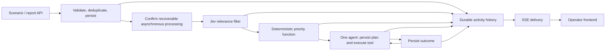

# Initial POC · scope and work packages

Scope agreed on 2026-09-19. This is the team's initial delivery plan, not a claim
of implemented behavior. TASKS.md tracks completion. The broader product vision
remains the long-term direction; this document takes precedence for the initial
POC scope over the broader architecture and contract drafts.

P2 delivery update: the [Jev filter module](jev-filter.md) implements shared
request/result/P3 handoff schemas and backend logs. Initial frontend filtering
notification is explicitly TBD; the eventual SSE path below remains the target.
P1/P0 still own invoking and persisting the filter during asynchronous processing.

Use [POC module contracts v1](poc-contracts.md) for package interfaces. Reuse the
input and SSE implementation from `origin/event-pipeline-backend-frontend`
(`e2579a9`); its port into this checkout remains pending. P0 extends domain
payloads behind that transport rather than designing another input/SSE contract.

## Goal and boundaries

Demonstrate one Sierra Bermeja scenario, one coordinating agent, and one
HappyRobot operation: receive a report, filter relevance, calculate priority,
create a plan, execute an action, and show the result. A later report must change
the next action. Persist plans now; defer the full plan browser/editor.

The operator can inspect reports, agent messages and activity, see the current
objective/action/result, and intervene through approval or pause. Preserve the
SKETCH notice. Mock actions must be visibly simulated; a verified real interaction
with an approved demo recipient is required to demonstrate the challenge's real
interaction requirement.

Deferred: subagents, multiple incident orchestration, priority effects from
current asset incidents, resource allocation optimization, full Twin integration,
graduated autonomy, cross-run learning, and the complete plan UI. These are not
prerequisites for the first connected slice.

## Processing and observation

The filter continues relevant and uncertain reports to triage and onward to the
agent, preserving uncertainty rather than requiring human review at P2.
Irrelevant reports remain in history but stop processing. A model failure is
recorded as unavailable, stops that attempt and produces a backend error log.
Downstream priority and action controls still apply before tool dispatch.

Use the confirmed [input contract](input-contract.md) and existing
`NormalizedReport`; do not introduce another public payload. A receipt confirms
storage and scheduling, not completed analysis. Notification and processing
must be independent: no connected browser is needed to start or finish a run.
Recover persisted-but-unscheduled work under the same report identity.

Jev assesses relevance, not whether the reported event is objectively true.
The POC filter uses `relevant`, `irrelevant`, and `uncertain`; these are not the
five response-policy outcomes in the broader product proposal.

Priority is calculated by one deterministic function with adjustable,
versioned weights. Record input factors, unknowns, factor contributions and
formula version with every result. Separate severity, urgency and source
reliability. Source reliability may influence handling/ranking, but must not
erase high potential impact merely because a report is anonymous. Source roles
such as police come from trusted adapter metadata, never self-declared text.
The precise formula, thresholds and initial weights remain to be agreed and
tested against fixtures; do not silently adopt the sketch's zone scoring.

## Audit and frontend delivery

Persist original reports and evidence; processing attempts and their status;
filter and priority decisions; agent messages; plan versions; tool calls and
results; operator commands; and chronological activity linking these records.
This is a logical persistence requirement, not a new SQL schema.

Audit decisions through evidence references, a brief explicit justification,
formula inputs, tool arguments/results and observed outcomes. Do not depend on
private model chain of thought or present generated explanations as proof of
the model's internal reasoning. Keep credentials and private contact data out
of frontend payloads and unrestricted logs.

Use a persisted activity stream delivered through the existing SSE contract for
the POC. Preserve `id`, `eventId`, `type`, `at`, `payload`; new domain payloads
carry version and run/execution references. Existing input payloads stay compatible.
Commit activity with the state change it describes.
The frontend loads an authorized snapshot and resumes from its cursor, deduplicates
replayed activity, and recovers missed entries on reconnect. If a cursor has
expired, preserve the existing reset frame and reload the authoritative snapshot.
Connect snapshot loading to existing cursor/replay semantics without a gap
between snapshot and subscription. SSE is delivery, not
storage or a job scheduler. Supabase Realtime is not a second required delivery
path for this POC. Hosting limits, authentication and replay retention must be
resolved in the integration package.

## Initial work packages

Each package needs one human owner; names are unassigned. The integration owner
owns shared schemas and boundary changes. Other owners consume the same fixtures
instead of creating competing enums or editing shared contracts independently.

| ID  | Package / ownership            | First deliverable                                                                                                               | Acceptance                                                                                                                                         |
| --- | ------------------------------ | ------------------------------------------------------------------------------------------------------------------------------- | -------------------------------------------------------------------------------------------------------------------------------------------------- |
| P0  | Contracts and integration      | Shared Zod contracts and fixtures for filter, priority, agent execution, activity and UI; preserve the existing report contract | All packages consume identical examples; IDs, unknown values, state transitions and retry behavior are explicit                                    |
| P1  | Input and scenarios            | Report intake, stable delivery identity, persistence, recoverable Workflow start; scenario fixtures                             | Text-only report accepted; duplicate delivery produces one effective processing run; storage/start failure recovers; independent witnesses survive |
| P2  | Jev relevance filter           | Typed decision with evidence references, brief justification and unavailable/error state                                        | Greeting stops; clear incident continues; ambiguous report or Jev failure remains reviewable                                                       |
| P3  | Deterministic triage           | Single pure priority function, versioned configuration and factor breakdown                                                     | Repeatable score; authenticated source affects configured policy; severe anonymous report retains high impact; unknowns remain explicit            |
| P4  | Agent and HappyRobot execution | Persist messages and plan versions; one validated tool; persist dispatch/outcome; handle a later report                         | Initial action and changed next action visible; retries do not duplicate dispatch; simulation, acceptance and confirmed result are distinct        |
| P5  | Frontend and live activity     | Report list/detail, activity timeline and agent messages; current objective/action/result; approval or pause                    | Refresh/reconnect restores history without gaps/duplicates; receipt differs from completion; errors and human intervention visible                 |

P0 also owns persistence integration, scheduling recovery, reuse of input-owned SSE,
authorization and route wiring. P1 emits intake activity; P2/P3/P4 emit their
domain activity through the shared persistence boundary. P5 consumes the read
contract and sends operator commands; it never starts processing by subscribing.
P4 checks persisted approval/pause and current plan version before dispatch.
Pausing prevents new dispatches; an already sent action is not falsely reported
as cancelled. Later reports supersede pending stale actions without redispatching
already completed ones.

### Work order and handoffs

1. **P0: freeze the minimum contracts and assign owners.** Choose the first
   HappyRobot operation with P4, define its success evidence, and publish fixtures.
   Settle priority factors with P3 and uncertain/error behavior with P2.
2. **Start P1, P2, P3, P4 and P5 against fixtures.** P1/P0 establish durable
   intake and history; P2/P3 implement bounded decisions; P4 implements one agent
   and tool adapter; P5 builds against the shared snapshot/activity examples.
3. **Connect input → filter → priority → agent → history → UI.** Use explicit
   simulation until provider credentials and the real operation are verified.
4. **Prove recovery, intervention and adaptation**, then validate one authorized
   live action. Record local check results and actual test platform; no CI.

Minimum shared fixtures: greeting, clear wildfire report, ambiguous message,
severe anonymous report, trusted police report, repeated delivery, Jev failure,
persisted-but-unscheduled report, road closure during execution, uncertain tool
timeout, duplicate outcome, stale approval, paused execution and SSE reconnect.

## Demo acceptance

- [ ] A greeting is persisted and classified irrelevant without invoking the coordinator.
- [ ] A wildfire report receives a recorded filter decision and reproducible priority.
- [ ] The agent persists a plan and performs the agreed action, with visible outcome.
- [ ] A road-closure report changes the next action and creates a new plan version.
- [ ] Operator approval or pause affects execution and appears in the history.
- [ ] Reload/reconnect preserves reports, decisions, messages and action history.
- [ ] Retries and duplicate deliveries do not duplicate external actions.
- [ ] A real HappyRobot interaction is verified with an approved demo recipient;
      otherwise the demo remains explicitly simulated and this item stays open.

## Decisions still needed

Assign people to P0–P5; select coordinator model and credentials; confirm Jev
configuration and unavailable behavior; choose priority weights/thresholds;
verify the first HappyRobot request, response and outcome contract; establish
demo recipient approval; select operator authentication; define durable
scheduling recovery and durable SSE replay/snapshot/hosting behavior. The current
memory cursor and reset contract already exist in the input branch. These details
remain open without reopening the agreed POC scope.

Use the verified public API facts in [HappyRobot notes](happyDocumentation.md)
when selecting the first operation. Workflow-specific fields and live execution
remain to be validated; do not repeat the old adapter's invented defaults.

Existing reusable modules and current limitations are documented in
[PROJECT.md](../PROJECT.md) and [the documentation map](README.md). The broader
[architecture review](architecture-review.md) and [contracts draft](contracts-v0.md)
are reference material for later work, not additional POC acceptance gates.
