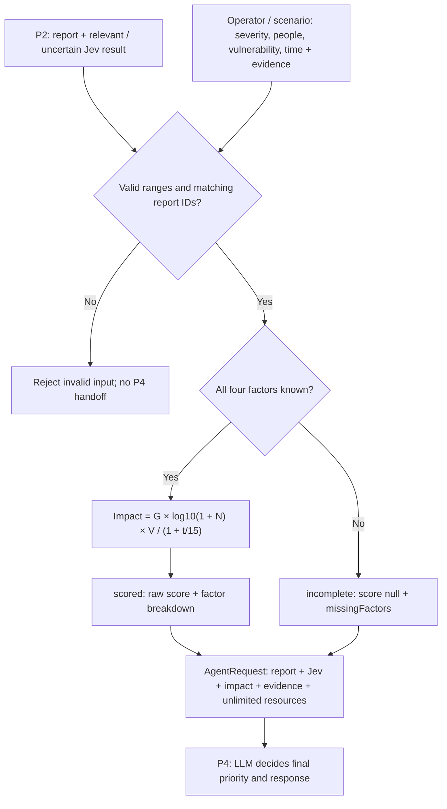

# P3 · Source-of-truth impact and planner handoff

Resource implementation update: GET /api/state, POST /api/agent/plan and
POST /api/state/release now use persisted Supabase inventory (10 ambulances).
P4 persisted execution replaces the legacy P3 unlimited fixture with finite state;
only ambulance proposals are accepted. Plans and allocation audit commit together.
See [resource state contract](resource-state-contract.md). Earlier unlimited examples below describe
the historical standalone harness. FE/intake integration remains pending.

P3 is a deterministic backend module. It accepts P2's `PriorityRequest` plus a
structured `ImpactAssessment` from an operator or scenario report. It calculates
potential impact and prepares an `AgentRequest` for the later LLM. It does not
call Jev again, infer facts from text, invoke the LLM or assign resources.

The POC addresses catastrophe coordination across affected populations, zones
and critical infrastructure. Standalone individual emergency dispatch is a
possible later add-on, not a scenario or acceptance requirement for this delivery.



## Formula and initial parameters

Use the formula from [the product source of truth](<../HackSpain 2026 · Project Source of Truth.md>):

`I = G × log10(1 + N) × V × 1 / (1 + t / 15)`

| Factor     | Meaning                        | Initial contract                               |
| ---------- | ------------------------------ | ---------------------------------------------- |
| G          | Severity if the report is true | Integer 1–5, supplied with evidence            |
| N          | People exposed                 | Nonnegative integer; unknown is null, not zero |
| V          | Vulnerability multiplier       | General 1; school 1.5; nursing home 2          |
| t          | Estimated minutes until harm   | Nonnegative number; zero means immediate harm  |
| Time scale | Time discount parameter        | 15 minutes                                     |

`DEFAULT_IMPACT_POLICY` holds the initial multipliers and time scale. Pass a
validated policy object to change them; no source, confidence or relevance weight
is added. The actual policy and a version derived from its values accompany every
result. `formulaVersion` is `source-of-truth-impact-v1`.

The score is raw impact and has no fixed maximum or priority bands. Do not rescale
it to 0–100 or copy the illustrative dashboard number in the source document.
Its terms multiply to the score. Rounding is a display concern; P3 keeps the value.
Higher scores mean greater potential impact under the agreed factors. Compare
complete assessments in descending score when ordering by impact. A score of
12 is not 12 percent, a resource count, or automatically a critical priority.
There are no agreed numeric cutoffs for low/medium/high/critical. P4 chooses that
final category from impact plus catastrophe context and must explain its choice.
Incomplete assessments cannot be ranked as zero or silently placed last.
For known zero people, the formula yields zero; this is not a blanket instruction
to ignore infrastructure or other response needs. Unknown exposure remains null.

Example: an operator reports severity 5, 45 exposed nursing-home residents and
20 minutes until harm. The default policy gives
`5 * log10(46) * 2 / (1 + 20/15) = 7.126104992921032`.
That is potential impact, not a final priority or a resource count. Jev's
relevance probability accompanies it separately, whether 0.55 or 0.98.
If the number of exposed people is unknown, P3 returns `incomplete`, null score
and `missingFactors: ["peopleExposed"]` instead, and still forwards the request.

## Structured facts and provenance

Import schemas/types from `src/lib/contracts/triage.ts`. An `ImpactAssessment`
has the same run/event/execution IDs as the P2 request and an `assessedAt` time.
Each factor is `{value, evidence: [{id}], method}`; known values require evidence.
Examples of method labels are `operator-assessment` and `scenario-report-v1`.
Vulnerability groups are `general`, `school`, `nursing_home`, or null if unknown.
Do not default an unknown population to general vulnerability.

Scenario inputs must be observations delivered as reports, not hidden simulator
ground truth. P1/P0 resolve references to stored reports/observations in the same
run and keep the assessment immutable for retry. P3 validates ranges, required
metadata and context identity; it cannot independently authenticate a caller's
evidence reference without the pending repository integration.

If any formula factor is null, `calculation.status` is `incomplete`, `score` and
`terms` are null, and `missingFactors` names what is absent. The request still
continues to the LLM, which must state assumptions or seek verification. Invalid
values are rejected rather than treated as unknown. Supply a new assessment when
evidence changes; its contents/time and policy contribute to decision identity.
Retries retain that decision ID. P0 must reuse the originally persisted result,
including `decidedAt`, when replaying; recalculation is not a persistence layer.

## Integration

```ts
import { prepareAgentRequest, TRIAGE_PLANNER_INSTRUCTIONS } from "@/lib/triage/impact";
import { plannerPriorityDecisionSchema } from "@/lib/contracts/triage";

const request = prepareAgentRequest(priorityRequestFromP2, structuredAssessment, {
  expectedRunRevision: currentRunRevision,
  activePlanId: currentPlanId, // UUID or null.
});
// P4: pass TRIAGE_PLANNER_INSTRUCTIONS as system instructions and request as data.
// Validate the later LLM result with plannerPriorityDecisionSchema; persist it.
// This module does not invoke a model or authorize any action.
```

The handoff preserves the full Jev result, including `uncertain` and its probability,
and the original report. `evidenceConfidence` stays null because P2 assesses
relevance, not truthfulness. `sourceProfileId` retains trusted source provenance;
a police claim inside message text cannot alter it or inflate impact.

Resources are represented as `{availability: "unlimited", mode: "poc_assumption"}`.
The LLM proposes finite positive integer quantities of named resource types, a
final low/medium/high/critical priority, rationale, assumptions and verification
needs. It may propose no resources. It must not claim dispatch or assume zero
travel time. P4 still checks correlation IDs/revision and validates resource types
against the eventual tool catalog before execution. Existing approval rules remain.

## Status

### Manual P3 scenarios verified on Windows

Run `npm run triage:try` on demand. It invokes the actual `prepareAgentRequest`
and schemas, compares known numeric results, verifies stable decision IDs on
recalculation, and exercises unknown/invalid inputs. It does not call Jev, an
LLM or tools, and is not part of tests, hooks or CI. Synthetic P2 results are
explicit fixtures. Full inputs, expected values and actual outputs are saved
locally to ignored `.data/triage-smoke-results.json`.

Latest manual run: **10/10 passed**, 2026-09-19. Scores below are rounded only
for display; runtime retains full precision. Input columns are G, N, group and
t in minutes.

| Scenario                     | G   | N    | Group        | t    | Actual output                         | P4 handoff |
| ---------------------------- | --- | ---- | ------------ | ---- | ------------------------------------- | ---------- |
| Campsite                     | 4   | 80   | general      | 10   | scored: 4.5804                        | Yes        |
| School, same exposure        | 4   | 80   | school       | 10   | scored: 6.8705                        | Yes        |
| Nursing home                 | 5   | 40   | nursing_home | 5    | scored: 12.0959                       | Yes        |
| Fire reaches settlement      | 5   | 120  | general      | 0    | scored: 10.4139                       | Yes        |
| Known zero people            | 3   | 0    | general      | 30   | scored: 0                             | Yes        |
| Uncertain Jev, same campsite | 4   | 80   | general      | 10   | scored: 4.5804; uncertain preserved   | Yes        |
| Unknown people               | 4   | null | general      | 10   | incomplete; peopleExposed missing     | Yes        |
| Unknown time                 | 4   | 80   | general      | null | incomplete; minutesToHarm missing     | Yes        |
| Invalid severity             | 6   | 80   | general      | 10   | Rejected: severity outside 1–5        | No         |
| Wrong execution ID           | 4   | 80   | general      | 10   | Rejected: assessment context mismatch | No         |

This verifies the implementation of the agreed formula and handoff, not real-world
priority accuracy. P4 must consider catastrophe context, affected infrastructure
and collective response needs as well as raw population impact.
Zero exposure is known zero, not unknown, and does not itself cancel processing.
The uncertain fixture changes relevance from 0.95 to 0.5 without lowering impact.

### Integration status

The formula, runtime contracts, planner prompt and request builder are implemented.
The public input body and P2 filter contract are unchanged. This replaces the
unimplemented additive score/0–100 draft in the POC contracts. The served sketch
still uses its old zone priority engine; it has not been silently replaced.
P1/P0 structured-factor adapters and persistence remain integration work.
P4 owns model invocation and consumes this boundary; see its implementation
status in [the POC contracts](poc-contracts.md). No automated tests are added or
run under the hackathon policy.
