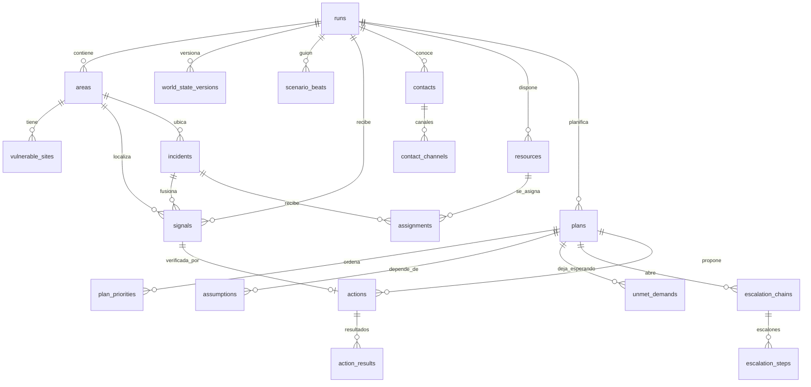
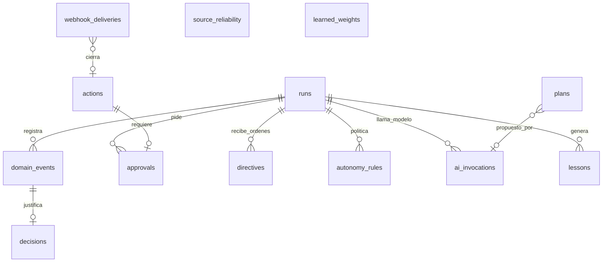

# FARO · Data model proposal

Status: proposal for team discussion. Base: the scaffolding that is already in place
`main` (Next 16, Supabase Postgres + Realtime, Zod, Vercel Workflow, AI SDK),
merged from `chore-scaffold-typescript-vercel` in PR 2.
This document proposes the complete data model of the command center. It is
deliberately verbose: each table carries its purpose, its DDL, the explanation
field by field and the decisions that motivate it, so that it can be discussed without
having to open the code. The short version is in section 3, the diagram.
---

## 1. What the model has to support

The challenge statement requires you to answer six questions on the screen, and each one
imposes something on the data model:

| Challenge question          | What it requires from the model                                                      |
| --------------------------- | ------------------------------------------------------------------------------------ |
| What information matters    | Signals with probability, deduplication, incident merging, and saved discard reason  |
| What comes first            | Versioned ranking with score breakdown, not just the number                          |
| Who is notified and when    | Contacts by role, channels with measured reliability, escalation chains with waiting |
| Where the resources go      | Assignments with reason, and the list of who is left waiting and why                 |
| What to do now              | Actions with level of autonomy, intent, idempotence and real result                  |
| When to throw away the plan | Assumptions stated by plan and the exact event that broke them                       |

And the source document adds four cross-cutting requirements:

- **Immutable event log** from which everything hangs, to reproduce a
  execution and learning from it.
- **Learning between runs** with lessons validated by a person.
- **Honesty about what is simulated**: in each action it must be written if
  went out to the real world or not.
- **AI provenance**: which model proposed what, with what input, at what cost.

---

## 2. Design principles

### 2.1 The record is the truth; state tables are convenient projections

`domain_events` is append-only and ordered. Everything else (`signals`, `plans`,
`actions`…) is current state that can be reconstructed from the log. In
In practice we write both things in the same transaction, because reading the
current state is what the panel does two hundred times a minute.But the
rule of thumb is: **if the record and a state table disagree, the log wins**.
This buys three things that the challenge scores: playing a demo step by step,
audit who decided what, and feed learning without implementing anything else.

### 2.2 A discarded signal is not deleted: it is excluded

Domain branch learning. There, each signal _mutated_ the risk of its
zone upon arrival, and upon discarding it, that mutation had to be reversed with explicit accounting. It worked, but it was fragile and forced a delicate contract between
two modules. Here the pressure on an incident **is derived** from its live signals at the time of calculation.To discard is to change a state; the engine
priority simply stops counting it. No reversals.

### 2.3 Probabilities, not labels

Signals carry `p_relevant`, `p_truthful`, `urgency` and `fused_confidence`
as numeric in [0, 1], in addition to the label that declares the source. It's what
allows the three outputs of triage (act, verify, discard) and the fusion of
trust between independent sources.

### 2.4 Everything the system decides leaves a reason and a breakdown

`plan_priorities.factors`, `assignments.reason`, `actions.reason`,
`assumptions.consequence`, `decisions.why`. They are not decorations: they are what the panel
teaches the jury to justify each decision. If a domain function cannot fill in the reason, it is a sign that the decision is not well defined.

### 2.5 Idempotency per attempt

Each `action` carries `attempt` and `idempotency_key = "<action_id>:<attempt>"` . A
operator retry gets a new key;an internal adapter retry
(timeout, 5xx) reuses it. This is how HappyRobot deduplicates what it should and not what it should not. Incoming webhooks are deduplicated separately in
`webhook_deliveries` .

### 2.6 Zod is the contract; SQL materializes it

Zod schemas live in `src/lib/domain/*.ts` and are the only shape definition seen by the frontend, route handlers, workflows and agents. The SQL migration
materializes them with `check` constraints that mirror the `z.enum` .We choose
`check` and not `create type … as enum` because adding a value to an enum
Postgres within a transaction has annoying restrictions and in a
hackathon we are going to add values.

### 2.7 JSONB with version, so it evolves quickly

`factors`, `changes`, `state` of the world, `structured` of a result of
call, `interpreted` of a directive. They are structures that are going to change
several times on the weekend. They are in `jsonb`, validated by Zod when writing and
when reading, and accompanied by a formula or schema version column where it matters (`plan_priorities.formula_version`, `world_state_versions.schema_version`).

### 2.8 Multi-tenancy per execution

Everything hangs off `runs` . An execution is a crisis managed from start to finish.
end: in the demo, a game; in a real operation, a fire. That gives
data isolation, allows you to compare executions to learn, and is the natural axis for security policies at the row level when entering the
operator authentication.

### 2.9 Personal data: separate, minimal and never in seeds

Phones and emails live **only** in `contact_channels.address`. No
other table copies them.Versioned seeds carry `null` or markers. Before
the demo the approved recipients are loaded by hand, with `consent_note`
filled in. It is the same criterion of `AGENTS.md` and the `demo_safe` safeguard.
---

## 3. Overview

Two diagrams: the decision loop and the control, audit and
learning.





**Module map → tables.** Each module writes only its tables; the rest read them.

| Module      | Write                                                                                 | Read                                             |
| ----------- | ------------------------------------------------------------------------------------- | ------------------------------------------------ |
| `scenario`  | `runs` (clock), `world_state_versions`, `scenario_beats`, `areas`, `vulnerable_sites` | —                                                |
| `ingest`    | `signals` (high), `webhook_deliveries`                                                | `runs`, `areas`                                  |
| `triage`    | `signals` (triage columns), `source_reliability` (read)                               | `contacts`                                       |
| `incidents` | `incidents`, `signals.incident_id`                                                    | `signals`, `vulnerable_sites`                    |
| `resources` | `resources`, `assignments`, `unmet_demands`                                           | `incidents`, `plans`                             |
| `planning`  | `plans`, `plan_priorities`, `assumptions`                                             | all of the above, `world_state_versions`         |
| `execution` | `actions`, `action_results`, `escalation_chains`, `escalation_steps`                  | `contacts`, `contact_channels`, `autonomy_rules` |
| `control`   | `approvals`, `directives`, `autonomy_rules`, `runs.autonomy_paused`                   | `actions`                                        |
| `audit`     | `domain_events`, `decisions`                                                          | —                                                |
| `learning`  | `lessons`, `learned_weights`, `source_reliability`                                    | `domain_events`, `action_results`, `signals`     |
| `agents`    | `ai_invocations`                                                                      | what the coordinator receives                    |

---

## 4. Conventions

- **SQL identifiers in English and `snake_case` ;TypeScript types in
  `camelCase` .** The mapping is done by a single function per entity
  (`rowToSignal`, `signalToRow`).Prose, reasons and screen text in
  Spanish.
- **Primary keys `uuid` with `gen_random_uuid()` **, except `domain_events`,
  which uses `bigint generated always as identity` because it needs total order
  cheap. The entities that the script and tests reference by stable name
  (areas, resources, seed contacts) also carry a unique `slug` per
  execution.
- **Two times where it matters**: `occurred_at` (when it happened in the world) and
  `received_at` or `recorded_at` (when we knew it). The temporary decay and
  run replay depend on distinguishing them.
- ** `created_at` and `updated_at` ** in every mutable table, with the trigger
  `set_updated_at` . Append-only tables do not have `updated_at` .
- **States as `text` with `check`**, exact mirror of an `z.enum`. When
  Add a value, touch the Zod and migrate in the same commit.
- **No deletions in domain tables.** Everything changes state
  (`dismissed`, `cancelled`, `superseded`). The FKs go with `on delete restrict`.
- **Circular cross-references** ( `signals ↔ actions` , `plans ↔ assumptions `) are added at the end of the migration with `alter table … add
constraint`, so creation order does not matter.
- **Probability numbers** as bounded `numeric` `between 0 and 1`. Costs in integer microunits (`cost_micros bigint`), never `float`.

```sql
create or replace function public.set_updated_at() returns trigger
language plpgsql as $$
begin
  new.updated_at = now();
  return new;
end $$;
```

---

## 5. Entities

Reading order: first the container and the world, then perception, people and
means, plan, action, control, registration, learning and AI.

### 5.1 `runs` — execution

Container for everything. One row per managed crisis.Replaces the table
`incidents` of the scaffolding, which played this role under another name;we reserve that name for sub-incidences, as requested in the source document.

```sql
create table public.runs (
  id               uuid primary key default gen_random_uuid(),
  name             text not null,
  kind             text not null default 'demo'
                   check (kind in ('demo', 'drill', 'live')),
  status           text not null default 'open'
                   check (status in ('open', 'paused', 'closed')),
  scenario_id      text,
  clock_speed      numeric not null default 1 check (clock_speed > 0),
  alert_level      smallint not null default 1 check (alert_level between 1 and 3),
  autonomy_paused  boolean not null default false,
  started_at       timestamptz not null default now(),
  paused_at        timestamptz,
  ended_at         timestamptz,
  summary          jsonb,
  created_at       timestamptz not null default now(),
  updated_at       timestamptz not null default now()
);
create trigger runs_updated before update on public.runs
  for each row execute function public.set_updated_at();
```

| Field             | For what                                                                                                                        |
| ----------------- | ------------------------------------------------------------------------------------------------------------------------------- |
| `kind`            | `demo` is a jury game;`drill` a test from which we also learn;`live` is reserved. Allows you to filter which runs feed lessons. |
| `scenario_id`     | Used script (`wildfire-sierra-bermeja`).`null` if there is no script.                                                           |
| `clock_speed`     | Scenario clock multiplier. The document talks about a compressed clock, 1 real minute ≈ 10 crisis minutes.                      |
| `alert_level`     | Alert level 1–3.Set how much cost per hour is allowed to be spent on resources.                                                 |
| `autonomy_paused` | Main switch. When it is at `true`, all actions require approval. It is the operator's strongest command.                        |
| `summary`         | Closing metrics: triaged signals, calls, confirmations, average replanning time, triage cost. It is filled when closing.        |

### 5.2 `areas` — geographic zones

Municipalities, urbanizations, places. They are the "where" of everything: signs,
incidents, resources and vulnerable points are located in an area. In the demo:
Estepona, Jubrique, Genalguacil, Benahavís and Los Pinares.

```sql
create table public.areas (
  id           uuid primary key default gen_random_uuid(),
  run_id       uuid not null references public.runs(id),
  slug         text not null,
  name         text not null,
  kind         text not null
               check (kind in ('municipio', 'urbanizacion', 'paraje', 'via', 'otro')),
  population   integer not null default 0 check (population >= 0),
  base_risk    integer not null default 0 check (base_risk between 0 and 100),
  centroid_x   numeric not null,
  centroid_y   numeric not null,
  geometry     jsonb,
  created_at   timestamptz not null default now(),
  updated_at   timestamptz not null default now(),
  unique (run_id, slug)
);
create index areas_run_idx on public.areas (run_id);
create trigger areas_updated before update on public.areas
  for each row execute function public.set_updated_at();
```

| Field                      | For what                                                                                                                                                                                           |
| -------------------------- | -------------------------------------------------------------------------------------------------------------------------------------------------------------------------------------------------- |
| `slug`                     | Stable identifier ( `estepona` , `los-pinares` ) used by script, seeds, and tests.UUIDs change by execution; the slug no.                                                                          |
| `base_risk`                | Structural risk of the area, independent of live signals. It is the only part of the risk that is saved: the rest is derived.                                                                      |
| `centroid_x`, `centroid_y` | Coordinates of the panel map, in the system that uses the SVG.Sufficient for the distance between zones required by resource allocation.                                                           |
| `geometry`                 | Optional GeoJSON of the polygon. When there is time, it is replaced by `geography(Polygon, 4326)` from PostGIS, which Supabase comes installed; the `jsonb` column allows you to start without it. |

### 5.3 `vulnerable_sites` — puntos vulnerables

Senior residence, rural school, camping. They are what triggers the
priority formula vulnerability multiplier and what it converts
an irreversible evacuation.

```sql
create table public.vulnerable_sites (
  id            uuid primary key default gen_random_uuid(),
  run_id        uuid not null references public.runs(id),
  area_id       uuid not null references public.areas(id),
  slug          text not null,
  name          text not null,
  kind          text not null
                check (kind in ('residencia', 'colegio', 'camping', 'hospital', 'urbanizacion', 'nucleo')),
  people        integer not null check (people >= 0),
  multiplier    numeric not null default 1 check (multiplier >= 1),
  evacuated     boolean not null default false,
  evacuated_at  timestamptz,
  notes         text,
  created_at    timestamptz not null default now(),
  updated_at    timestamptz not null default now(),
  unique (run_id, slug)
);
create index vulnerable_sites_area_idx on public.vulnerable_sites (area_id);
```

`multiplier` follows the document: 1 default, 1.5 college, 2 residence. It is
a data, not a constant in code, because learning can move it
("the operator prioritized the school three times").

### 5.4 `world_state_versions` — the simulated world, versioned

Wind, closed roads, state of the canals, hospital beds. Each
change creates a new version;It is never updated on site. It is against what
contrast the assumptions, and versioning it is what allows us to say "the assumption is
broke in version 7, caused by the X" signal.

```sql
create table public.world_state_versions (
  id                    uuid primary key default gen_random_uuid(),
  run_id                uuid not null references public.runs(id),
  version               integer not null,
  schema_version        smallint not null default 1,
  state                 jsonb not null,
  caused_by_signal_id   uuid,
  caused_by_beat_id     uuid,
  caused_by_actor       text not null
                        check (caused_by_actor in ('scenario', 'operator', 'happyrobot', 'system')),
  recorded_at           timestamptz not null default now(),
  unique (run_id, version)
);
create index world_state_run_idx on public.world_state_versions (run_id, version desc);
```

Forma de `state`, validada por `worldStateSchema`:

```ts
export const worldStateSchema = z
  .object({
    wind: z.object({
      direction: z.enum(["N", "NE", "E", "SE", "S", "SO", "O", "NO"]),
      speedKmh: z.number().min(0),
    }),
    roads: z.record(z.string(), z.enum(["open", "restricted", "closed"])),
    channels: z.object({
      sms: z.boolean(),
      voice: z.boolean(),
      whatsapp: z.boolean(),
      email: z.boolean(),
    }),
    hospitals: z.record(z.string(), z.object({ beds: z.number().int().min(0) })),
    frontline: z.object({ x: z.number(), y: z.number(), headingDeg: z.number() }).optional(),
  })
  .strict();
```

### 5.5 `scenario_beats` — el guion

Scheduled stage events and chaos buttons.Save shots to
database, and not just in memory, is what allows the script to survive
a restart of the server in the middle of the demo and so that the learning knows what happened and
when.

```sql
create table public.scenario_beats (
  id           uuid primary key default gen_random_uuid(),
  run_id       uuid not null references public.runs(id),
  scenario_id  text not null,
  beat_key     text not null,
  at_seconds   integer not null check (at_seconds >= 0),
  label        text not null,
  kind         text not null
               check (kind in ('signal', 'world_change', 'chaos', 'noise_burst')),
  payload      jsonb not null,
  fired_at     timestamptz,
  skipped      boolean not null default false,
  fired_by     text check (fired_by in ('clock', 'operator', 'jury')),
  unique (run_id, scenario_id, beat_key)
);
create index scenario_beats_due_idx on public.scenario_beats (run_id, at_seconds)
  where fired_at is null and skipped = false;
```

`kind = 'chaos'` with `fired_by = 'jury'` is exactly the moment "the jury
choose what we break", and it is recorded as such.`noise_burst` is the barrage
of forty messages with three relevant ones: the payload takes the list of signals to
generate.

### 5.6 `signals` — signals

Everything that comes in: calls, SMS, sensors, HappyRobot webhooks, the script.
It is the most written table and the first that triage processes.Replaces the table
`events` of the scaffolding, which had this role and a name that we now reserve
for domain log.

```sql
create table public.signals (
  id                    uuid primary key default gen_random_uuid(),
  run_id                uuid not null references public.runs(id),
  area_id               uuid references public.areas(id),
  incident_id           uuid,
  source                text not null
                        check (source in ('operator', 'sensor', 'happyrobot', 'public', 'scenario', 'webhook')),
  channel               text
                        check (channel in ('call', 'sms', 'whatsapp', 'email', 'web', 'api', 'sensor')),
  external_ref          text,
  title                 text not null check (length(title) <= 300),
  body                  text not null check (length(body) <= 4000),
  category              text not null,
  severity              text not null
                        check (severity in ('low', 'medium', 'high', 'critical')),
  reported_confidence   text
                        check (reported_confidence in ('low', 'medium', 'high')),
  location              jsonb,
  occurred_at           timestamptz not null default now(),
  received_at           timestamptz not null default now(),
  dedupe_key            text not null,
  occurrences           integer not null default 1 check (occurrences >= 1),
  merged_into_id        uuid references public.signals(id),

  -- triaje calibrado
  p_relevant            numeric check (p_relevant between 0 and 1),
  p_truthful            numeric check (p_truthful between 0 and 1),
  urgency               numeric check (urgency between 0 and 1),
  fused_confidence      numeric check (fused_confidence between 0 and 1),
  triage_decision       text check (triage_decision in ('act', 'verify', 'discard')),
  triage_rationale      text,
  triage_assessor       text
                        check (triage_assessor in ('deterministic', 'jev', 'llm', 'operator')),
  triage_details        jsonb,
  triage_latency_ms     integer,
  triage_cost_micros    bigint,
  triaged_at            timestamptz,

  -- verification
  verification_status   text not null default 'unverified'
                        check (verification_status in ('unverified', 'verifying', 'confirmed', 'refuted')),
  verification_action_id uuid,
  verified_at           timestamptz,
  verified_by           text,

  raw                   jsonb,
  created_at            timestamptz not null default now(),
  updated_at            timestamptz not null default now()
);
create index signals_run_received_idx on public.signals (run_id, received_at desc);
create index signals_dedupe_idx       on public.signals (run_id, dedupe_key, received_at desc);
create index signals_incident_idx     on public.signals (incident_id);
create index signals_untriaged_idx    on public.signals (run_id, received_at)
  where triage_decision is null;
create index signals_live_idx         on public.signals (run_id, area_id)
  where triage_decision = 'act' and verification_status <> 'refuted';
create trigger signals_updated before update on public.signals
  for each row execute function public.set_updated_at();
```

| Field                                                                         | For what                                                                                                                                                                                      |
| ----------------------------------------------------------------------------- | --------------------------------------------------------------------------------------------------------------------------------------------------------------------------------------------- |
| `source` / `channel`                                                          | Logical source and physical channel.`public` is a neighbor;`happyrobot` is what a system call returns.Learned reliability hangs from `source`.                                                |
| `external_ref`                                                                | Identifier on the source system: call id on HappyRobot, message id. Allows you to link to the transcript.                                                                                     |
| `category`                                                                    | Open catalog (`incendio`, `evacuacion`, `route-blocked`, `refugio`). It is the key that resource allocation and contact selection use;That's why it is text without accents and stable.       |
| `occurred_at` / `received_at`                                                 | Temporal decay uses `occurred_at` ;panel sorting and deduplication use `received_at` .                                                                                                        |
| `dedupe_key`, `occurrences`, `merged_into_id`                                 | A repeated signal within the window does not create a new row: it increases `occurrences` of the original. If it was created and then detected, point to the original with `merged_into_id` . |
| `p_*`, `fused_confidence`, `triage_decision`                                  | The three exits of triage. The middle band generates a check action and `verification_status` becomes `verifying` .                                                                           |
| `triage_assessor`, `triage_latency_ms`, `triage_cost_micros`                  | Who evaluated and how much it cost. It is the data of "40 triad signals in X seconds for Y euros" that the document wants on the screen.                                                      |     | `triage_details` | What doesn't deserve a column: breakdown of the merger, discarded alternatives, tester's version. |
| `verification_*`                                                              | Result of verification by call or operator.`refuted` is what we used to call "discarded by a person".                                                                                         |
| `raw`                                                                         | The complete original payload. It is never touched. This is what allows you to re-triage with a better evaluator without asking for the data again.                                           |
| Partial indices (`signals_untriaged_idx`, `signals_live_idx`) because both    |
| hot queries are "what remains to be triaged" and "what living signs does this |
| zone", and both are a small fraction of the table.                            |

### 5.7 `incidents` — subincidencias

An incident groups coherent signs in one place: "active front on the slope
north of Los Pinares". It is what is prioritized and what resources are allocated to.
A signal belongs to one incident at most.

```sql
create table public.incidents (
  id                        uuid primary key default gen_random_uuid(),
  run_id                    uuid not null references public.runs(id),
  area_id                   uuid not null references public.areas(id),
  title                     text not null,
  category                  text not null,
  status                    text not null default 'open'
                            check (status in ('open', 'contained', 'resolved', 'dismissed')),
  gravity                   smallint not null check (gravity between 1 and 5),
  people_exposed            integer not null default 0 check (people_exposed >= 0),
  vulnerability_multiplier  numeric not null default 1 check (vulnerability_multiplier >= 1),
  minutes_to_impact         integer check (minutes_to_impact >= 0),
  fused_confidence          numeric check (fused_confidence between 0 and 1),
  location                  jsonb,
  first_signal_at           timestamptz,
  last_signal_at            timestamptz,
  opened_at                 timestamptz not null default now(),
  closed_at                 timestamptz,
  created_at                timestamptz not null default now(),
  updated_at                timestamptz not null default now()
);
create index incidents_run_open_idx on public.incidents (run_id)
  where status in ('open', 'contained');
create index incidents_area_idx on public.incidents (area_id);
create trigger incidents_updated before update on public.incidents
  for each row execute function public.set_updated_at();
```

The five fields `gravity`, `people_exposed`, `vulnerability_multiplier`,
`minutes_to_impact` and `fused_confidence` are exactly the variables G, N, V,
t and C of the document priority formula.`minutes_to_impact` supports
`null` by the way: "unknown" is a valid answer and the panel should
teach it as such, not as zero.

### 5.8 `contacts` and `contact_channels` — who is notified

We separate contact from its channels because reliability is measured **per channel**:
"Estepona Firefighters do not take calls at night but respond to SMS in 40 seconds"
It's a lesson about a channel, not a person.

```sql
create table public.contacts (
  id              uuid primary key default gen_random_uuid(),
  run_id          uuid not null references public.runs(id),
  slug            text not null,
  name            text not null,
  role            text not null
                  check (role in ('vecino', 'residencia', 'colegio', 'camping', 'bombero', 'sanitario',
                                  'policia', 'alcalde', 'sala-112', 'autoridad', 'voluntario', 'otro')),
  organization    text,
  area_id         uuid references public.areas(id),
  language        text not null default 'es',
  demo_safe       boolean not null default false,
  consent_note    text,
  responsiveness  numeric not null default 0.5 check (responsiveness between 0 and 1),
  created_at      timestamptz not null default now(),
  updated_at      timestamptz not null default now(),
  unique (run_id, slug),
  check (demo_safe = false or consent_note is not null)
);

create table public.contact_channels (
  id                       uuid primary key default gen_random_uuid(),
  contact_id               uuid not null references public.contacts(id),
  channel                  text not null
                           check (channel in ('call', 'sms', 'whatsapp', 'email', 'slack', 'teams')),
  address                  text not null,
  priority                 smallint not null default 1,
  attempts                 integer not null default 0,
  successes                integer not null default 0,
  avg_seconds_to_confirm   integer,
  last_used_at             timestamptz,
  created_at               timestamptz not null default now(),
  updated_at               timestamptz not null default now(),
  unique (contact_id, channel, address)
);
create index contact_channels_contact_idx on public.contact_channels (contact_id, priority);
```

| Field                                             | For what                                                                                                                                                                                            |
| ------------------------------------------------- | --------------------------------------------------------------------------------------------------------------------------------------------------------------------------------------------------- |
| `role`                                            | The message and the channel depend on the role: an SMS is sent to a neighbor, a coordinator is called, an authority is written to. It includes `alcalde` because it is the one who judges the demo. |
| `demo_safe` + `consent_note`                      | A contact can only receive a live action if it is approved **and** it is clear who authorized it and for what.`check` forces both things at the same time.                                          |
| `address`                                         | The only model site with personal data.Never in versioned seeds. When Supabase Vault is configured, it is encrypted at the column level.                                                            |
| `attempts`, `successes`, `avg_seconds_to_confirm` | Reliability measured by channel.With a minimum of samples before use, as the learning module already does.                                                                                          |

### 5.9 `resources` and `assignments` — where the media goes

```sql
create table public.resources (
  id                  uuid primary key default gen_random_uuid(),
  run_id              uuid not null references public.runs(id),
  slug                text not null,
  name                text not null,
  kind                text not null
                      check (kind in ('ambulancia', 'helicoptero', 'bomberos', 'patrulla', 'autobus',
                                      'albergue', 'comunicaciones', 'otro')),
  capabilities        text[] not null default '{}',
  capacity            integer not null default 1 check (capacity >= 0),
  status              text not null default 'available'
                      check (status in ('available', 'assigned', 'en_route', 'unavailable')),
  home_area_id        uuid references public.areas(id),
  current_area_id     uuid references public.areas(id),
  position            jsonb,
  eta_minutes         integer,
  cost_per_hour       numeric,
  min_reserve         integer not null default 0 check (min_reserve >= 0),
  unavailable_reason  text,
  created_at          timestamptz not null default now(),
  updated_at          timestamptz not null default now(),
  unique (run_id, slug)
);
create index resources_run_status_idx on public.resources (run_id, status);
create index resources_capabilities_gin on public.resources using gin (capabilities);

create table public.assignments (
  id               uuid primary key default gen_random_uuid(),
  run_id           uuid not null references public.runs(id),
  resource_id      uuid not null references public.resources(id),
  incident_id      uuid references public.incidents(id),
  plan_id          uuid,
  action_id        uuid,
  status           text not null default 'proposed'
                   check (status in ('proposed', 'active', 'released', 'superseded')),
  score            numeric,
  reason           text not null,
  assigned_at      timestamptz not null default now(),
  released_at      timestamptz,
  released_reason  text
);
create unique index assignments_one_active_per_resource
  on public.assignments (resource_id) where status = 'active';
create index assignments_incident_idx on public.assignments (incident_id) where status = 'active';
```

| Field                                | For what                                                                                                                                                                                         |
| ------------------------------------ | ------------------------------------------------------------------------------------------------------------------------------------------------------------------------------------------------ |
| `capabilities`                       | What the resource knows how to cover, such as `text[]` with GIN index. This is what prevents assigning a forestry brigade to a health emergency; the domain branch verified it with a real case. |
| `min_reserve`                        | Minimum reserve of the type.You do not get off of it except priority 1, and if you do, it is marked in red.                                                                                      |
| `cost_per_hour` × `runs.alert_level` | The alert level sets how much you are allowed to spend.                                                                                                                                          |
| `assignments.reason` and `score`     | Why this resource and not the closest one. It's screen text.                                                                                                                                     |
| Partial unique index                 | A resource has at most one active assignment. The database guarantees this, not the code.                                                                                                        |

### 5.10 `plans`, `plan_priorities`, `assumptions`, `unmet_demands` — el plan

The plan is **versioned and immutable**: each replan creates a new row
and mark the previous one as `superseded` or `invalid` . Only one is `current` per
execution, guaranteed by index.

```sql
create table public.plans (
  id                            uuid primary key default gen_random_uuid(),
  run_id                        uuid not null references public.runs(id),
  version                       integer not null,
  previous_plan_id              uuid references public.plans(id),
  status                        text not null default 'current'
                                check (status in ('draft', 'current', 'superseded', 'invalid')),
  mode                          text not null
                                check (mode in ('deterministic', 'ai', 'simulation')),
  trigger                       text not null,
  summary                       text not null,
  changes                       jsonb not null default '[]',
  plan_b                        jsonb,
  invalidated_at                timestamptz,
  invalidated_by_assumption_id  uuid,
  ai_invocation_id              uuid,
  generated_at                  timestamptz not null default now(),
  unique (run_id, version)
);
create unique index plans_one_current on public.plans (run_id) where status = 'current';

create table public.plan_priorities (
  id               uuid primary key default gen_random_uuid(),
  plan_id          uuid not null references public.plans(id),
  incident_id      uuid not null references public.incidents(id),
  rank             integer not null check (rank >= 1),
  previous_rank    integer,
  score            numeric not null,
  formula_version  text not null,
  factors          jsonb not null,
  reason           text not null,
  unique (plan_id, incident_id),
  unique (plan_id, rank)
);

create table public.assumptions (
  id                          uuid primary key default gen_random_uuid(),
  run_id                      uuid not null references public.runs(id),
  plan_id                     uuid not null references public.plans(id),
  key                         text not null,
  text                        text not null,
  variable                    text not null,
  operator                    text not null
                              check (operator in ('eq', 'neq', 'lt', 'lte', 'gt', 'gte', 'in', 'contains')),
  expected                    jsonb not null,
  status                      text not null default 'ok'
                              check (status in ('ok', 'broken', 'unknown')),
  broken_at                   timestamptz,
  broken_by_signal_id         uuid,
  broken_by_world_version_id  uuid,
  consequence                 text,
  unique (plan_id, key)
);
create index assumptions_open_idx on public.assumptions (run_id) where status = 'ok';

create table public.unmet_demands (
  id                       uuid primary key default gen_random_uuid(),
  plan_id                  uuid not null references public.plans(id),
  incident_id              uuid not null references public.incidents(id),
  wanted_resource_kind     text not null,
  wanted_resource_id       uuid references public.resources(id),
  blocked_by_assignment_id uuid references public.assignments(id),
  estimated_wait_minutes   integer,
  accepted_risk            text not null,
  reason                   text not null
);
create index unmet_demands_plan_idx on public.unmet_demands (plan_id);
```

| Field                                          | For what                                                                                                                                                                                                                                                                       |
| ---------------------------------------------- | ------------------------------------------------------------------------------------------------------------------------------------------------------------------------------------------------------------------------------------------------------------------------------ |
| `plans.changes`                                | The diff with the previous version, already written for the screen: `[{ kind, label, detail }]`. The panel changes bar reads this.                                                                                                                                             |
| `plans.trigger`                                | Why it was replanned, in one sentence.                                                                                                                                                                                                                                         |
| `plans.mode`                                   | `deterministic` is the core;`ai` when the coordinator proposed and the code validated;`simulation` for modelless runs. It is never mixed in the same row.                                                                                                                      |
| `plan_priorities.factors` + `formula_version`  | The actual breakdown of the score. The model is agnostic to the formula: `[{ key, label, value, op: "add" \| "mul" }]`. The dominance branch uses additive factors;The document proposes a multiplicative formula.Both fit, and `formula_version` tells which one was applied. |
| `assumptions.variable`, `operator`, `expected` | The assumed form evaluable against `world_state_versions.state`: `("wind.direction", "eq", "NE")`, `("roads. A-397", "eq", "open")`, `("hospitals.costa-del-sol.beds", "gte", 10)`.                                                                                            |
| `assumptions.consequence`                      | What stops making sense if it falls: "the buses on the A-397 towards the pavilion."                                                                                                                                                                                            |
| `unmet_demands`                                | Who is left waiting in this version of the plan, what they wanted, who took it, and what risk is accepted. It is pillar 3 of the document made into a table.                                                                                                                   |

### 5.11 `escalation_chains`, `escalation_steps`, `actions`, `action_results`, `webhook_deliveries` — ejecutar

```sql
create table public.escalation_chains (
  id            uuid primary key default gen_random_uuid(),
  run_id        uuid not null references public.runs(id),
  plan_id       uuid references public.plans(id),
  incident_id   uuid references public.incidents(id),
  objective     text not null,
  status        text not null default 'active'
                check (status in ('active', 'satisfied', 'exhausted', 'cancelled')),
  current_step  integer not null default 0,
  workflow_run_id text,
  created_at    timestamptz not null default now(),
  updated_at    timestamptz not null default now()
);

create table public.escalation_steps (
  id            uuid primary key default gen_random_uuid(),
  chain_id      uuid not null references public.escalation_chains(id),
  position      integer not null check (position >= 0),
  contact_id    uuid not null references public.contacts(id),
  channel       text not null,
  wait_seconds  integer not null check (wait_seconds > 0),
  reason        text not null,
  ask_for       text,
  action_id     uuid,
  unique (chain_id, position)
);

create table public.actions (
  id                  uuid primary key default gen_random_uuid(),
  run_id              uuid not null references public.runs(id),
  plan_id             uuid references public.plans(id),
  incident_id         uuid references public.incidents(id),
  kind                text not null
                      check (kind in ('verify', 'notify', 'assign', 'mass_alert', 'evacuate',
                                      'escalate', 'ticket', 'review')),
  channel             text not null
                      check (channel in ('call', 'sms', 'whatsapp', 'email', 'slack', 'teams',
                                         'ticket', 'webhook', 'internal')),
  contact_id          uuid references public.contacts(id),
  resource_id         uuid references public.resources(id),
  chain_step_id       uuid,
  verifies_signal_id  uuid references public.signals(id),
  target_label        text not null,
  objective           text not null,
  message_body        text,
  ask_for             text,
  reason              text not null,
  autonomy_level      text not null
                      check (autonomy_level in ('auto', 'auto_notify', 'approval')),
  reversibility       text not null
                      check (reversibility in ('reversible', 'partial', 'irreversible')),
  status              text not null default 'proposed'
                      check (status in ('proposed', 'awaiting_approval', 'approved', 'rejected',
                                        'running', 'succeeded', 'failed', 'blocked', 'stalled',
                                        'cancelled')),
  execution_mode      text not null default 'simulated'
                      check (execution_mode in ('simulated', 'live')),
  attempt             integer not null default 1 check (attempt >= 1),
  idempotency_key     text not null unique,
  external_action_id  text,
  workflow_run_id     text,
  approval_id         uuid,
  error               text,
  result_summary      text,
  stalled_after       timestamptz,
  dispatched_at       timestamptz,
  completed_at        timestamptz,
  created_at          timestamptz not null default now(),
  updated_at          timestamptz not null default now()
);
create index actions_run_open_idx on public.actions (run_id, created_at desc)
  where status in ('proposed', 'awaiting_approval', 'approved', 'running', 'blocked', 'stalled');
create index actions_external_idx on public.actions (external_action_id)
  where external_action_id is not null;
create index actions_stalled_sweep_idx on public.actions (stalled_after)
  where status = 'running';
create trigger actions_updated before update on public.actions
  for each row execute function public.set_updated_at();

create table public.action_results (
  id              uuid primary key default gen_random_uuid(),
  action_id       uuid not null references public.actions(id),
  attempt         integer not null,
  outcome         text not null
                  check (outcome in ('accepted', 'declined', 'no_answer', 'needs_human',
                                     'delivered', 'failed', 'info')),
  summary         text,
  transcript      text,
  structured      jsonb,
  new_signal_ids  uuid[] not null default '{}',
  received_via    text not null
                  check (received_via in ('webhook', 'poll', 'manual', 'simulation')),
  received_at     timestamptz not null default now()
);
create index action_results_action_idx on public.action_results (action_id, received_at desc);

create table public.webhook_deliveries (
  id            uuid primary key default gen_random_uuid(),
  provider      text not null,
  delivery_id   text not null,
  body_sha256   text not null,
  action_id     uuid references public.actions(id),
  http_status   integer,
  response      jsonb,
  received_at   timestamptz not null default now(),
  unique (provider, delivery_id)
);
```

| Field                             | For what                                                                                                                                                                                  |
| --------------------------------- | ----------------------------------------------------------------------------------------------------------------------------------------------------------------------------------------- |
| `actions.kind`                    | Type for autonomy purposes. It extends the three scaffolding (`review`, `notify`, `allocate` → `assign`) with which the document requires: `verify`, `mass_alert`, `evacuate`,            |
| `autonomy_level`, `reversibility` | At what level it was shipped and why. They are copied from the rule at the time the action is created, so that changing the policy later does not rewrite history.                        |
| `execution_mode`                  | `simulated` or `live` . There is no third value. The panel shows it in each row.                                                                                                          |
| `attempt`, `idempotency_key`      | See principle 2.5.Uniqueness is guaranteed by the database.                                                                                                                               |
| `workflow_run_id`                 | Link to the Vercel Workflow execution that carries this action.Workflow persists its own state;we keep the reference.                                                                     |
| `stalled_after`                   | When does it become considered stuck if no result arrives?A partial index makes scanning cheap.                                                                                           |
| `verifies_signal_id`              | The verification action points to the signal whose doubt it resolves. When the result arrives, `signals.verification_status` is updated.                                                  |
| `action_results.structured`       | The fields returned by the HappyRobot agent: "confirm smoke", "address", "people".What becomes new signals remains in `new_signal_ids`.                                                   |     | `action_results.transcript` | The transcript of the call.Raw material of learning. |
| `webhook_deliveries`              | Input Deduplication: The same forwarded callback returns the same response and moves nothing.Key `(provider, delivery_id)` ; if the provider does not send the id, the body hash is used. |

### 5.12 `autonomy_rules`, `approvals`, `directives` — control humano

```sql
create table public.autonomy_rules (
  id                    uuid primary key default gen_random_uuid(),
  run_id                uuid references public.runs(id),
  action_kind           text not null,
  reversibility         text not null
                        check (reversibility in ('reversible', 'partial', 'irreversible')),
  level                 text not null
                        check (level in ('auto', 'auto_notify', 'approval')),
  confidence_threshold  numeric check (confidence_threshold between 0 and 1),
  rationale             text not null,
  enabled               boolean not null default true,
  updated_by            text,
  updated_at            timestamptz not null default now()
);
create unique index autonomy_rules_scope_idx
  on public.autonomy_rules (coalesce(run_id, '00000000-0000-0000-0000-000000000000'::uuid), action_kind);

create table public.approvals (
  id                   uuid primary key default gen_random_uuid(),
  run_id               uuid not null references public.runs(id),
  action_id            uuid not null references public.actions(id),
  status               text not null default 'pending'
                       check (status in ('pending', 'approved', 'rejected', 'expired')),
  consequence_preview  jsonb,
  requested_at         timestamptz not null default now(),
  decided_at           timestamptz,
  decided_by           text,
  note                 text
);
create unique index approvals_one_pending on public.approvals (action_id) where status = 'pending';
create index approvals_run_pending_idx on public.approvals (run_id) where status = 'pending';

create table public.directives (
  id                   uuid primary key default gen_random_uuid(),
  run_id               uuid not null references public.runs(id),
  raw_text             text not null,
  interpreted          jsonb,
  interpretation_mode  text check (interpretation_mode in ('ai', 'manual')),
  ai_invocation_id     uuid,
  status               text not null default 'active'
                       check (status in ('active', 'revoked', 'rejected')),
  author               text not null,
  created_at           timestamptz not null default now(),
  revoked_at           timestamptz
);
create index directives_active_idx on public.directives (run_id) where status = 'active';
```

| Field                                 | For what                                                                                                                                                                                                                       |
| ------------------------------------- | ------------------------------------------------------------------------------------------------------------------------------------------------------------------------------------------------------------------------------ |
| `autonomy_rules.run_id` null          | Default global rule;with `run_id` , it overrides it for that execution. The operator can raise or lower levels from steering without touching the global.                                                                      |
| `approvals.consequence_preview`       | What happens if it is approved and if it is rejected: what area is discovered, what resource is moved. The document wants the human to see the consequence **before** confirming.                                              |
| `directives.raw_text` / `interpreted` | "Prioritizes school" as the operator wrote it, and the structured constraint it became: `{ kind: "boost", target: { vulnerable_site: "colegio-rural" }, factor: 1.5 }` .Both are saved to be able to audit the interpretation. |

### 5.13 `domain_events` and `decisions` — registration

```sql
create table public.domain_events (
  id            bigint generated always as identity primary key,
  run_id        uuid not null references public.runs(id),
  type          text not null,
  actor         text not null
                check (actor in ('system', 'operator', 'happyrobot', 'scenario', 'ai', 'jury')),
  entity_type   text,
  entity_id     uuid,
  plan_version  integer,
  payload       jsonb not null default '{}',
  occurred_at   timestamptz not null default now()
);
create index domain_events_run_idx on public.domain_events (run_id, id);
create index domain_events_entity_idx on public.domain_events (entity_type, entity_id);
create index domain_events_type_idx on public.domain_events (run_id, type);

create table public.decisions (
  id                uuid primary key default gen_random_uuid(),
  run_id            uuid not null references public.runs(id),
  domain_event_id   bigint references public.domain_events(id),
  kind              text not null
                    check (kind in ('triage', 'fusion', 'priority', 'assignment', 'autonomy',
                                    'channel', 'replan', 'invalidation', 'approval', 'override')),
  what              text not null,
  why               text not null,
  confidence        numeric check (confidence between 0 and 1),
  actor             text not null,
  entity_type       text,
  entity_id         uuid,
  inputs            jsonb not null default '{}',
  ai_invocation_id  uuid,
  decided_at        timestamptz not null default now()
);
create index decisions_run_idx on public.decisions (run_id, decided_at desc);
```

`domain_events` is truly append-only: in addition to not having
`update` and `delete` are revoked even from the service role and are granted only
`insert` and `select`.`type` follows the `entidad.verbo` convention:
`signal.received`, `signal.triaged`, `plan.invalidated`, `action.dispatched`,
`approval.decided`, `chaos.fired`.
`decisions` is the readable version of the record: what, why, with what
trust, who, with what inputs. It is what the audit panel teaches and
what learning reads.`inputs` carries the ids of signals, resources and
assumptions that were used, to be able to reproduce the decision.

### 5.14 `lessons`, `source_reliability`, `learned_weights` — aprender

```sql
create table public.lessons (
  id                 uuid primary key default gen_random_uuid(),
  source_run_id      uuid not null references public.runs(id),
  pattern            text not null,
  change             jsonb not null,
  metric             text not null,
  evidence           jsonb,
  status             text not null default 'proposed'
                     check (status in ('proposed', 'accepted', 'rejected', 'applied')),
  reviewed_by        text,
  reviewed_at        timestamptz,
  applied_in_run_id  uuid references public.runs(id),
  created_at         timestamptz not null default now()
);
create index lessons_status_idx on public.lessons (status, created_at desc);

create table public.source_reliability (
  id            uuid primary key default gen_random_uuid(),
  source        text not null,
  category      text,
  reliability   numeric not null check (reliability between 0 and 1),
  observations  integer not null default 0,
  confirmed     integer not null default 0,
  refuted       integer not null default 0,
  min_samples   integer not null default 8,
  explanation   text,
  updated_at    timestamptz not null default now()
);
create unique index source_reliability_scope_idx
  on public.source_reliability (source, coalesce(category, ''));

create table public.learned_weights (
  id                    uuid primary key default gen_random_uuid(),
  scope                 text not null default 'global',
  key                   text not null,
  value                 jsonb not null,
  samples               integer not null default 0,
  derived_from_run_ids  uuid[] not null default '{}',
  explanation           text not null,
  updated_at            timestamptz not null default now(),
  unique (scope, key)
);
```

| Field                            | For what                                                                                                                                                                                                                                                            |
| -------------------------------- | ------------------------------------------------------------------------------------------------------------------------------------------------------------------------------------------------------------------------------------------------------------------- |
| `lessons.change`                 | A structured patch, not prose: `{ target: "contact_channel", contact: "bomberos-estepona", set: { preferred: "sms" } }`. It's what the following run **applies** when loading.                                                                                      |
| `lessons.metric` + `evidence`    | The figure that justifies it and the ids that prove it.Without metrics there is no lesson, and the panel teaches both.                                                                                                                                              |
| `lessons.status`                 | The lessons are validated by a person before being activated.`applied` when a run loaded them, with `applied_in_run_id` . This is what allows you to label "SMS instead of a call · lesson #3" in the feed.                                                         |
| `source_reliability.min_samples` | Below the minimum the reliability is not published. A system that overreacts to a single error is worse than one that does not learn.                                                                                                                               |
| `learned_weights`                | Weights derived from past runs with their explanation: `triage.verify_threshold`, `channel.sms.success_rate`, `vulnerability.colegio.multiplier`. They are rebuilt from scratch when booting by adding closed `runs`, so that restarting does not inflate anything. |

### 5.15 `ai_invocations` — model provenance

Every call to the AI ​​SDK leaves a queue.Without exception. It is what allows us to respond
"What if the model is wrong?"with data, and show cost and latency in
screen.

```sql
create table public.ai_invocations (
  id                uuid primary key default gen_random_uuid(),
  run_id            uuid references public.runs(id),
  agent             text not null
                    check (agent in ('coordinator', 'triage', 'planner', 'communicator', 'steering')),
  model             text not null,
  prompt_version    text not null,
  schema_name       text,
  input_hash        text not null,
  input             jsonb,
  output            jsonb,
  valid             boolean,
  validation_error  text,
  latency_ms        integer,
  input_tokens      integer,
  output_tokens     integer,
  cost_micros       bigint,
  created_at        timestamptz not null default now()
);
create index ai_invocations_run_idx on public.ai_invocations (run_id, created_at desc);
```

`valid = false` with `validation_error` is the case "the model returned something that
Zod rejected": you register, retry or drop the deterministic, and you are
constancy.`input_hash` allows caching and detecting that the same prompt gave
different exits.

### 5.16 Restricciones cruzadas

They are added at the end of the migration, when all tables exist.

```sql
alter table public.signals
  add constraint signals_incident_fk foreign key (incident_id) references public.incidents(id),
  add constraint signals_verification_action_fk foreign key (verification_action_id) references public.actions(id);

alter table public.world_state_versions
  add constraint world_caused_by_signal_fk foreign key (caused_by_signal_id) references public.signals(id),
  add constraint world_caused_by_beat_fk foreign key (caused_by_beat_id) references public.scenario_beats(id);

alter table public.assignments
  add constraint assignments_plan_fk foreign key (plan_id) references public.plans(id),
  add constraint assignments_action_fk foreign key (action_id) references public.actions(id);

alter table public.plans
  add constraint plans_invalidated_by_fk foreign key (invalidated_by_assumption_id) references public.assumptions(id),
  add constraint plans_ai_invocation_fk foreign key (ai_invocation_id) references public.ai_invocations(id);

alter table public.assumptions
  add constraint assumptions_broken_by_signal_fk foreign key (broken_by_signal_id) references public.signals(id),
  add constraint assumptions_broken_by_world_fk foreign key (broken_by_world_version_id) references public.world_state_versions(id);

alter table public.escalation_steps
  add constraint escalation_steps_action_fk foreign key (action_id) references public.actions(id);

alter table public.actions
  add constraint actions_chain_step_fk foreign key (chain_step_id) references public.escalation_steps(id),
  add constraint actions_approval_fk foreign key (approval_id) references public.approvals(id);

alter table public.directives
  add constraint directives_ai_invocation_fk foreign key (ai_invocation_id) references public.ai_invocations(id);

alter table public.decisions
  add constraint decisions_ai_invocation_fk foreign key (ai_invocation_id) references public.ai_invocations(id);
```

---

## 6. Esquemas Zod del contrato

Only those that cross the border between frontend, route handlers, workflows and
agents. The rest are internal and follow the same pattern. They live in
`src/lib/domain/`, one file per entity, and export both the
**input** (what the API accepts) as **row** (what is in the table).

```ts
// src/lib/domain/shared.ts
import { z } from "zod";

export const severity = z.enum(["low", "medium", "high", "critical"]);
export const confidenceLabel = z.enum(["low", "medium", "high"]);
export const probability = z.number().min(0).max(1);
export const isoDate = z.iso.datetime();

export const signalSource = z.enum([
  "operator",
  "sensor",
  "happyrobot",
  "public",
  "scenario",
  "webhook",
]);
export const channel = z.enum([
  "call",
  "sms",
  "whatsapp",
  "email",
  "slack",
  "teams",
  "ticket",
  "webhook",
  "internal",
]);
export const triageDecision = z.enum(["act", "verify", "discard"]);
export const autonomyLevel = z.enum(["auto", "auto_notify", "approval"]);
export const reversibility = z.enum(["reversible", "partial", "irreversible"]);
export const actionKind = z.enum([
  "verify",
  "notify",
  "assign",
  "mass_alert",
  "evacuate",
  "escalate",
  "ticket",
  "review",
]);
export const actionStatus = z.enum([
  "proposed",
  "awaiting_approval",
  "approved",
  "rejected",
  "running",
  "succeeded",
  "failed",
  "blocked",
  "stalled",
  "cancelled",
]);
```

```ts
// src/lib/domain/signal.ts
export const incomingSignalSchema = z
  .object({
    runId: z.uuid(),
    areaSlug: z.string().min(1).optional(),
    source: signalSource,
    channel: channel.optional(),
    externalRef: z.string().max(200).optional(),
    title: z.string().trim().min(1).max(300),
    body: z.string().trim().min(1).max(4000),
    category: z.string().regex(/^[a-z0-9-]+$/),
    severity,
    reportedConfidence: confidenceLabel.optional(),
    location: z.object({ x: z.number(), y: z.number() }).optional(),
    occurredAt: isoDate.optional(),
    raw: z.unknown().optional(),
  })
  .strict();

export const signalAssessmentSchema = z
  .object({
    pRelevant: probability,
    pTruthful: probability,
    urgency: probability,
    fusedConfidence: probability,
    decision: triageDecision,
    rationale: z.string().min(1).max(600),
    assessor: z.enum(["deterministic", "jev", "llm", "operator"]),
    latencyMs: z.number().int().min(0).optional(),
    costMicros: z.number().int().min(0).optional(),
    details: z.record(z.string(), z.unknown()).optional(),
  })
  .strict();
```

```ts
// src/lib/domain/plan.ts
export const priorityFactorSchema = z
  .object({
    key: z.string(),
    label: z.string(),
    value: z.number(),
    op: z.enum(["add", "mul"]).default("add"),
  })
  .strict();

export const planPrioritySchema = z
  .object({
    incidentId: z.uuid(),
    rank: z.number().int().min(1),
    previousRank: z.number().int().min(1).nullable(),
    score: z.number(),
    formulaVersion: z.string(),
    factors: z.array(priorityFactorSchema).min(1),
    reason: z.string().min(1).max(400),
  })
  .strict();

export const planChangeSchema = z
  .object({
    kind: z.enum([
      "priority_up",
      "priority_down",
      "action_added",
      "action_invalidated",
      "resource_reassigned",
      "assumption_broken",
      "zone_status",
      "integration",
    ]),
    label: z.string().min(1).max(160),
    detail: z.string().min(1).max(600),
  })
  .strict();

export const assumptionSchema = z
  .object({
    key: z.string().regex(/^[a-z0-9.-]+$/),
    text: z.string().min(1).max(200),
    variable: z.string(),
    operator: z.enum(["eq", "neq", "lt", "lte", "gt", "gte", "in", "contains"]),
    expected: z.unknown(),
    consequence: z.string().max(400).optional(),
  })
  .strict();

/** Planner output (AI SDK). The code validates it before persisting anything. */
export const plannerOutputSchema = z
  .object({
    summary: z.string().min(1).max(600),
    priorities: z.array(planPrioritySchema).min(1),
    assumptions: z.array(assumptionSchema).min(1).max(8),
    proposedActions: z
      .array(
        z
          .object({
            kind: actionKind,
            channel,
            incidentId: z.uuid(),
            contactSlug: z.string().optional(),
            resourceSlug: z.string().optional(),
            objective: z.string().min(1).max(400),
            messageBody: z.string().max(1200).optional(),
            askFor: z.string().max(300).optional(),
            reason: z.string().min(1).max(400),
          })
          .strict(),
      )
      .max(12),
    planB: z.string().max(800).optional(),
  })
  .strict();
```

```ts
// src/lib/domain/action.ts
export const createActionSchema = z
  .object({
    runId: z.uuid(),
    incidentId: z.uuid().optional(),
    kind: actionKind,
    channel,
    contactId: z.uuid().optional(),
    resourceId: z.uuid().optional(),
    targetLabel: z.string().min(1).max(200),
    objective: z.string().min(1).max(400),
    messageBody: z.string().max(1200).optional(),
    reason: z.string().min(1).max(400),
  })
  .strict();

export const actionResultSchema = z
  .object({
    externalActionId: z.string().optional(),
    localActionId: z.uuid().optional(),
    attempt: z.number().int().min(1),
    outcome: z.enum([
      "accepted",
      "declined",
      "no_answer",
      "needs_human",
      "delivered",
      "failed",
      "info",
    ]),
    summary: z.string().max(2000).optional(),
    transcript: z.string().max(20000).optional(),
    structured: z.record(z.string(), z.unknown()).optional(),
    newInformation: z
      .array(incomingSignalSchema.omit({ runId: true }))
      .max(10)
      .optional(),
  })
  .strict();
```

```ts
// src/lib/domain/control.ts
export const approvalDecisionSchema = z
  .object({
    approvalId: z.uuid(),
    decision: z.enum(["approved", "rejected"]),
    note: z.string().max(400).optional(),
  })
  .strict();

export const directiveSchema = z
  .object({
    runId: z.uuid(),
    rawText: z.string().trim().min(1).max(300),
  })
  .strict();

export const interpretedDirectiveSchema = z.discriminatedUnion("kind", [
  z.object({
    kind: z.literal("boost"),
    target: z.object({
      incidentId: z.uuid().optional(),
      vulnerableSiteSlug: z.string().optional(),
    }),
    factor: z.number().min(1).max(3),
  }),
  z.object({ kind: z.literal("forbid_resource"), resourceSlug: z.string() }),
  z.object({
    kind: z.literal("reserve"),
    resourceKind: z.string(),
    minimum: z.number().int().min(0),
  }),
  z.object({ kind: z.literal("pause_autonomy") }),
  z.object({
    kind: z.literal("set_autonomy"),
    actionKind,
    level: autonomyLevel,
  }),
]);
```

**TypeScript Types**: `z.infer` of each scheme.For rows, it is generated
`Database` with `supabase gen types typescript` and the function of
`rowTo*` mapping as single point where `snake_case` becomes
`camelCase` .
---

## 7. Flows and which tables they touch

Each flow is a transaction, except where indicated.everyone writes
`domain_events` .
**Entry and triage.**
`webhook_deliveries` (dedupe) → `signals` (discharge with `raw`) → triage fills
`p_*` , `triage_decision` → if `discard` , end;if `verify` , `actions` (kind
`verify` , `verifies_signal_id` ) and `signals.verification_status = 'verifying'` ;
if `act`, merge into `incidents` (`signals.incident_id`) and recalculate
`fused_confidence` .`decisions` with kind `triage` and `fusion`.
**Replanning.**
Triggered by: signal in `act`, action result, broken assumption, directive
new, resource down.Reads open `incidents`, live `signals`, `resources`,
Current `world_state_versions`, active `directives`, `learned_weights`.Write
`plans` (new version, the one before `superseded`), `plan_priorities`,
`assumptions`, `assignments` (new `active`, those that change to `superseded`),
`unmet_demands`, `actions` proposals, and `decisions` with kind `priority`,
`assignment`, `replan`. If the coordinator intervened, `ai_invocations` first and
`plans.ai_invocation_id` after.
**Break of course.**
New `world_state_versions` or signal in `act` → `assumptions` is evaluated with
`status = 'ok'` of the `current` plan → those that fail move to `broken` with
`broken_by_*` → `plans.status = 'invalid'` , `invalidated_by_assumption_id` →
`decisions` kind `invalidation` → immediate replanning. The actions of
invalid plan that depended on the assumption move to `cancelled` with `error`
explaining why.
**Dispatch of an action.**
`autonomy_rules` + `runs.autonomy_paused` decide `autonomy_level` .Yes
`approval`, row in `approvals` and state `awaiting_approval`;Workflow waits
the event. If `auto` or `auto_notify` , state `running` , `dispatched_at` ,
`stalled_after`, `execution_mode` according to `contacts.demo_safe` and the
configuration. The adapter ships with `idempotency_key`.`decisions` kind
`autonomy` and `channel`.
**Result of an action.**
`webhook_deliveries` → `action_results` → `actions.status` , `completed_at` ,
`result_summary` → `contact_channels.attempts/successes` → if it comes
`newInformation`, new signals with `source = 'happyrobot'` → if it was
check, `signals.verification_status` → replan if something changed.
If `no_answer` and there is `chain_step_id` , `escalation_chains.current_step` advances
and the next step action is created.
**Execution closure.**
`runs.status = 'closed'` , `ended_at` , `summary` with metrics. The module
learning reads `domain_events`, `decisions`, `action_results` and `signals` from
execution and writes `lessons` to `proposed` , and recalculates `source_reliability`
and `learned_weights` from all closed runs of `kind` in
(`demo`, `drill`). None of this touches the next run until a
person pass the lesson to `accepted` .
---

## 8. Row-level and real-time security

**Phase 1, the demo.** Same as the scaffolding: RLS activated in all
tables, permissions revoked to `anon` and `authenticated`, all granted to
`service_role` . The browser does not talk to Supabase;talk to the routes
handlers, which use the service key.Real time in this phase: the server
subscribes to `postgres_changes` and forwards to browser by Server-Sent Events
from a route handler, filtered by `run_id` . It is a small piece and avoids
opening the database to the browser before having authentication.

```sql
alter table public.runs enable row level security;
-- … same for the remaining 30 tables …
revoke all on all tables in schema public from anon, authenticated;
grant all on all tables in schema public to service_role;
revoke update, delete on public.domain_events from service_role;
grant insert, select on public.domain_events to service_role;
```

**Phase 2, with authenticated operators.** `run_members (run_id,
user_id, role)` and read policies by membership are added. Then the browser
can subscribe directly to Realtime.

```sql
create policy "members read signals" on public.signals
  for select to authenticated
  using (run_id in (select run_id from public.run_members where user_id = auth.uid()));
```

**Realtime publication.** Narrow on purpose. The scaffolding published
`events` ;This publishes the tables whose changes must repaint the panel without
waiting for the next poll, and not the high volume ones.

```sql
alter publication supabase_realtime add table
  public.plans, public.plan_priorities, public.assumptions,
  public.actions, public.approvals, public.world_state_versions, public.runs;
```

`signals` and `domain_events` are **not** published: in a flurry of forty
messages would saturate the channel. The panel reloads them when `plans` changes, which
that is when something has really happened.
---

## 9. Scalability

What is done now because it is cheap, and what is left prepared.

- **Partial indices on hot paths**: untried signs, signs
  live by zone, open actions, pending approvals, standing assumptions,
  beats for shooting. These are the queries that the panel and the Workflow make in
  loop, and each one touches a small fraction of its table.
- **`domain_events` with `bigint` identity**: total order without `order by
occurred_at`, cheap cursors (`where id > $last`) for the feed and for
  replay a run. When it grows, it is partitioned by `run_id` with
  `partition by hash` ; the key is already in all queries.
- **Retention**: `runs.kind = 'drill'` can be purged by age without touching
  the demos; `ai_invocations.input/output` can be emptied after a while
  preserving `input_hash`, cost and latency.
- **JSONB only where not filtered**: `factors` , `changes` , `state` ,
  `structured` .Anything filtered or sorted has its own column. If it does
  we need to search within `state`, GIN index with `jsonb_path_ops` in that
  specific column, not in all of them.
- **No uncapped growing arrays**: `new_signal_ids` and `derived_from_run_ids`
  They are short by construction.Real many-to-many relationships have
  table.
- **Serverless and connections**: route handlers and Workflow steps use the Supabase pooler in transaction mode. No function maintains
  an open connection between invocations.
- **Views for the panel**: `v_run_situation(run_id)` groups current plan,
  priorities, open actions, pending approvals, assumptions and waiting
  in a single query.It starts as a normal view; if the panel needs it, it
  materializes and refreshes in the `plans` trigger.
- **PostGIS when needed**: `areas.geometry` and `signals.location` become
  `geography` with GiST index when the map is no longer an SVG. The column
  `jsonb` is now converted with a data migration, not a schema migration.

---

## 10. Migration plan from scaffolding

Scaffolding `202609180001_initial_schema.sql` migration is **written
but not applied in any environment** (so says its `TASKS.md`). Therefore not
there is nothing to migrate: it is replaced by the one in this document, in the same
file or in `202609180002_faro_schema.sql` deleting the previous one.
Renamed from to the scaffolding, so that the team does not get confused reading
old code:

| Scaffolding                                                                       | Here                                   | Why                                                                            |
| --------------------------------------------------------------------------------- | -------------------------------------- | ------------------------------------------------------------------------------ |
| `incidents` (container)                                                           | `runs`                                 | The source document uses "incident" for the prioritizable subincident.         |
| `events` (entries)                                                                | `signals`                              | "Event" is left for the domain log, as requested by the `audit` module.        |
| `results`                                                                         | `action_results`                       | Explicit about what it belongs to.                                             |
| `actions.kind` `allocate`                                                         | `assign`                               | Aligned with autonomy and the resource engine.                                 |
| `actions.status` `simulated`                                                      | `actions.execution_mode = 'simulated'` | Simulated is not a lifecycle state;a simulated action also completes or fails. |
| What is preserved as is from the scaffolding: RLS activated by default with       |
| permissions revoked to `anon` and `authenticated`, `idempotency_key` only in      |
| actions, `plans.mode` with the simulation/AI distinction, and the discipline that |
| HappyRobot adapter returns explicit `blocked` when it is not                      |
| configured.                                                                       |
| Proposed work order:                                                              |

1. `src/lib/domain/*.ts` with the Zod schemas from section 6 and their tests.
2. The migration with the 31 tables, cross-table constraints, RLS and publication.
3. `supabase gen types` and `rowTo*` / `*ToRow` functions.
4. Sierra Bermeja Seeds (`areas`, `vulnerable_sites`, `resources`,
   `contacts` without personal `address` values, `autonomy_rules`, `scenario_beats`).
5. Repositories per module, each one writing only its tables.

---

## 11. Open decisions

- **Priority formula.** The model admits additive factors and
  multiplicative with `formula_version` .You have to choose one for the demo. The
  multiplicative formula from the document is easier to tell in a sentence; the additive
  the additive formula from the domain branch has 49 tests and temporal decay tested.
- **`contact_channels.address` encryption.** Supabase Vault is available;
  Setting it up costs half an hour.Proposal: before loading the number of the
  jury.
- **Realtime in phase 1.** Server-Sent Events from a route handler, as shown
  proposes, or open reading policies for `authenticated` with a login
  minimum. The second is more "Supabase"; the first does not require authentication in
  the demo.
- **Tickets.** The document mentions them as its own table in Supabase.here
  They are `actions` with `kind = 'ticket'` and `channel = 'ticket'`. If necessary
  A flow of tickets with person responsible and expiration is moved to a table.
- **Stage noise.** `scenario_beats.kind = 'noise_burst'` generates the
  signals when shooting. Alternative: pregenerate them as `signals` rows with
  `received_at` future. The first is simpler; the second allows
  inspect the burst before the demo.
